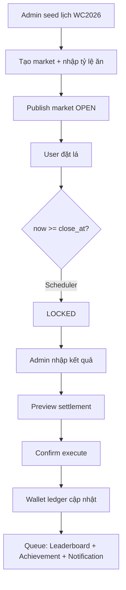

# Kế Hoạch Triển Khai — Dự Đoán Lá (WC2026)

**Stack:** Laravel 12 · PHP 8.3 · Filament 4 · PostgreSQL 16 · Redis 7 · Livewire + Alpine.js  
**Timezone:** `Asia/Ho_Chi_Minh` (toàn bộ DB và UI)  
**Nguồn:** `docs/planning/21_ROADMAP_WORKFLOW_STAGE.md`, `22_PHASE_1_MVP_DETAILED_SPEC.md`, `23_PHASE_2_ENHANCEMENT_SPEC.md`, `04_ERD_DATABASE_DESIGN.md`, `17_DOMAIN_SERVICE_DESIGN.md`, `21_TECH_DECISIONS.md`

> [!IMPORTANT]
> Settlement Engine và Wallet Ledger là hai module quan trọng nhất. Lỗi ở đây = mất tin cậy toàn hệ thống.

---

## Phase 0 — Foundation (v0.1–v0.4)

**Mục tiêu:** Dựng nền kỹ thuật: project, auth, DB migrations, seed data, CI test.  
**Thời gian ước tính:** 1–2 ngày

### v0.1.0 — Project Bootstrap

| Task | Chi tiết |
|---|---|
| Laravel 12 + Filament 4 | `composer create-project laravel/laravel`, cài Filament 4 |
| Auth admin | Filament default auth |
| Base layout Blade | Cấu trúc layout cơ bản |
| Timezone config | `APP_TIMEZONE=Asia/Ho_Chi_Minh` trong `.env` |
| Dev setup | Theo `docs/technical/11_DEV_SETUP_GUIDE.md` |

### v0.2.0 — Roles & Permissions

| Task | Chi tiết |
|---|---|
| `spatie/laravel-permission` | Cài và config |
| `bezhansalleh/filament-shield` | Permission UI |
| Roles seed | `super_admin`, `operator`, `settlement_manager`, `auditor`, `player` |
| Policy classes | User, Market, Bet, Settlement |

### v0.3.0 — Core Migrations

Migration theo thứ tự từ `docs/technical/04_ERD_DATABASE_DESIGN.md`:

```
01 users (+ status, accepted_rules_at, last_login_at)
02 seasons
03 wallets (unique user+season, check >= 0)
04 wallet_ledgers (append-only, indexes)
05 matches (model: FootballMatch, table: matches)
06 match_period_results (unique match+period)
07 markets (index status+close_at)
08 market_outcomes (profit_rate decimal(10,4))
09 bets (snapshot fields, public_code unique)
10 settlements (unique partial: one EXECUTED per market)
11 settlement_items
12 leaderboard_snapshots
13 audit_logs / install spatie-activitylog
14 system_settings / install spatie-settings
```

> [!WARNING]
> KHÔNG dùng float cho `profit_rate`, `line_value`, `stake`, `payout`. Dùng `decimal` và `integer`.

### v0.4.0 — Seed Data & Dev Setup

| Task | Chi tiết |
|---|---|
| Seed Super Admin | Admin user mặc định |
| Seed Season WC2026 | `code=WC2026`, `starting_leaves=1000` |
| Seed System Settings | `min_stake=10`, `max_stake_per_bet=200`, `max_stake_per_match=500`, `max_stake_per_day=1000` |
| Seed Roles/Permissions | Từ permission matrix |
| Seed Enums | MarketType, PeriodType, BetStatus, LedgerType |
| PHPUnit base test | Kiểm tra DB connect, model load |

**Deliverable Phase 0:**
- Admin login được Filament
- Migration chạy clean
- Seed chạy clean
- `php artisan test` pass

---

## Phase 1 — MVP Nghiệp Vụ (v0.5–v1.0)

**Mục tiêu:** Hệ thống đủ để chạy thật nội bộ World Cup 2026.  
**Thời gian ước tính:** 5–10 ngày

### v0.5.0 — Wallet Engine

**Domain:** `app/Domain/Wallet/Services/WalletService.php`

| Task | Chi tiết |
|---|---|
| `WalletService::createWallet()` | Tạo ví cho user/season |
| `WalletService::grant()` | Admin cấp lá + ledger `ADMIN_GRANT` |
| `WalletService::deduct()` | Admin trừ lá + ledger `ADMIN_DEDUCT` |
| `WalletService::lockStake()` | available -= stake, locked += stake + ledger `BET_PLACED` |
| `WalletService::settleBet()` | Settle theo status, ledger tương ứng |
| `WalletService::voidBet()` | Hoàn stake, ledger `BET_VOIDED` |
| Filament Resource: Wallets | Admin xem/cấp/trừ lá |
| Unit tests | grant, deduct, lock, settle, void, không âm balance |

> [!IMPORTANT]
> Tất cả thao tác wallet phải: DB transaction + `lockForUpdate()` + ledger row + kiểm tra âm.

### v0.6.0 — Match / Market / Odds Admin

| Task | Chi tiết |
|---|---|
| Import CSV lịch WC2026 | `FootballMatch` model, seed từ file CSV |
| Filament Resource: Matches | CRUD trận đấu, set status |
| Filament Resource: Markets | Tạo market theo trận + period |
| Filament Resource: MarketOutcomes | Nhập tỷ lệ ăn (profit_rate) |
| Publish market | Chuyển DRAFT → OPEN |
| Enum validation | MarketType, PeriodType, MarketStatus |
| Unit tests | Market status transition |

**Market types hỗ trợ:** `EXACT_SCORE`, `ASIAN_HANDICAP`, `OVER_UNDER`  
**Period types MVP:** `FULL_TIME`, `FIRST_HALF` (mở trước), `SECOND_HALF`, `EXTRA_TIME`, `PENALTY` (mở thủ công)

### v0.7.0 — Bet Placement

**Domain:** `app/Domain/Betting/Services/BetPlacementService.php`

Validation sequence (theo AGENTS.md rule 6):

```
1. DB transaction start
2. Lock wallet FOR UPDATE
3. User active?
4. Market OPEN?
5. now < close_at?
6. Outcome active?
7. stake >= min_stake?
8. stake <= max_stake_per_bet?
9. total_match_stake <= max_stake_per_match?
10. available_balance >= stake?
11. Snapshot profit_rate, line, label, display_odds, close_at, market_type, period_type
12. Create bet PENDING
13. WalletService::lockStake()
14. Commit
```

| Task | Chi tiết |
|---|---|
| `BetPlacementService::placeBet()` | Full flow trên |
| User portal: form đặt dự đoán | Livewire component |
| Hiển thị kiểu "ăn 0.90" | UI theo quy ước Việt Nam |
| Unit tests | Thành công, market đóng, thiếu lá, stake > max, sau giờ |

### v0.8.0 — Market Auto-Lock

**Domain:** `app/Domain/Market/Services/MarketLockService.php`

| Task | Chi tiết |
|---|---|
| `MarketLockService::lockExpiredMarkets()` | Tìm OPEN có `close_at <= now`, chuyển LOCKED |
| Artisan command | `php artisan markets:lock-expired` |
| Scheduler | `everyMinute()` |
| Idempotent | Không lock lại nếu đã LOCKED/SETTLED/VOIDED |
| Unit tests | Lock đúng giờ, idempotent, không ảnh hưởng settled |

> [!NOTE]
> `BetPlacementService` phải kiểm tra `close_at` lần cuối trong transaction, không chỉ dựa vào scheduler.

### v0.9.0 — Settlement Engine

**Domain:** `app/Domain/Settlement/`

```
Calculators/
  ExactScoreSettlementCalculator.php
  AsianHandicapSettlementCalculator.php
  OverUnderSettlementCalculator.php
Services/
  SettlementEngine.php
Data/
  SettlementResult.php
  MatchResult.php
```

**Payout formulas (từ AGENTS.md):**

| Kết quả | Công thức |
|---|---|
| Full Win | `stake × (1 + profit_rate)` |
| Lose | `0` |
| Push | `stake` |
| Half Win | `(stake/2) × (1 + profit_rate) + (stake/2)` |
| Half Lose | `stake / 2` |

**Rounding:** `round($payout, 0, PHP_ROUND_HALF_UP)` → cast `int`

**Asian Handicap quarter-line split:**

| Line | Split |
|---|---|
| -0.25 | 0 và -0.5 |
| -0.75 | -0.5 và -1 |
| +0.25 | 0 và +0.5 |
| +0.75 | +0.5 và +1 |

**Over/Under quarter-line split:**

| Line | Split |
|---|---|
| 2.25 | 2.0 và 2.5 |
| 2.75 | 2.5 và 3.0 |

| Task | Chi tiết |
|---|---|
| 3 calculators | Exact score, Asian handicap, Over/under |
| `SettlementEngine::preview()` | Tính preview, không update ví |
| `SettlementEngine::execute()` | Transaction, lock market, lock bets, payout từng bet, ledger |
| Idempotency | Unique partial constraint: 1 EXECUTED per market |
| Admin: nhập kết quả | `match_period_results` theo period |
| Admin: preview settlement | Bảng hiển thị WON/LOST/PUSH/HALF_WON/HALF_LOST + payout |
| Admin: confirm settlement | Execute với audit log |
| Unit tests | Mỗi loại kèo + quarter lines + edge cases |
| Integration test | Đặt lá → settle → kiểm tra ledger balance |

### v0.10.0 — Leaderboard MVP

**Domain:** `app/Domain/Leaderboard/Services/LeaderboardService.php`

| Task | Chi tiết |
|---|---|
| `LeaderboardService::rebuildSeason()` | Tính net_profit, ROI, win_rate |
| `LeaderboardService::snapshot()` | Chụp bảng xếp hạng |
| Sort order | net_profit → ROI → exact_score_wins → win_rate |
| Queue job | Rebuild sau settlement (không block luồng chính) |
| User portal: bảng xếp hạng | Hiển thị top |
| Unit tests | net_profit, ROI, rank, điều kiện tối thiểu |

**Xếp theo `net_profit` (không theo balance)** — tránh méo khi admin cấp thêm lá.

### v0.11.0 — Import/Export + Audit Log

| Task | Chi tiết |
|---|---|
| `spatie/laravel-activitylog` | Cài và config |
| `pxlrbt/filament-activity-log` | Xem audit log trong Filament |
| Log events | USER_CREATED, WALLET_GRANTED, MARKET_PUBLISHED, ODDS_CHANGED, MARKET_LOCKED, RESULT_UPDATED, SETTLEMENT_PREVIEWED, SETTLEMENT_EXECUTED, MARKET_VOIDED, CORRECTION_EXECUTED |
| Export CSV | Bets, wallet ledger, leaderboard |
| Import CSV lịch WC2026 | Command/seeder có thể re-run |

### v1.0.0 — MVP Production-Ready

| Task | Chi tiết |
|---|---|
| `spatie/laravel-backup` | Backup tự động |
| Security checklist | Theo `docs/technical/13_SECURITY_CHECKLIST.md` |
| Staging UAT | 10–30 user test, 5 trận giả, settle thử |
| UAT test cases | Void/correction, đồng thời nhiều user sát giờ |
| Go-live checklist | Theo `docs/operation/20_CHANGELOG_RELEASE_PLAN.md` |

**Deliverable Phase 1:**
- User đặt được dự đoán
- Market tự khóa đúng giờ
- Admin settle được, ví cộng/trừ đúng
- Leaderboard cập nhật
- Toàn bộ có ledger và audit log
- `php artisan test` pass (settlement matrix bắt buộc)

---

## Phase 2 — Game Hóa & Vận Hành Nâng Cao (v1.1–v1.6)

**Mục tiêu:** Tăng engagement, vận hành dễ hơn, ổn định xuyên suốt WC2026.  
**Thời gian ước tính:** 5–7 ngày

> [!NOTE]
> Phase 2 **không** thay đổi logic lõi Phase 1. **Không** làm phòng ban/team leaderboard.

### v1.1.0 — Achievement / Badge

**Domain:** `app/Domain/Achievement/Services/AchievementService.php`

| Badge | Điều kiện |
|---|---|
| `FIRST_PREDICTION` | Vé đặt đầu tiên |
| `FIRST_WIN` | Vé thắng đầu tiên |
| `EXACT_SCORE_MASTER_I/II` | 1/3 bet EXACT_SCORE won |
| `WIN_STREAK_3/5` | Chuỗi thắng 3/5 |
| `POSITIVE_ROI_QUALIFIED` | >= 10 bets, >= 500 lá staked, ROI > 0 |
| `MARKET_EXPLORER` | Có bet settled ở cả 3 market types |
| `COMEBACK_PLAYER` | Từ net_profit âm sang dương trong tuần |
| `FINAL_PREDICTOR` | Có bet ở trận FINAL |

> [!IMPORTANT]
> Achievement không trao quà có giá trị quy đổi. Chỉ hiệu ứng hiển thị.

### v1.2.0 — Mission Engine

| Task | Chi tiết |
|---|---|
| `MissionService` | Tạo, track, hoàn thành nhiệm vụ tuần/vòng |
| Mission templates | Nhiệm vụ nhẹ, không khuyến khích spam vé |
| Queue job | Xét mission sau settlement |

### v1.3.0 — Notification

| Task | Chi tiết |
|---|---|
| `NotificationService` | Thông báo trong hệ thống |
| Trigger events | Market sắp đóng, settlement xong, nhận badge, admin cấp lá |
| Queue-based | Không block luồng chính |

### v1.4.0 — Approval Workflow

| Task | Chi tiết |
|---|---|
| `ApprovalService` | Duyệt settlement/correction/void nhạy cảm |
| Filament action | Settlement Manager phải approve trước khi execute |
| Audit trail | Log ai approve, khi nào |

### v1.5.0 — Correction Workflow

**Domain:** `app/Domain/Settlement/Services/CorrectionService.php`

| Task | Chi tiết |
|---|---|
| `CorrectionService::createCorrection()` | Sửa kết quả sai, không xóa ledger cũ |
| `CorrectionService::executeCorrection()` | Tạo adjustment ledger `SETTLEMENT_CORRECTION` |
| Formula | `adjustment = new_payout - old_payout` |
| Audit log | Ghi đầy đủ before/after |

### v1.6.0 — Dashboard Analytics

| Task | Chi tiết |
|---|---|
| `leandrocfe/filament-apex-charts` | Charts Filament |
| Admin dashboard | Tổng user, tổng vé, lá đang khóa, market sắp đóng, market cần settle |
| Leaderboard nâng cao | Tuần, vòng đấu, ROI board, Exact score board |
| Thống kê cá nhân | win_rate, ROI, streak, market preference |
| Report export | XLSX cho leaderboard, bets, ledger, settlement |

---

## Verification Plan

### Automated Tests (bắt buộc trước release)

```bash
php artisan test
./vendor/bin/pint
./vendor/bin/phpstan analyse
```

### Settlement Test Matrix (bắt buộc v0.9+)

| Test case | Loại |
|---|---|
| Exact score thắng/thua | Unit |
| AH 0, ±0.5, ±1 (full win/lose/push) | Unit |
| AH ±0.25 (half win/half lose) | Unit |
| AH ±0.75 (half win/half lose) | Unit |
| O/U line tròn (2.0, 2.5) | Unit |
| O/U quarter line (2.25, 2.75) | Unit |
| Settlement idempotent (chạy 2 lần) | Unit |
| Void market → hoàn stake | Unit |
| Đặt lá → settle → kiểm tra ledger balance | Integration |
| Race condition: 2 user đặt cùng lúc | Integration |

---

## Luồng Vận Hành Chuẩn



---

## Anti-patterns Cấm

```text
❌ Tính payout trong Filament Resource/Controller
❌ Update wallet balance không qua ledger
❌ Dùng float cho profit_rate/stake/payout
❌ Xóa bet/ledger đã settle
❌ Chạy settlement không có idempotency
❌ Để admin action bỏ qua service
❌ Nạp tiền/rút tiền/chuyển lá/quy đổi lá
```
