# Roadmap, Workflow Stage và Đặc tả Nghiệp vụ Logic cho dự án “Lá Dự Đoán”


## Quy ước tỷ lệ ăn kiểu Việt Nam

Tài liệu này dùng cách ghi phổ biến ở Việt Nam: **line + ăn + hệ số lãi**. Ví dụ `Home -0.5 ăn 0.90` nghĩa là đặt 100 lá, thắng đủ nhận 190 lá, gồm 100 lá vốn + 90 lá lãi.

Quy ước kỹ thuật:

```text
profit_rate = tỷ lệ ăn / hệ số lãi
decimal_odds = 1 + profit_rate
gross_payout_full_win = stake * (1 + profit_rate)
net_profit_full_win = stake * profit_rate
```


> Phiên bản: 1.0  
> Ngày: 2026-06-11  
> Stack định hướng: Laravel + Filament + PostgreSQL + Redis  
> Phạm vi: Website dự đoán bóng đá nội bộ bằng điểm ảo “lá”, cố định lịch World Cup 2026, không nạp/rút/đổi thưởng bằng tiền.

---

## 1. Mục tiêu tài liệu

Tài liệu này dùng để chuyển ý tưởng sản phẩm thành bản đặc tả có thể triển khai. Trọng tâm không nằm ở giao diện, mà nằm ở:

- Roadmap triển khai theo giai đoạn.
- Workflow vận hành từ lúc tạo mùa giải đến lúc kết thúc mùa.
- State machine cho trận, market, vé dự đoán, settlement và ví lá.
- Logic nghiệp vụ cho:
  - Dự đoán tỉ số.
  - Kèo châu Á.
  - Kèo tài/xỉu.
  - Các mốc: cả trận, hiệp 1, hiệp 2, hiệp phụ, penalty.
- Quy tắc xử lý ví lá bằng ledger.
- Các bước đầu để bắt đầu dự án Laravel + Filament.
- Checklist test nghiệp vụ bắt buộc trước khi chạy nội bộ.

---

## 2. Định nghĩa sản phẩm

### 2.1. Định nghĩa nên dùng

Sản phẩm nên được định nghĩa là:

> Hệ thống game dự đoán bóng đá nội bộ bằng điểm ảo “lá”, phục vụ hoạt động gắn kết nhân viên trong công ty.

Không nên định nghĩa là:

> Website cá cược bóng đá.

### 2.2. Nguyên tắc pháp lý và vận hành

Các nguyên tắc cần khóa cứng trong sản phẩm:

| Nguyên tắc | Quy định |
|---|---|
| Không tiền thật | User không nạp tiền để mua lá |
| Không rút tiền | Lá không được rút, bán, đổi sang tiền |
| Không chuyển nhượng | User không được chuyển lá cho nhau |
| Không public | Chỉ dùng nội bộ công ty |
| Không mở đăng ký tự do | Admin cấp tài khoản |
| Không gọi là cá cược trên UI | Dùng “dự đoán”, “lá tham gia”, “bảng xếp hạng” |
| Có audit log | Mọi thay đổi ví, tỷ lệ ăn, kết quả, settlement phải có log |
| Có thể lệ rõ | User phải thấy luật chơi và giới hạn lá |

### 2.3. Các từ nên dùng trên giao diện

| Từ rủi ro | Từ thay thế |
|---|---|
| Cá cược | Dự đoán |
| Tiền cược | Lá tham gia |
| Nhà cái | Ban tổ chức |
| Thắng cược | Dự đoán đúng |
| Thua cược | Dự đoán sai |
| Kèo | Cửa dự đoán / dòng dự đoán |
| Rút thưởng | Xếp hạng / vinh danh |

Trong database và code có thể dùng từ `bet`, `tỷ lệ ăn`, `market` vì đây là thuật ngữ kỹ thuật. Tuy nhiên UI nên dùng ngôn ngữ an toàn hơn.

---

## 3. Tư duy thiết kế nghiệp vụ

Dự án này có 5 lõi nghiệp vụ chính:

```text
1. Fixture Engine
   Quản lý lịch World Cup 2026, trận đấu, vòng đấu, đội bóng, sân, giờ thi đấu.

2. Market Engine
   Quản lý các loại dự đoán: tỉ số, châu Á, tài/xỉu theo từng mốc thời gian.

3. Wallet Engine
   Quản lý ví lá bằng ledger, khóa lá khi đặt, hoàn/thắng/thua khi settle.

4. Settlement Engine
   Tính kết quả thắng/thua/hoàn/nửa thắng/nửa thua theo từng market.

5. Ranking Engine
   Tính bảng xếp hạng cá nhân, phòng ban, tuần, vòng, mùa giải.
```

Trong đó, phần **Settlement Engine** và **Wallet Ledger** là phần quan trọng nhất. Nếu hai phần này sai, toàn bộ hệ thống mất tin cậy.

---

## 4. Roadmap tổng thể

### 4.1. Giai đoạn 0 — Chốt phạm vi và luật chơi

Mục tiêu: tránh sửa logic giữa chừng.

Việc cần làm:

- Chốt tên sản phẩm.
- Chốt đơn vị điểm là “lá”.
- Chốt lá không quy đổi thành tiền/quà.
- Chốt loại market MVP:
  - Tỉ số chính xác.
  - Kèo châu Á.
  - Kèo tài/xỉu.
- Chốt mốc tính:
  - Cả trận 90 phút.
  - Hiệp 1.
  - Hiệp 2 độc lập.
  - Hiệp phụ.
  - Penalty.
- Chốt giới hạn lá:
  - Tối thiểu mỗi vé.
  - Tối đa mỗi vé.
  - Tối đa mỗi trận.
  - Tối đa mỗi ngày.
  - Không cho số dư âm.
- Chốt quy tắc hủy/void/correction.

Deliverable:

```text
- Rulebook v1
- Danh sách market MVP
- Danh sách period được hỗ trợ
- Chính sách ví lá
- Chính sách audit/correction
```

---

### 4.2. Giai đoạn 1 — Thiết kế domain và database

Mục tiêu: dựng nền dữ liệu đúng trước khi viết UI.

Việc cần làm:

- Thiết kế ERD.
- Tạo migration.
- Tạo enum/state.
- Seed lịch World Cup 2026.
- Seed roles/permissions.
- Seed system settings.
- Tạo các service nghiệp vụ rỗng:
  - `WalletService`
  - `BetService`
  - `MarketLockService`
  - `SettlementService`
  - `LeaderboardService`

Deliverable:

```text
- Database migrations
- Model relationships
- Enum classes
- Seeder cho WC2026
- Seeder role/permission
- Seeder cấu hình game
```

---

### 4.3. Giai đoạn 2 — Xây lõi ví lá và đặt dự đoán

Mục tiêu: user đặt dự đoán an toàn, không âm lá, không race condition.

Việc cần làm:

- Tạo wallet cho từng user.
- Admin cấp lá.
- User đặt lá.
- Hệ thống khóa lá vào vé pending.
- Kiểm tra số dư bằng transaction + row lock.
- Lưu tỷ lệ ăn snapshot.
- Không cho đặt sau `close_at`.
- Không cho sửa tỷ lệ ăn ảnh hưởng vé cũ.

Deliverable:

```text
- Wallet ledger hoạt động
- Bet placement hoạt động
- Tỷ lệ ăn snapshot hoạt động
- Unit test chống đặt quá số dư
- Unit test chống đặt sau giờ khóa
```

---

### 4.4. Giai đoạn 3 — Xây settlement engine

Mục tiêu: hệ thống tự tính thắng/thua/hoàn chính xác.

Việc cần làm:

- Tính tỉ số chính xác.
- Tính kèo châu Á.
- Tính tài/xỉu.
- Tính hiệp 1, hiệp 2, cả trận, hiệp phụ.
- Tính penalty nếu có.
- Preview settlement trước khi xác nhận.
- Xác nhận settlement bằng transaction.
- Ghi ledger sau settlement.
- Ghi audit log.

Deliverable:

```text
- Settlement preview
- Settlement execute
- Unit test cho từng loại kèo
- Integration test cho cả luồng đặt lá -> settle -> leaderboard
```

---

### 4.5. Giai đoạn 4 — Admin panel Filament

Mục tiêu: admin có thể vận hành mùa giải thật.

Việc cần làm:

- Resource quản lý user.
- Resource quản lý ví lá.
- Resource quản lý trận.
- Resource quản lý market.
- Resource quản lý tỷ lệ ăn/outcome.
- Page preview settlement.
- Page audit log.
- Page leaderboard.
- Page settings.
- Import/export CSV.

Deliverable:

```text
- Admin panel đầy đủ
- Phân quyền bằng Filament Shield
- Audit log bằng Spatie Activitylog
- Backup database
```

---

### 4.6. Giai đoạn 5 — User portal

Mục tiêu: user sử dụng đơn giản, ít nhầm.

Việc cần làm:

- Trang dashboard.
- Trang danh sách trận.
- Trang chi tiết trận.
- Form đặt dự đoán.
- Trang vé của tôi.
- Trang ví lá.
- Trang bảng xếp hạng.
- Trang thể lệ.

Deliverable:

```text
- User có thể chơi từ mobile
- Giao diện tránh ngôn ngữ cá cược
- Hiển thị giờ đóng rõ ràng
- Hiển thị lá khả dụng và lá đang khóa
```

---

### 4.7. Giai đoạn 6 — Vận hành thử nội bộ

Mục tiêu: chạy thử với dữ liệu giả trước giải thật.

Việc cần làm:

- Tạo 10–30 user test.
- Tạo 5 trận giả.
- Tạo đủ market.
- Cho user đặt thử.
- Admin settle thử.
- Test case void/correction.
- Test đồng thời nhiều user đặt sát giờ.
- Test backup/restore.

Deliverable:

```text
- UAT report
- Bug list
- Settlement accuracy report
- Checklist go-live
```

---

### 4.8. Giai đoạn 7 — Go-live và vận hành World Cup 2026

Mục tiêu: chạy ổn định theo lịch cố định.

Việc cần làm:

- Seed toàn bộ lịch World Cup 2026.
- Mở mùa giải.
- Cấp lá khởi tạo.
- Publish vòng bảng.
- Admin nhập tỷ lệ ăn từng trận.
- Tự khóa market theo giờ.
- Settlement sau trận.
- Cập nhật leaderboard.
- Backup định kỳ.

Deliverable:

```text
- Season WC2026 hoạt động
- Leaderboard chạy theo vòng/ngày/mùa
- Báo cáo cuối mùa
```

---

## 5. Workflow stage tổng thể

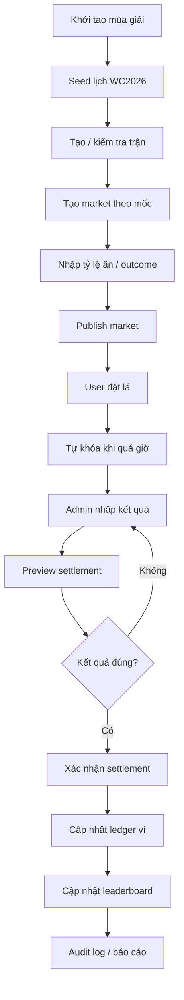

---

## 6. State machine chi tiết

### 6.1. Match state

Trận đấu nên có trạng thái riêng, không phụ thuộc hoàn toàn vào market.

```text
DRAFT
SCHEDULED
LIVE
FINISHED
POSTPONED
CANCELLED
ABANDONED
SETTLED
```

Ý nghĩa:

| State | Ý nghĩa |
|---|---|
| `DRAFT` | Trận mới tạo, chưa public |
| `SCHEDULED` | Trận đã có lịch, có thể tạo market |
| `LIVE` | Trận đang diễn ra |
| `FINISHED` | Trận đã kết thúc, chờ nhập kết quả |
| `POSTPONED` | Trận bị hoãn |
| `CANCELLED` | Trận bị hủy |
| `ABANDONED` | Trận bị dừng bất thường |
| `SETTLED` | Tất cả market chính đã settle |

Luồng chuẩn:

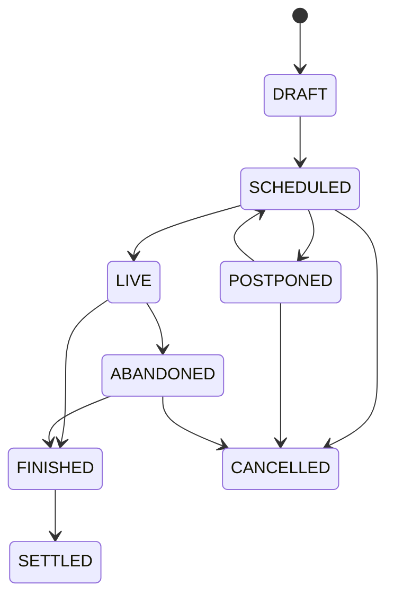

---

### 6.2. Market state

Market là từng cửa dự đoán theo từng mốc.

Ví dụ:

```text
Match: Việt Nam vs Thái Lan
Market 1: Cả trận - Tỉ số chính xác
Market 2: Cả trận - Châu Á
Market 3: Cả trận - Tài/xỉu
Market 4: Hiệp 1 - Tỉ số chính xác
Market 5: Hiệp 1 - Tài/xỉu
```

State:

```text
DRAFT
OPEN
LOCKED
RESULT_ENTERED
SETTLEMENT_PREVIEWED
SETTLED
VOIDED
CANCELLED
```

Luồng chuẩn:

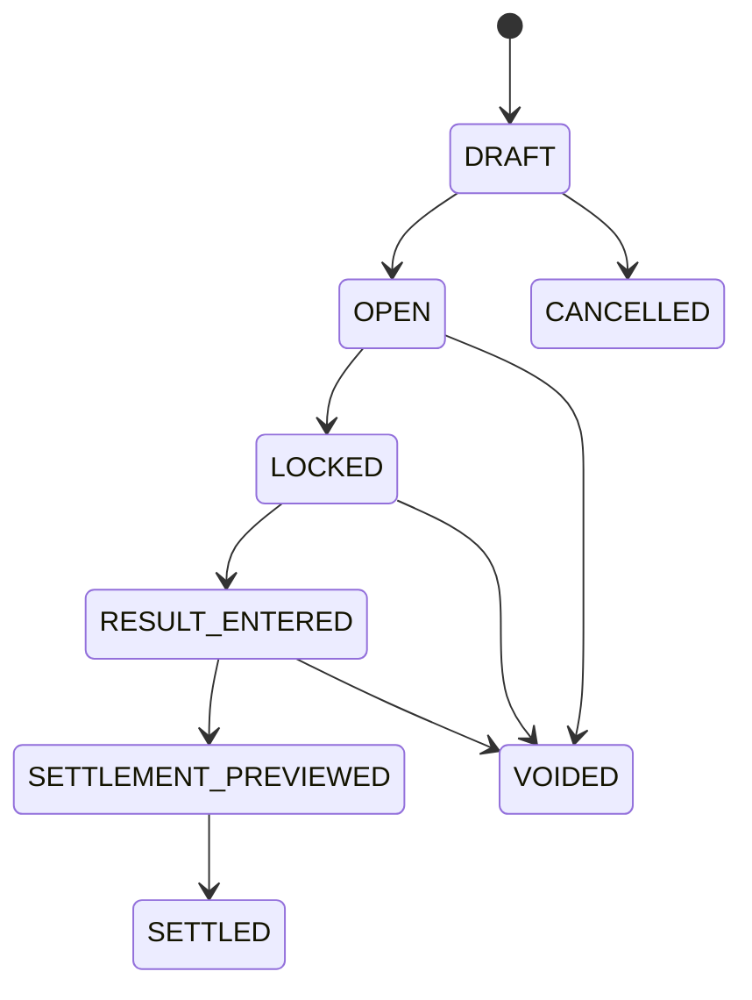

Quy định:

- Chỉ `OPEN` mới được đặt.
- `LOCKED` không cho đặt/sửa/hủy vé.
- `SETTLED` không được settle lại trực tiếp, chỉ qua flow correction.
- `VOIDED` phải hoàn lá cho toàn bộ vé pending.

---

### 6.3. Bet state

Vé dự đoán của user.

```text
PENDING
WON
LOST
PUSH
HALF_WON
HALF_LOST
VOIDED
CANCELLED_BY_ADMIN
```

Ý nghĩa:

| State | Ý nghĩa |
|---|---|
| `PENDING` | Đã đặt, chờ kết quả |
| `WON` | Thắng đủ |
| `LOST` | Thua đủ |
| `PUSH` | Hòa kèo, hoàn lá |
| `HALF_WON` | Nửa thắng, nửa hoàn |
| `HALF_LOST` | Nửa thua, nửa hoàn |
| `VOIDED` | Market bị hủy, hoàn lá |
| `CANCELLED_BY_ADMIN` | Admin hủy vé theo quy trình đặc biệt |

---

### 6.4. Wallet ledger state

Không dùng cách sửa trực tiếp `balance`. Mọi thay đổi phải qua ledger.

Loại giao dịch:

```text
ADMIN_GRANT
ADMIN_DEDUCT
BET_LOCK
BET_WIN_PAYOUT
BET_LOSS_RELEASE
BET_PUSH_REFUND
BET_HALF_WIN_PAYOUT
BET_HALF_LOSS_REFUND
MARKET_VOID_REFUND
CORRECTION_DEBIT
CORRECTION_CREDIT
SEASON_RESET
```

Quy tắc:

- Khi user đặt: trừ `available_balance`, cộng `locked_balance`.
- Khi thua: trừ `locked_balance`, không cộng lại.
- Khi thắng: trừ `locked_balance`, cộng payout vào `available_balance`.
- Khi push: trừ `locked_balance`, hoàn stake vào `available_balance`.
- Khi void: trừ `locked_balance`, hoàn stake vào `available_balance`.
- Không bao giờ cho `available_balance < 0`.
- Không bao giờ cho `locked_balance < 0`.

---

## 7. Workflow nghiệp vụ chi tiết

### 7.1. Workflow khởi tạo mùa giải

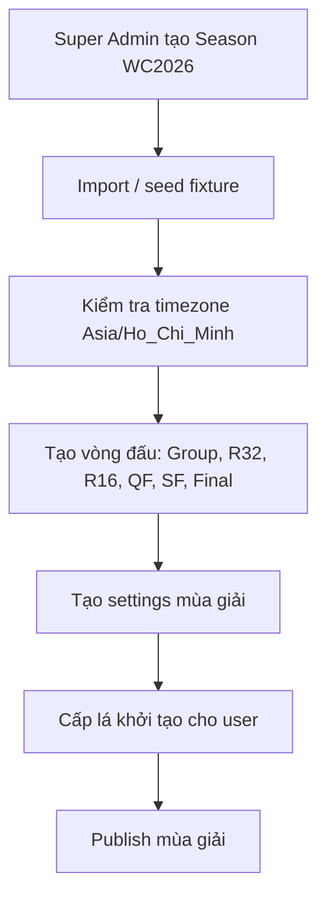

Checklist:

- `season_code = WC2026`
- `timezone = Asia/Ho_Chi_Minh`
- `currency_name = lá`
- `starting_leaves = 1000` hoặc theo cấu hình công ty
- `allow_negative_balance = false`
- `allow_transfer = false`
- `public_registration = false`

---

### 7.2. Workflow tạo trận và market

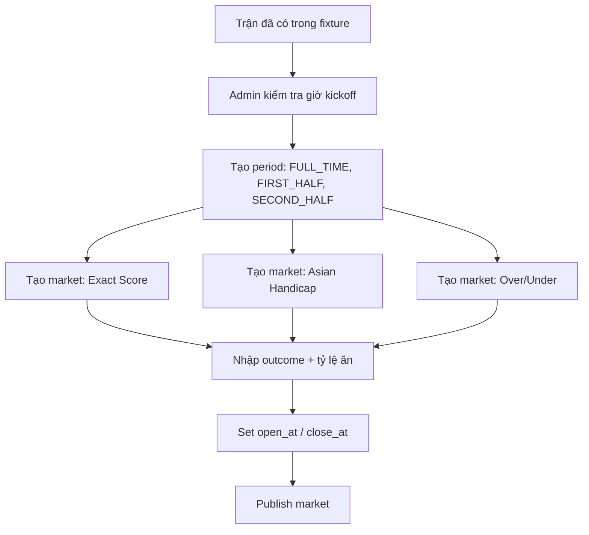

Quy định setup thời gian:

| Period | Close time khuyến nghị |
|---|---|
| Cả trận | Trước kickoff 1–5 phút |
| Hiệp 1 | Trước kickoff 1–5 phút |
| Hiệp 2 | Trước khi hiệp 2 bắt đầu |
| Hiệp phụ | Trước khi hiệp phụ bắt đầu |
| Penalty | Trước khi loạt penalty bắt đầu |

Lưu ý:

- Các mốc hiệp 2, hiệp phụ, penalty có thể mở thủ công khi trận đang diễn ra.
- Nếu không muốn xử lý live phức tạp ở MVP, chỉ mở trước trận các market: cả trận và hiệp 1.
- Giai đoạn 2 mới mở hiệp 2/hiệp phụ/penalty.

---

### 7.3. Workflow đặt dự đoán của user

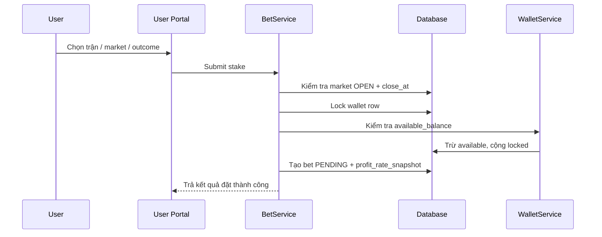

Validation bắt buộc:

| Điều kiện | Xử lý nếu sai |
|---|---|
| User active | Từ chối |
| Market `OPEN` | Từ chối |
| `now < close_at` | Từ chối |
| Stake >= min | Từ chối |
| Stake <= max per bet | Từ chối |
| Tổng stake trận <= max per match | Từ chối |
| Tổng stake ngày <= max per day | Từ chối |
| Số dư đủ | Từ chối |
| Outcome active | Từ chối |

Dữ liệu cần snapshot vào bet:

```text
market_id
outcome_id
stake
profit_rate_snapshot
handicap_snapshot
line_snapshot
period_type_snapshot
market_type_snapshot
placed_at
user_balance_before
user_balance_after
```

---

### 7.4. Workflow tự khóa market

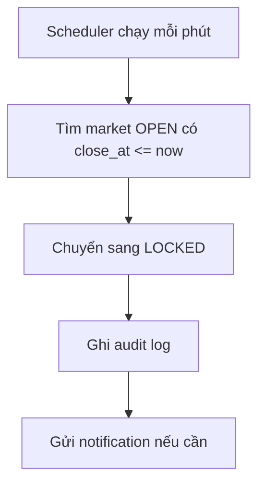

Laravel command gợi ý:

```bash
php artisan markets:lock-expired
```

Scheduler:

```php
Schedule::command('markets:lock-expired')->everyMinute();
```

Nếu có nhiều user đặt sát giờ, logic `BetService` vẫn phải kiểm tra `close_at` lần cuối trong transaction, không chỉ dựa vào scheduler.

---

### 7.5. Workflow nhập kết quả

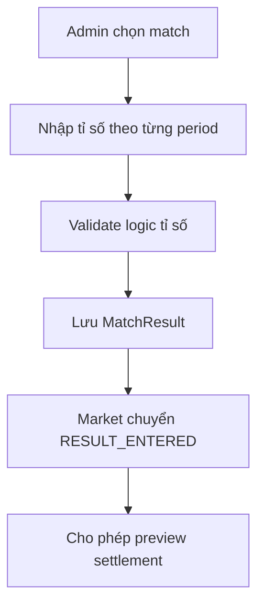

Các kết quả cần lưu:

```text
first_half_home_score
first_half_away_score
second_half_home_score
second_half_away_score
full_time_home_score
full_time_away_score
extra_time_home_score
extra_time_away_score
penalty_home_score
penalty_away_score
final_winner_team_id
```

Quy tắc tính:

```text
full_time_score = first_half_score + second_half_score
```

Nhưng vẫn nên lưu cả hai dạng:

- Lưu tỉ số hiệp 1.
- Lưu tỉ số hiệp 2 độc lập.
- Lưu tỉ số full-time.

Vì admin có thể nhập trực tiếp full-time và hệ thống kiểm tra lại.

---

### 7.6. Workflow preview settlement

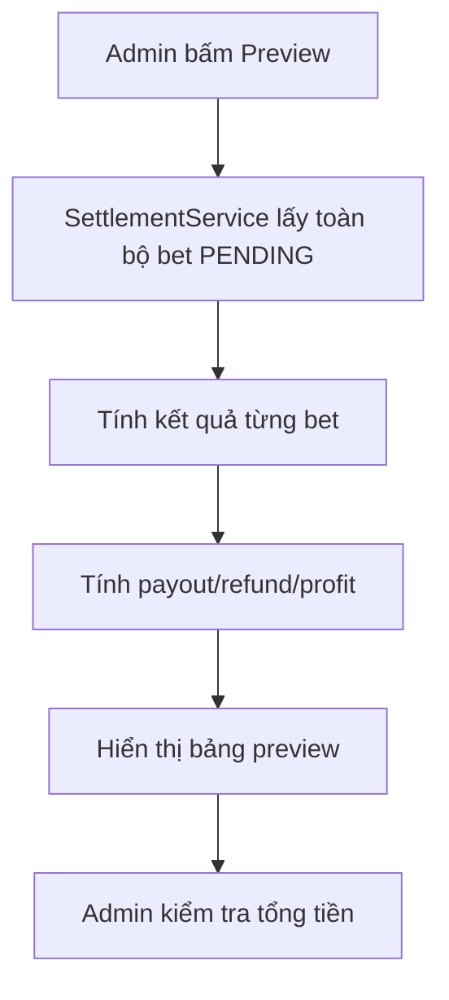

Preview cần hiển thị:

| Field | Ý nghĩa |
|---|---|
| User | Người đặt |
| Market | Loại dự đoán |
| Outcome | Cửa đã chọn |
| Stake | Lá đặt |
| Tỷ lệ ăn snapshot | Tỉ lệ tại thời điểm đặt |
| Result | WON/LOST/PUSH/HALF_WON/HALF_LOST |
| Payout | Tổng lá trả |
| Profit | Lãi ròng |
| Wallet impact | Tác động ví |

Không được cập nhật ví ở bước preview.

---

### 7.7. Workflow execute settlement

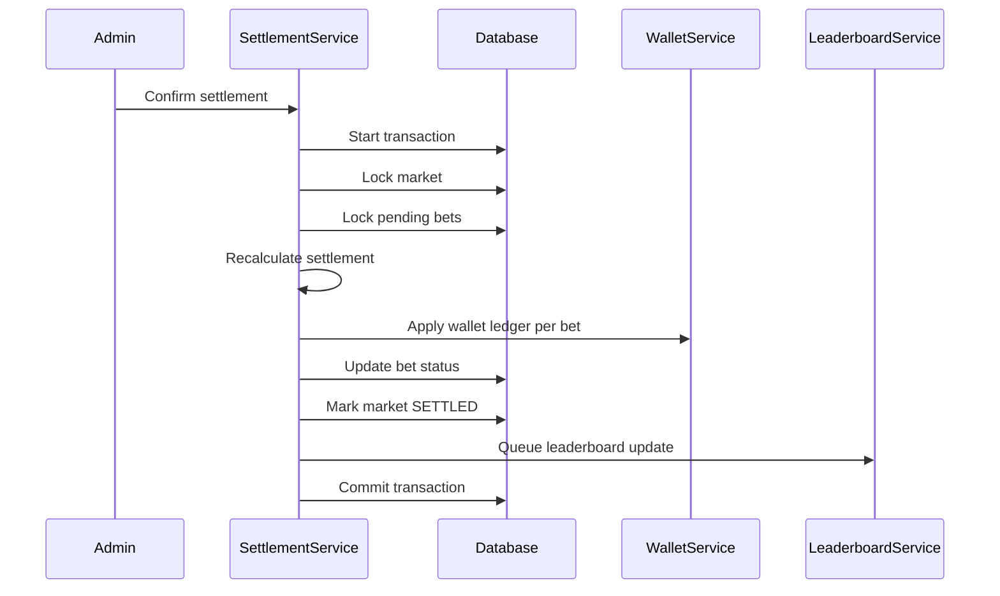

Nguyên tắc quan trọng:

- Khi execute phải **recalculate lại**, không tin 100% vào preview cũ.
- Dùng transaction.
- Lock market row.
- Lock các bet pending liên quan.
- Settlement phải idempotent: không được chạy 2 lần gây cộng tiền 2 lần.

Điều kiện trước khi settle:

```text
market.status in [RESULT_ENTERED, SETTLEMENT_PREVIEWED]
market.settled_at is null
pending_bets_count >= 0
result exists
```

---

## 8. Logic market và settlement

### 8.1. Khái niệm stake, payout, profit

Quy ước:

```text
stake = số lá user đặt
tỷ lệ ăn = tỉ lệ payout dạng decimal
payout = tổng lá trả về cho user
profit = payout - stake
```

Ví dụ:

```text
stake = 100
profit_rate = 0.90
payout = 190
profit = 90
```

Khi thua:

```text
payout = 0
profit = -100
```

Khi push:

```text
payout = 100
profit = 0
```

---

### 8.2. Settlement tỉ số chính xác

Market type:

```text
EXACT_SCORE
```

Outcome ví dụ:

```text
0-0 @ 6.50
1-0 @ 5.20
1-1 @ 5.00
2-1 @ 7.00
Khác @ 8.00
```

Input:

```text
selected_home_score
selected_away_score
actual_home_score
actual_away_score
```

Logic:

```text
Nếu selected_home_score == actual_home_score
và selected_away_score == actual_away_score
=> WON

Ngược lại
=> LOST
```

Pseudocode:

```php
if ($bet->selected_home_score === $result->home_score
    && $bet->selected_away_score === $result->away_score) {
    return SettlementResult::won($stake * $tỷ lệ ăn);
}

return SettlementResult::lost();
```

Với option “Khác”:

```text
Nếu actual score không nằm trong danh sách outcome score cụ thể
=> outcome Khác WON
```

Ví dụ:

```text
Admin tạo outcome cụ thể: 0-0, 1-0, 0-1, 1-1, 2-1, 1-2, 2-0, 0-2.
Nếu kết quả 3-2 và user chọn Khác => WON.
```

---

### 8.3. Settlement kèo châu Á

Market type:

```text
ASIAN_HANDICAP
```

Input:

```text
team_side = HOME hoặc AWAY
handicap = -1.25, -1, -0.75, -0.5, -0.25, 0, +0.25, +0.5, +0.75, +1, +1.25...
actual_home_score
actual_away_score
```

Quy tắc chuẩn:

```text
adjusted_score = selected_team_score + handicap
compare adjusted_score với opponent_score
```

Nếu selected team là HOME:

```text
adjusted = home_score + handicap
opponent = away_score
```

Nếu selected team là AWAY:

```text
adjusted = away_score + handicap
opponent = home_score
```

Kết quả cơ bản:

| So sánh | Kết quả |
|---|---|
| adjusted > opponent | WIN |
| adjusted = opponent | PUSH |
| adjusted < opponent | LOSE |

Tuy nhiên kèo 0.25 và 0.75 phải tách thành 2 nửa.

#### 8.3.1. Tách handicap

| Handicap | Tách thành |
|---:|---|
| -0.25 | 0 và -0.5 |
| +0.25 | 0 và +0.5 |
| -0.75 | -0.5 và -1 |
| +0.75 | +0.5 và +1 |
| -1.25 | -1 và -1.5 |
| +1.25 | +1 và +1.5 |
| -1.75 | -1.5 và -2 |
| +1.75 | +1.5 và +2 |

Cách xử lý tổng quát:

```php
function splitAsianHandicap(float $line): array
{
    $fraction = abs($line - floor($line));

    if (str_ends_with((string) abs($line), '.25')) {
        return [$line + 0.25, $line - 0.25];
    }

    if (str_ends_with((string) abs($line), '.75')) {
        return [$line + 0.25, $line - 0.25];
    }

    return [$line];
}
```

Trong thực tế nên xử lý bằng integer quarter unit để tránh lỗi float.

Ví dụ:

```text
-0.75 = -3 quarter units
Tách thành -0.5 và -1.0
```

#### 8.3.2. Công thức payout châu Á

Mỗi nửa stake được tính riêng.

```text
stake_part = stake / number_of_parts
```

Kết quả từng phần:

| Kết quả phần | Payout phần |
|---|---:|
| Win | `stake_part × tỷ lệ ăn` |
| Push | `stake_part` |
| Lose | `0` |

Tổng payout:

```text
total_payout = sum(payout_part)
profit = total_payout - stake
```

#### 8.3.3. Ví dụ kèo châu Á

Ví dụ 1:

```text
HOME -0.5 ăn 0.90
Stake: 100
Kết quả: HOME 2-1 AWAY
```

Tính:

```text
adjusted = 2 - 0.5 = 1.5
opponent = 1
adjusted > opponent => WIN
payout = 100 × (1 + 0.90) = 190
profit = +90
```

Ví dụ 2:

```text
HOME -1 ăn 0.90
Stake: 100
Kết quả: HOME 2-1 AWAY
```

Tính:

```text
adjusted = 2 - 1 = 1
opponent = 1
PUSH
payout = 100
profit = 0
```

Ví dụ 3:

```text
HOME -0.75 ăn 0.90
Stake: 100
Kết quả: HOME 2-1 AWAY
```

Tách:

```text
50 lá ở -0.5 => WIN => 95
50 lá ở -1.0 => PUSH => 50
Tổng payout = 145
Profit = 45
Result = HALF_WON
```

Ví dụ 4:

```text
HOME +0.75 ăn 0.90
Stake: 100
Kết quả: HOME 0-1 AWAY
```

Tách:

```text
50 lá ở +0.5 => LOSE => 0
50 lá ở +1.0 => PUSH => 50
Tổng payout = 50
Profit = -50
Result = HALF_LOST
```

---

### 8.4. Settlement tài/xỉu

Market type:

```text
OVER_UNDER
```

Input:

```text
selection = OVER hoặc UNDER
line = 0.5, 0.75, 1, 1.25, 1.5, 1.75, 2, 2.25, 2.5, 2.75, 3...
actual_total_goals
```

Tổng bàn:

```text
actual_total_goals = home_score + away_score
```

#### 8.4.1. Logic tài/xỉu cơ bản

Với cửa tài:

| Điều kiện | Kết quả |
|---|---|
| total_goals > line | WIN |
| total_goals = line | PUSH |
| total_goals < line | LOSE |

Với cửa xỉu:

| Điều kiện | Kết quả |
|---|---|
| total_goals < line | WIN |
| total_goals = line | PUSH |
| total_goals > line | LOSE |

#### 8.4.2. Line 0.25 và 0.75

Cũng tách thành 2 nửa:

| Line | Tách thành |
|---:|---|
| 0.75 | 0.5 và 1.0 |
| 1.25 | 1.0 và 1.5 |
| 1.75 | 1.5 và 2.0 |
| 2.25 | 2.0 và 2.5 |
| 2.75 | 2.5 và 3.0 |
| 3.25 | 3.0 và 3.5 |

#### 8.4.3. Ví dụ tài/xỉu

Ví dụ 1:

```text
Tài 2.5 ăn 0.90
Stake: 100
Kết quả: 2-1
Total goals = 3
```

Tính:

```text
3 > 2.5 => WIN
payout = 190
profit = +90
```

Ví dụ 2:

```text
Xỉu 2.5 ăn 0.90
Stake: 100
Kết quả: 1-1
Total goals = 2
```

Tính:

```text
2 < 2.5 => WIN
payout = 190
profit = +90
```

Ví dụ 3:

```text
Tài 2.25 ăn 0.90
Stake: 100
Kết quả: 1-1
Total goals = 2
```

Tách:

```text
50 lá ở Tài 2.0 => PUSH => 50
50 lá ở Tài 2.5 => LOSE => 0
Tổng payout = 50
Profit = -50
Result = HALF_LOST
```

Ví dụ 4:

```text
Xỉu 2.25 ăn 0.90
Stake: 100
Kết quả: 1-1
Total goals = 2
```

Tách:

```text
50 lá ở Xỉu 2.0 => PUSH => 50
50 lá ở Xỉu 2.5 => WIN => 95
Tổng payout = 145
Profit = +45
Result = HALF_WON
```

---

## 9. Logic theo period

### 9.1. FULL_TIME

Tên UI:

```text
Cả trận 90 phút
```

Phạm vi:

```text
Hiệp 1 + Hiệp 2 + bù giờ chính thức
Không bao gồm hiệp phụ
Không bao gồm penalty
```

Input result:

```text
full_time_home_score
full_time_away_score
```

---

### 9.2. FIRST_HALF

Tên UI:

```text
Hiệp 1
```

Phạm vi:

```text
Từ phút 1 đến hết bù giờ hiệp 1
```

Input result:

```text
first_half_home_score
first_half_away_score
```

---

### 9.3. SECOND_HALF

Tên UI:

```text
Hiệp 2 độc lập
```

Phạm vi:

```text
Chỉ tính bàn thắng trong hiệp 2, bao gồm bù giờ hiệp 2
Không cộng bàn hiệp 1
```

Input result:

```text
second_half_home_score
second_half_away_score
```

Ví dụ:

```text
Hiệp 1: 1-1
Full-time: 2-1
Hiệp 2 độc lập: 1-0
```

---

### 9.4. EXTRA_TIME

Tên UI:

```text
Hiệp phụ
```

Phạm vi:

```text
30 phút hiệp phụ, không tính penalty
```

Input result:

```text
extra_time_home_score
extra_time_away_score
```

Lưu ý:

- Chỉ mở nếu trận thuộc vòng loại trực tiếp.
- Nếu trận không có hiệp phụ, market hiệp phụ nên bị void hoặc không tạo.
- Nên ưu tiên không mở hiệp phụ trong MVP nếu chưa có vận hành live.

---

### 9.5. PENALTY

Tên UI:

```text
Luân lưu penalty
```

Phạm vi:

```text
Chỉ tính loạt sút luân lưu
Không cộng bàn 90 phút hoặc hiệp phụ
```

Market nên hỗ trợ:

- Đội thắng penalty.
- Tỉ số penalty.

Không nên hỗ trợ kèo châu Á/tài xỉu penalty trong MVP vì dễ gây nhầm.

---

## 10. Tỷ lệ ăn versioning và snapshot

### 10.1. Vì sao cần snapshot

Khi user đặt dự đoán, tỷ lệ ăn tại thời điểm đó phải được giữ nguyên.

Ví dụ:

```text
20:00 User đặt HOME -0.5 ăn 0.90
20:10 Admin đổi HOME -0.5 thành ăn 0.85
```

Vé của user vẫn phải tính theo `profit_rate = 0.90` đã snapshot.

### 10.2. Quy tắc sửa tỷ lệ ăn

| Tình huống | Xử lý |
|---|---|
| Outcome chưa có ai đặt | Cho sửa trực tiếp |
| Outcome đã có người đặt | Tạo tỷ lệ ăn version mới |
| Market đã locked | Không cho sửa, trừ khi Super Admin correction |
| Market đã settled | Không cho sửa, chỉ correction flow |

### 10.3. Dữ liệu snapshot trong bet

```text
profit_rate_snapshot
line_snapshot
handicap_snapshot
selection_snapshot
period_type_snapshot
market_type_snapshot
outcome_label_snapshot
```

Không được tính settlement bằng tỷ lệ ăn hiện tại trong `market_outcomes`.

---

## 11. Wallet ledger chi tiết

### 11.1. Cấu trúc ví

Bảng `wallets`:

```text
id
user_id
season_id
available_balance
locked_balance
total_deposited_by_admin
total_staked
total_payout
total_profit
created_at
updated_at
```

Bảng `wallet_ledger_entries`:

```text
id
wallet_id
user_id
season_id
type
amount
available_before
available_after
locked_before
locked_after
reference_type
reference_id
description
created_by
created_at
```

### 11.2. Ví dụ ledger khi đặt vé

Trước khi đặt:

```text
available = 1000
locked = 0
```

User đặt 100 lá:

```text
available = 900
locked = 100
```

Ledger:

```text
Type: BET_LOCK
Amount: -100 available, +100 locked
Reference: bet_id
```

### 11.3. Ví dụ ledger khi thắng

Vé stake 100, ăn 0.90.

Trước settle:

```text
available = 900
locked = 100
```

Sau settle:

```text
available = 1090
locked = 0
```

Ledger:

```text
Type: BET_WIN_PAYOUT
Locked: -100
Available: +190
```

### 11.4. Ví dụ ledger khi thua

Trước settle:

```text
available = 900
locked = 100
```

Sau settle:

```text
available = 900
locked = 0
```

Ledger:

```text
Type: BET_LOSS_RELEASE
Locked: -100
Available: +0
```

### 11.5. Ví dụ ledger khi push

Trước settle:

```text
available = 900
locked = 100
```

Sau settle:

```text
available = 1000
locked = 0
```

Ledger:

```text
Type: BET_PUSH_REFUND
Locked: -100
Available: +100
```

---

## 12. Correction và rollback

### 12.1. Không nên rollback bằng cách xóa

Không được:

```text
Xóa bet
Xóa ledger
Sửa trực tiếp balance
Sửa status âm thầm
```

Nên:

```text
Tạo correction transaction ngược lại
Ghi rõ lý do
Ghi người thực hiện
Ghi thời điểm
Ghi reference tới settlement cũ
```

### 12.2. Workflow correction

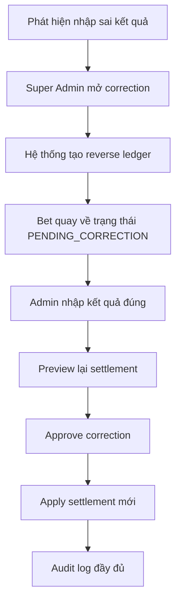

### 12.3. Quy tắc correction

- Chỉ `super_admin` hoặc `settlement_manager` được correction.
- Bắt buộc nhập lý do.
- Bắt buộc preview trước khi apply.
- Không cho correction nếu đã qua thời gian khóa sổ, trừ khi super admin override.
- Mọi correction phải xuất hiện trong audit log.

---

## 13. Leaderboard logic

### 13.1. Các chỉ số chính

```text
current_balance
season_profit
total_staked
total_payout
win_count
loss_count
push_count
half_win_count
half_loss_count
exact_score_hit_count
asian_handicap_roi
over_under_roi
win_rate
roi
current_rank
previous_rank
rank_change
```

### 13.2. Công thức

```text
season_profit = current_balance - starting_balance + total_admin_deduct - total_admin_grant_after_start
```

Công thức đơn giản hơn cho MVP:

```text
season_profit = total_payout - total_staked
```

ROI:

```text
roi = season_profit / total_staked * 100
```

Win rate:

```text
win_rate = won_bets / settled_bets * 100
```

Lưu ý:

- Có thể tính `HALF_WON` là 0.5 win.
- Có thể tính `HALF_LOST` là 0.5 loss.
- `PUSH` không tính win/loss.

### 13.3. Ranking rules

Thứ tự xếp hạng đề xuất:

```text
1. current_balance cao hơn
2. season_profit cao hơn
3. ROI cao hơn nếu total_staked đủ ngưỡng
4. exact_score_hit_count cao hơn
5. placed_bets_count cao hơn
```

Nên có ngưỡng tối thiểu để tránh user đặt 1 vé rồi đứng đầu ROI:

```text
Chỉ hiện ROI leaderboard nếu total_staked >= 500 lá
```

---

## 14. Cấu trúc module code đề xuất

```text
app/
  Domain/
    Wallet/
      Models/
      Services/
      Actions/
      Enums/
    Betting/
      Models/
      Services/
      Actions/
      DTOs/
      Enums/
    Settlement/
      Services/
      Calculators/
      DTOs/
      Enums/
    Fixture/
      Models/
      Services/
      Seeders/
    Leaderboard/
      Services/
      Jobs/
    Audit/
      Services/
  Filament/
    Resources/
    Pages/
    Widgets/
  Console/
    Commands/
  Jobs/
  Policies/
```

Các class cốt lõi:

```text
WalletService
BetPlacementService
MarketLockService
SettlementPreviewService
SettlementExecutionService
ExactScoreCalculator
AsianHandicapCalculator
OverUnderCalculator
LeaderboardRebuildService
CorrectionService
```

---

## 15. Database model đề xuất

### 15.1. Danh sách bảng chính

```text
users
departments
seasons
teams
stadiums
matches
match_results
periods
markets
market_outcomes
tỷ lệ ăn_versions
bets
settlements
settlement_items
wallets
wallet_ledger_entries
leaderboard_snapshots
audit_logs
system_settings
```

### 15.2. Quan hệ chính

```text
Season hasMany Matches
Match hasMany Markets
Market hasMany MarketOutcomes
Market hasMany Bets
User hasMany Bets
User hasOne Wallet per Season
Wallet hasMany WalletLedgerEntries
Settlement hasMany SettlementItems
Bet hasOne SettlementItem
Department hasMany Users
```

---

## 16. API / Service boundary

MVP có thể dùng Livewire action trực tiếp, nhưng nghiệp vụ không nên viết trong Filament Resource. Nên gọi service.

Không nên:

```php
// Trong Filament Action viết trực tiếp logic trừ ví, tạo bet, settle...
```

Nên:

```php
BetPlacementService::placeBet($user, $outcome, $stake);
SettlementExecutionService::execute($market, $adminUser);
```

Lý do:

- Dễ test.
- Dễ dùng lại cho API/mobile sau này.
- Tránh logic rải rác trong UI.
- Dễ bảo toàn transaction.

---

## 17. Bước đầu để bắt đầu dự án

### 17.1. Bước 1 — Tạo repository

```bash
composer create-project laravel/laravel la-du-doan
cd la-du-doan
```

Khuyến nghị:

```text
PHP >= 8.3
PostgreSQL >= 15
Redis >= 7
Node.js LTS
```

---

### 17.2. Bước 2 — Cài Filament và plugin nền

```bash
composer require filament/filament
php artisan filament:install --panels
```

Plugin nên cài sớm:

```bash
composer require spatie/laravel-permission
composer require bezhansalleh/filament-shield
composer require spatie/laravel-activitylog
composer require pxlrbt/filament-activity-log
composer require spatie/laravel-settings
composer require filament/spatie-laravel-settings-plugin
composer require jeffgreco13/filament-breezy
```

---

### 17.3. Bước 3 — Tạo enum nghiệp vụ

Các enum nên tạo trước:

```text
SeasonStatus
MatchStatus
MarketStatus
MarketType
PeriodType
BetStatus
SettlementStatus
WalletLedgerType
SelectionSide
```

Ví dụ:

```php
namespace App\Domain\Betting\Enums;

enum MarketType: string
{
    case EXACT_SCORE = 'exact_score';
    case ASIAN_HANDICAP = 'asian_handicap';
    case OVER_UNDER = 'over_under';
}
```

---

### 17.4. Bước 4 — Tạo migration lõi

Thứ tự migration:

```text
1. departments
2. seasons
3. teams
4. stadiums
5. matches
6. match_results
7. markets
8. market_outcomes
9. tỷ lệ ăn_versions
10. wallets
11. wallet_ledger_entries
12. bets
13. settlements
14. settlement_items
15. leaderboard_snapshots
```

Lý do: tránh phụ thuộc vòng tròn.

---

### 17.5. Bước 5 — Viết WalletService trước

Đây là module nên làm đầu tiên.

Phải có method:

```php
createWallet(User $user, Season $season): Wallet
adminGrant(Wallet $wallet, int $amount, User $admin, string $reason): void
adminDeduct(Wallet $wallet, int $amount, User $admin, string $reason): void
lockForBet(Wallet $wallet, Bet $bet, int $stake): void
settleWin(Wallet $wallet, Bet $bet, int $payout): void
settleLoss(Wallet $wallet, Bet $bet): void
settlePush(Wallet $wallet, Bet $bet, int $refund): void
voidBet(Wallet $wallet, Bet $bet): void
```

Tất cả method phải chạy trong transaction hoặc được gọi từ service có transaction.

---

### 17.6. Bước 6 — Viết calculator settlement

Tạo 3 calculator độc lập:

```text
ExactScoreCalculator
AsianHandicapCalculator
OverUnderCalculator
```

Interface:

```php
interface MarketCalculator
{
    public function calculate(Bet $bet, MatchResult $result): SettlementResult;
}
```

DTO `SettlementResult`:

```php
class SettlementResult
{
    public BetStatus $status;
    public int $stake;
    public int $payout;
    public int $profit;
    public array $breakdown;
}
```

`breakdown` rất quan trọng để debug các kèo nửa thắng/nửa thua.

---

### 17.7. Bước 7 — Viết test trước UI

Các test bắt buộc:

```text
tests/Feature/WalletTest.php
tests/Feature/BetPlacementTest.php
tests/Unit/ExactScoreCalculatorTest.php
tests/Unit/AsianHandicapCalculatorTest.php
tests/Unit/OverUnderCalculatorTest.php
tests/Feature/SettlementExecutionTest.php
tests/Feature/MarketLockTest.php
tests/Feature/CorrectionTest.php
```

Không nên làm UI trước khi calculator có test.

---

### 17.8. Bước 8 — Sau khi logic ổn mới dựng Filament Resource

Thứ tự Resource:

```text
1. SeasonResource
2. TeamResource
3. MatchResource
4. MarketResource
5. MarketOutcomeResource
6. WalletResource
7. BetResource
8. SettlementResource
9. LeaderboardResource
10. SystemSettingPage
```

Filament chỉ nên là lớp nhập/xem dữ liệu, không phải nơi chứa logic tính toán.

---

## 18. Checklist nghiệp vụ MVP

### 18.1. User

- [ ] User đăng nhập được.
- [ ] User xem số lá khả dụng.
- [ ] User xem trận sắp diễn ra.
- [ ] User xem market đang mở.
- [ ] User đặt tỉ số chính xác.
- [ ] User đặt kèo châu Á.
- [ ] User đặt tài/xỉu.
- [ ] User không đặt được sau giờ khóa.
- [ ] User không đặt quá số lá.
- [ ] User xem vé pending.
- [ ] User xem vé đã settle.
- [ ] User xem leaderboard.

### 18.2. Admin

- [ ] Admin tạo user.
- [ ] Admin cấp lá.
- [ ] Admin tạo/sửa trận.
- [ ] Admin tạo market.
- [ ] Admin nhập tỷ lệ ăn.
- [ ] Admin publish market.
- [ ] Admin nhập kết quả.
- [ ] Admin preview settlement.
- [ ] Admin execute settlement.
- [ ] Admin void market.
- [ ] Admin xem audit log.

### 18.3. System

- [ ] Scheduler tự khóa market.
- [ ] Queue cập nhật leaderboard.
- [ ] Ledger không lệch balance.
- [ ] Settlement không chạy lặp.
- [ ] Correction có reverse ledger.
- [ ] Backup hoạt động.
- [ ] Import fixture hoạt động.
- [ ] Export report hoạt động.

---

## 19. Test case nghiệp vụ cốt lõi

### 19.1. Exact score

| Case | Bet | Result | Expected |
|---|---|---|---|
| Đúng tỉ số | 2-1 | 2-1 | WON |
| Sai tỉ số | 1-1 | 2-1 | LOST |
| Chọn khác, kết quả khác danh sách | Khác | 4-3 | WON |
| Chọn khác, kết quả có trong danh sách | Khác | 1-1 | LOST |

### 19.2. Asian handicap

| Case | Line | Score | Expected |
|---|---:|---|---|
| HOME -0.5 | -0.5 | HOME 1-0 | WON |
| HOME -0.5 | -0.5 | HOME 0-0 | LOST |
| HOME 0 | 0 | HOME 0-0 | PUSH |
| HOME -1 | -1 | HOME 1-0 | PUSH |
| HOME -1 | -1 | HOME 2-0 | WON |
| HOME -0.75 | -0.75 | HOME 1-0 | HALF_WON |
| HOME +0.75 | +0.75 | HOME 0-1 | HALF_LOST |
| AWAY +1 | +1 | HOME 1-0 | PUSH |
| AWAY +1.5 | +1.5 | HOME 1-0 | WON |

### 19.3. Over/under

| Case | Line | Score | Total | Expected |
|---|---:|---|---:|---|
| Over 2.5 | 2.5 | 2-1 | 3 | WON |
| Under 2.5 | 2.5 | 1-1 | 2 | WON |
| Over 2 | 2.0 | 1-1 | 2 | PUSH |
| Under 2 | 2.0 | 1-1 | 2 | PUSH |
| Over 2.25 | 2.25 | 1-1 | 2 | HALF_LOST |
| Under 2.25 | 2.25 | 1-1 | 2 | HALF_WON |
| Over 2.75 | 2.75 | 2-1 | 3 | HALF_WON |
| Under 2.75 | 2.75 | 2-1 | 3 | HALF_LOST |

---

## 20. Rủi ro nghiệp vụ và cách khóa

| Rủi ro | Cách khóa |
|---|---|
| User đặt sau giờ nhưng request đến chậm | Check `close_at` trong transaction |
| User đặt quá số dư do double click | Lock wallet row bằng `lockForUpdate()` |
| Admin sửa tỷ lệ ăn làm thay đổi vé cũ | Lưu tỷ lệ ăn snapshot |
| Settlement chạy 2 lần | Dùng `settled_at`, unique settlement lock, transaction |
| Nhập sai kết quả | Preview, approval, correction flow |
| Ledger lệch balance | Mọi thay đổi qua WalletService, có reconciliation command |
| Plugin UI chứa logic | Cấm viết business logic trong Resource |
| Hiệp 2 bị hiểu nhầm | Ghi rõ “hiệp 2 độc lập” |
| Hiệp phụ/penalty gây nhầm | Chỉ mở khi trận có khả năng đá knock-out |
| Lá bị hiểu là tiền | Không nạp/rút/chuyển/đổi lá |

---

## 21. Command vận hành nên có

```bash
php artisan markets:lock-expired
php artisan leaderboards:rebuild --season=WC2026
php artisan wallets:reconcile --season=WC2026
php artisan fixtures:import-wc2026
php artisan settlements:check-pending
php artisan backups:run
```

### 21.1. Wallet reconciliation

Command này kiểm tra:

```text
wallet.available_balance + wallet.locked_balance
so với tổng ledger tính lại
```

Nếu lệch:

- Không tự sửa.
- Gửi cảnh báo admin.
- Xuất report.

---

## 22. Gợi ý sprint triển khai

### Sprint 1 — Foundation

Thời lượng tham khảo: 1 tuần.

Deliverable:

```text
- Laravel project
- Filament panel
- Auth
- Roles/permissions
- Enum
- Migrations chính
- Seeder season/user/settings
```

### Sprint 2 — Wallet + Betting

Deliverable:

```text
- WalletService
- Wallet ledger
- Admin grant/deduct
- BetPlacementService
- Market locking
- Tests cho wallet/bet
```

### Sprint 3 — Settlement engine

Deliverable:

```text
- ExactScoreCalculator
- AsianHandicapCalculator
- OverUnderCalculator
- Settlement preview
- Settlement execute
- Tests đầy đủ
```

### Sprint 4 — Admin panel

Deliverable:

```text
- MatchResource
- MarketResource
- OutcomeResource
- Settlement page
- WalletResource
- Audit log
```

### Sprint 5 — User portal + leaderboard

Deliverable:

```text
- Dashboard user
- Chi tiết trận
- Form đặt dự đoán
- Vé của tôi
- Leaderboard
```

### Sprint 6 — UAT + hardening

Deliverable:

```text
- Test đồng thời
- Test correction
- Test backup/restore
- Test mobile
- UAT report
- Go-live checklist
```

---

## 23. Definition of Done cho nghiệp vụ lõi

Một chức năng chỉ được xem là xong nếu có đủ:

```text
1. Migration/model đầy đủ
2. Service nghiệp vụ riêng
3. Transaction đúng
4. Audit log nếu có thay đổi dữ liệu quan trọng
5. Unit test
6. Feature test
7. UI admin/user nếu cần
8. Error message rõ ràng
9. Không dùng ngôn ngữ rủi ro trên giao diện
10. Có ghi chú trong tài liệu vận hành
```

---

## 24. Thứ tự ưu tiên làm trước

Không nên bắt đầu từ giao diện đẹp. Nên làm theo thứ tự:

```text
1. Rulebook
2. Database schema
3. Wallet ledger
4. Bet placement
5. Settlement calculator
6. Settlement preview/execute
7. Admin panel
8. User portal
9. Leaderboard
10. Realtime/notification/chart
```

Lý do:

- UI có thể sửa sau.
- Logic tiền ảo/lá sai thì khó sửa.
- Settlement cần test rất kỹ.
- Ledger phải ổn trước khi có user thật.

---

## 25. Kết luận triển khai

Dự án nên được triển khai như một **domain-driven internal prediction game**. Phần kỹ thuật Filament giúp tạo admin panel nhanh, nhưng phần quyết định chất lượng sản phẩm là:

```text
- Wallet ledger đúng
- Settlement engine đúng
- Tỷ lệ ăn snapshot đúng
- Market state đúng
- Audit/correction minh bạch
- Rulebook rõ ràng
```

Khuyến nghị triển khai MVP:

```text
MVP chỉ nên mở:
- Cả trận 90 phút
- Hiệp 1
- Tỉ số chính xác
- Kèo châu Á
- Tài/xỉu
```

Sau khi chạy ổn mới mở thêm:

```text
- Hiệp 2 live
- Hiệp phụ
- Penalty
- Realtime notification
- Advanced leaderboard
- Department league
```
