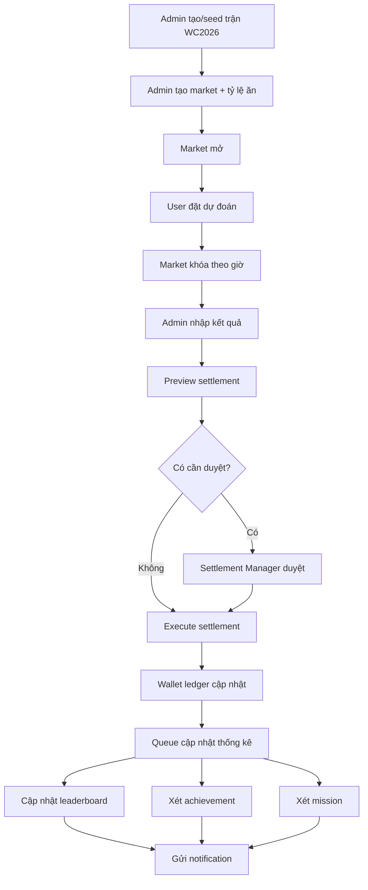
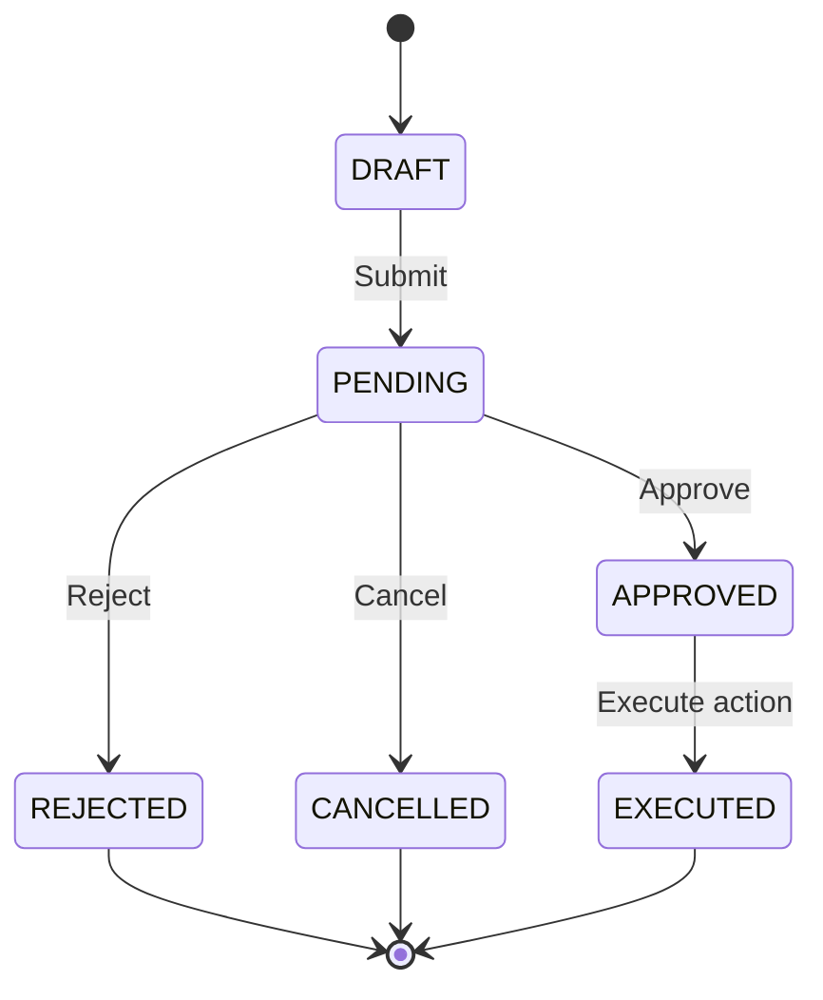

# Giai đoạn 2 – Game hóa, leaderboard cá nhân, dashboard và workflow vận hành nâng cao cho dự án “Lá Dự Đoán”


## Quy ước tỷ lệ ăn kiểu Việt Nam

Tài liệu này dùng cách ghi phổ biến ở Việt Nam: **line + ăn + hệ số lãi**. Ví dụ `Home -0.5 ăn 0.90` nghĩa là đặt 100 lá, thắng đủ nhận 190 lá, gồm 100 lá vốn + 90 lá lãi.

Quy ước kỹ thuật:

```text
profit_rate = tỷ lệ ăn / hệ số lãi
decimal_odds = 1 + profit_rate
gross_payout_full_win = stake * (1 + profit_rate)
net_profit_full_win = stake * profit_rate
```


> Phiên bản: 1.0  
> Phạm vi: Giai đoạn 2 sau MVP  
> Công nghệ định hướng: Laravel + Filament + PostgreSQL + Redis  
> Đơn vị điểm: `lá`  
> Ghi chú quan trọng: **Giai đoạn 2 bỏ hoàn toàn module phòng ban / team / department leaderboard vì không quan trọng với sản phẩm hiện tại.**

---

## 1. Mục tiêu của tài liệu

Tài liệu này mô tả chi tiết **Giai đoạn 2** của dự án “Lá Dự Đoán” sau khi Giai đoạn 1 – MVP đã hoàn thành.

Giai đoạn 1 tập trung vào phần lõi:

- User login.
- Admin tạo user.
- Admin cấp lá.
- Seed lịch World Cup 2026.
- Tạo trận.
- Tạo market.
- Nhập tỷ lệ ăn.
- User đặt dự đoán bằng lá.
- Khóa market theo thời gian.
- Admin nhập kết quả.
- Preview settlement.
- Execute settlement.
- Leaderboard cơ bản.
- Wallet ledger.
- Audit log.

Giai đoạn 2 tập trung vào:

- Game hóa trải nghiệm người chơi.
- Leaderboard cá nhân nâng cao.
- Thống kê cá nhân.
- Huy hiệu / thành tựu.
- Nhiệm vụ tuần / vòng đấu.
- Thông báo.
- Dashboard quản trị.
- Workflow approval / correction rõ hơn.
- Báo cáo vận hành.
- Tối ưu quy trình admin nhập tỷ lệ ăn, khóa market và settlement.
- Nâng cấp UX để hệ thống có thể chạy ổn định trong thời gian World Cup 2026.

---

## 2. Nguyên tắc quan trọng của Giai đoạn 2

## 2.1. Không mở rộng thành nền tảng cá cược thương mại

Hệ thống vẫn phải giữ định vị:

```text
Game dự đoán bóng đá nội bộ bằng điểm ảo "lá".
Lá không có giá trị quy đổi thành tiền, hiện vật hoặc dịch vụ.
```

Không được thêm các tính năng sau:

- Nạp tiền.
- Rút tiền.
- Mua lá.
- Bán lá.
- Chuyển lá giữa user.
- Quy đổi lá thành tiền.
- Quy đổi lá thành quà vật chất theo tỉ lệ cố định.
- Mở đăng ký công khai.
- Cho người ngoài công ty tham gia.
- Tạo link share công khai có thể tham gia.

## 2.2. Bỏ phòng ban

Giai đoạn 2 **không phát triển**:

- Department model.
- Team model.
- Phòng ban leaderboard.
- Đua top theo phòng ban.
- Thống kê theo phòng ban.
- Badge theo phòng ban.
- Nhiệm vụ theo phòng ban.

Lý do:

- Không phải nhu cầu chính.
- Tăng phức tạp nghiệp vụ không cần thiết.
- Dễ phát sinh tranh luận về người thuộc phòng ban nào.
- Không đóng góp trực tiếp cho MVP vận hành World Cup 2026.

Thay thế bằng:

- Leaderboard cá nhân.
- Mini leaderboard theo tuần.
- Mini leaderboard theo vòng đấu.
- Badge cá nhân.
- Mission cá nhân.
- Thống kê cá nhân.

## 2.3. Ưu tiên rules phổ biến, dễ hiểu, dễ vận hành

Các rules Giai đoạn 2 phải đạt 4 tiêu chí:

| Tiêu chí | Diễn giải |
|---|---|
| Dễ hiểu | User đọc là hiểu ngay cách xếp hạng, cách nhận badge, cách tính chỉ số. |
| Dễ kiểm thử | Dev có thể viết unit test rõ ràng. |
| Dễ vận hành | Admin không phải can thiệp thủ công nhiều. |
| Không khuyến khích lạm dụng | Không tạo động lực đặt lá quá mức chỉ để nhận thành tích. |

---

## 3. Định nghĩa Giai đoạn 2

## 3.1. Giai đoạn 2 là gì?

Giai đoạn 2 là lớp mở rộng sau MVP, biến hệ thống từ công cụ đặt dự đoán cơ bản thành một **sản phẩm nội bộ có tính tương tác, cạnh tranh nhẹ và theo dõi thành tích tốt hơn**.

Giai đoạn 2 không thay đổi logic lõi của Giai đoạn 1:

- Vẫn dùng wallet ledger.
- Vẫn dùng tỷ lệ ăn snapshot.
- Vẫn dùng settlement engine.
- Vẫn dùng market locking.
- Vẫn dùng audit log.
- Vẫn tính kèo tỉ số, kèo châu Á, tài/xỉu theo rule đã thống nhất.

Giai đoạn 2 bổ sung các lớp:

- `Statistics Projection` – tính thống kê từ dữ liệu bet/ledger.
- `Leaderboard Snapshot` – chụp bảng xếp hạng theo chu kỳ.
- `Achievement Engine` – xét huy hiệu.
- `Mission Engine` – xét nhiệm vụ.
- `Notification Engine` – thông báo sự kiện.
- `Admin Operation Dashboard` – dashboard vận hành.
- `Approval / Correction Workflow` – kiểm soát thao tác nhạy cảm.

## 3.2. Mục tiêu kinh doanh của Giai đoạn 2

- Tăng mức độ tham gia của user.
- Tạo cảm giác cạnh tranh vui vẻ.
- Giúp user hiểu mình đang chơi tốt hay kém ở loại market nào.
- Giúp admin vận hành ít lỗi hơn.
- Tăng minh bạch với lịch sử thay đổi và báo cáo.
- Chuẩn bị hệ thống đủ tốt để chạy xuyên suốt World Cup 2026.

## 3.3. Mục tiêu kỹ thuật của Giai đoạn 2

- Tách rõ logic thống kê khỏi settlement.
- Không làm chậm settlement vì tính leaderboard trực tiếp quá nặng.
- Có snapshot để xem lại bảng xếp hạng theo ngày/tuần/vòng.
- Có queue xử lý thống kê sau settlement.
- Có notification không chặn luồng chính.
- Có audit đầy đủ cho correction, void và approval.
- Có test case cho rule leaderboard, badge, mission.

---

## 4. Phạm vi Giai đoạn 2

## 4.1. Chức năng nên làm

| Nhóm | Chức năng |
|---|---|
| Leaderboard | Leaderboard cá nhân nâng cao, tuần, vòng đấu, mùa giải. |
| Thống kê cá nhân | ROI, win rate, total stake, exact score wins, streak, market preference. |
| Achievement | Huy hiệu cá nhân theo thành tích. |
| Mission | Nhiệm vụ nhẹ theo tuần/vòng đấu. |
| Notification | Thông báo sắp đóng market, settlement xong, nhận badge, admin cấp lá. |
| Admin Dashboard | Tổng số user, tổng vé, tổng lá khóa, market sắp đóng, market cần settle. |
| Approval | Duyệt settlement/correction/void nhạy cảm. |
| Correction | Quy trình sửa settlement đã chạy, không xóa dữ liệu cũ. |
| Report | Export leaderboard, bets, wallet ledger, settlement. |
| UX | Trang hồ sơ user, trang vé của tôi, trang thành tích, trang lịch sử lá. |
| Tỷ lệ ăn Operations | Template market, bulk import tỷ lệ ăn, duplicate tỷ lệ ăn set. |

## 4.2. Chức năng chưa nên làm trong Giai đoạn 2

| Chức năng | Lý do chưa làm |
|---|---|
| Phòng ban / team leaderboard | User đã yêu cầu bỏ vì không quan trọng. |
| App mobile native | Website responsive đủ cho MVP/Phase 2. |
| Chat trong trận | Tăng moderation, không liên quan logic core. |
| Social feed | Không cần thiết. |
| Public registration | Rủi ro pháp lý và vận hành. |
| Transfer lá giữa user | Dễ lạm dụng, khó audit. |
| Marketplace đổi lá | Rủi ro pháp lý cao. |
| Kèo phức tạp như góc/thẻ/cầu thủ | Tăng dữ liệu settlement thủ công. |
| Tự động lấy tỷ lệ ăn bên thứ ba | Không cần cho nội bộ, tăng phụ thuộc ngoài. |
| Payment | Không phù hợp định vị điểm ảo nội bộ. |

---

## 5. Kiến trúc nghiệp vụ Giai đoạn 2

## 5.1. Luồng tổng thể sau khi Giai đoạn 2 hoàn thành



## 5.2. Các lớp nghiệp vụ mới

| Lớp | Vai trò |
|---|---|
| `UserStatisticsService` | Tính và cập nhật thống kê cá nhân. |
| `LeaderboardService` | Tính ranking theo mùa/tuần/vòng đấu. |
| `LeaderboardSnapshotService` | Lưu snapshot để xem lại lịch sử xếp hạng. |
| `AchievementService` | Xét và cấp huy hiệu. |
| `MissionService` | Tạo, theo dõi, hoàn thành nhiệm vụ. |
| `NotificationService` | Gửi thông báo trong hệ thống/email/push nếu có. |
| `ApprovalService` | Quản lý các thao tác cần duyệt. |
| `CorrectionService` | Tạo bản điều chỉnh settlement có audit. |
| `ReportService` | Xuất báo cáo CSV/XLSX. |

## 5.3. Nguyên tắc thiết kế

Không tính lại mọi thứ trực tiếp trên giao diện.

Nên dùng mô hình:

```text
Dữ liệu gốc: bets, settlements, wallet_ledger
↓
Projection: user_statistics, leaderboard_entries, achievement_progress
↓
Snapshot: leaderboard_snapshots
↓
UI đọc dữ liệu đã tính sẵn
```

Lý do:

- Tránh query nặng.
- Dễ audit.
- Dễ chụp ranking theo thời điểm.
- Dễ hiển thị nhanh khi nhiều user cùng xem.
- Dễ kiểm thử bằng cách rebuild statistics từ dữ liệu gốc.

---

## 6. Rules mặc định đề xuất cho Giai đoạn 2

## 6.1. Rules leaderboard phổ biến và khả thi nhất

Leaderboard chính nên xếp theo **lãi ròng từ dự đoán**, không xếp theo tổng lá hiện có.

### Vì sao không nên xếp theo tổng số lá?

Nếu admin cấp thêm lá cho một số user, tổng số lá hiện có sẽ không còn công bằng.

Ví dụ:

```text
User A khởi đầu 1.000 lá, lời 300 lá → balance 1.300.
User B khởi đầu 1.000 lá, được admin cấp thêm 500 lá, lời 0 → balance 1.500.
```

Nếu xếp theo balance, User B cao hơn User A dù không chơi tốt hơn.

Do đó leaderboard chính nên dùng:

```text
net_profit = tổng lá thắng từ settlement - tổng lá thua từ settlement
```

Không tính vào `net_profit` các giao dịch:

- Admin cấp lá.
- Admin trừ lá.
- Reset mùa.
- Correction kỹ thuật không phải kết quả dự đoán.
- Bonus lá nếu có.

### Công thức đề xuất

```text
net_profit = total_settlement_return - total_staked_on_settled_bets
```

Trong đó:

```text
total_settlement_return = tổng payout từ các bet đã settled
total_staked_on_settled_bets = tổng stake của các bet đã settled
```

Ví dụ:

```text
User đặt 100 lá ăn 0.90 và thắng → payout 190 → profit +90.
User đặt 100 lá và thua → payout 0 → profit -100.
User đặt 100 lá và push → payout 100 → profit 0.
User đặt 100 lá và half win ăn 0.90 → payout 145 → profit +45.
User đặt 100 lá và half lose → payout 50 → profit -50.
```

## 6.2. Leaderboard chính của mùa giải

Tên đề xuất trên UI:

```text
Bảng xếp hạng mùa giải
```

Sắp xếp:

| Ưu tiên | Tiêu chí | Chiều |
|---:|---|---|
| 1 | `net_profit` | Cao đến thấp |
| 2 | `roi` | Cao đến thấp |
| 3 | `exact_score_wins` | Cao đến thấp |
| 4 | `win_rate` | Cao đến thấp |
| 5 | `total_staked` | Cao đến thấp |
| 6 | `last_profit_at` | Người đạt mốc sớm hơn xếp trên |

### Công thức ROI

```text
roi = net_profit / total_staked_on_settled_bets * 100
```

Nếu user chưa có bet settled:

```text
roi = 0
```

hoặc:

```text
roi = null và hiển thị "Chưa đủ dữ liệu"
```

Khuyến nghị hiển thị:

```text
Chưa đủ dữ liệu
```

## 6.3. Leaderboard tuần

Tên đề xuất:

```text
Bảng xếp hạng tuần
```

Một tuần nên tính từ:

```text
Thứ Hai 00:00:00 đến Chủ Nhật 23:59:59 theo giờ Việt Nam
```

Tuy nhiên với World Cup, trận đấu có thể diễn ra rạng sáng, nên nên dùng `settled_at` để tính tuần, không dùng `kickoff_at`.

Rule:

```text
Một bet thuộc leaderboard tuần nào thì dựa vào thời điểm settlement của bet đó.
```

Ưu điểm:

- Dữ liệu chắc chắn đã có kết quả.
- Không bị rối khi trận đá đêm hoặc trận bị hoãn.
- Dễ query.

## 6.4. Leaderboard vòng đấu

Tên đề xuất:

```text
Bảng xếp hạng vòng đấu
```

Vòng đấu nên định nghĩa theo `round_code` của World Cup 2026:

```text
GROUP_STAGE
ROUND_OF_32
ROUND_OF_16
QUARTER_FINAL
SEMI_FINAL
THIRD_PLACE
FINAL
```

Rule:

```text
Một bet thuộc vòng nào thì dựa theo match.round_code.
```

Leaderboard vòng đấu dùng cùng tiêu chí với leaderboard mùa:

```text
net_profit desc
roi desc
exact_score_wins desc
win_rate desc
total_staked desc
```

## 6.5. Leaderboard ROI

ROI leaderboard rất dễ bị méo nếu user chỉ đặt 1 vé may mắn.

Do đó cần điều kiện đủ chuẩn.

Rule phổ biến nên dùng:

```text
User chỉ được xuất hiện trên bảng ROI nếu:
- có ít nhất 10 bet đã settled
- và total_staked_on_settled_bets >= 500 lá
```

Các giá trị này nên cấu hình trong `GameSettings`:

```text
roi_leaderboard_min_bets = 10
roi_leaderboard_min_staked = 500
```

Nếu user chưa đủ điều kiện:

```text
Hiển thị trong profile cá nhân nhưng không đưa vào leaderboard ROI.
```

## 6.6. Leaderboard tỉ số chính xác

Tên đề xuất:

```text
Cao thủ tỉ số
```

Sắp xếp:

| Ưu tiên | Tiêu chí |
|---:|---|
| 1 | Số lần đoán đúng tỉ số chính xác |
| 2 | Net profit từ market tỉ số |
| 3 | ROI market tỉ số |
| 4 | Tổng số bet tỉ số đã settled |

Rule:

```text
Chỉ tính bet thuộc market_type = EXACT_SCORE và status = WON.
```

## 6.7. Leaderboard kèo châu Á

Tên đề xuất:

```text
Cao thủ handicap
```

Rule:

```text
Chỉ tính bet thuộc market_type = ASIAN_HANDICAP.
```

Điều kiện xuất hiện:

```text
Ít nhất 10 bet handicap đã settled.
```

Sắp xếp:

```text
net_profit_from_asian_handicap desc
roi_from_asian_handicap desc
win_rate_from_asian_handicap desc
```

## 6.8. Leaderboard tài/xỉu

Tên đề xuất:

```text
Cao thủ tài xỉu
```

Rule:

```text
Chỉ tính bet thuộc market_type = OVER_UNDER.
```

Điều kiện xuất hiện:

```text
Ít nhất 10 bet tài/xỉu đã settled.
```

Sắp xếp:

```text
net_profit_from_over_under desc
roi_from_over_under desc
win_rate_from_over_under desc
```

## 6.9. Bảng chuỗi thắng

Tên đề xuất:

```text
Chuỗi phong độ
```

Rule phổ biến:

```text
Một bet được tính là thắng trong streak nếu status thuộc:
- WON
- HALF_WON
```

Một bet làm đứt chuỗi nếu status thuộc:

```text
- LOST
- HALF_LOST
```

Một bet không ảnh hưởng chuỗi nếu status thuộc:

```text
- PUSH
- VOIDED
```

### Vì sao HALF_WON tính là thắng?

Vì user có lãi ròng dương.

### Vì sao PUSH không làm đứt chuỗi?

Vì user không thắng cũng không thua.

### Vì sao VOIDED không ảnh hưởng?

Vì market bị hủy do vận hành, không phản ánh năng lực dự đoán.

## 6.10. Bảng comeback

Tên đề xuất:

```text
Comeback tuần
```

Mục đích:

- Tạo động lực cho user đang xếp thấp.
- Không chỉ tập trung vào top mùa.

Rule:

```text
comeback_score = net_profit_current_week - net_profit_previous_week
```

Điều kiện:

```text
User phải có ít nhất 5 bet settled trong tuần hiện tại.
```

Sắp xếp:

```text
comeback_score desc
net_profit_current_week desc
```

---

## 7. Rules achievement / huy hiệu

## 7.1. Nguyên tắc thiết kế achievement

Achievement nên:

- Dễ hiểu.
- Có điều kiện rõ ràng.
- Không khuyến khích đặt lá quá mức.
- Không yêu cầu admin duyệt thủ công.
- Có thể tính tự động sau settlement.
- Không trao quà có giá trị quy đổi.

Achievement không nên dựa quá nhiều vào `total_staked`, vì dễ khuyến khích user đặt nhiều lá chỉ để nhận huy hiệu.

## 7.2. Loại achievement nên có trong Giai đoạn 2

| Nhóm | Ví dụ |
|---|---|
| Thành tích thắng | Thắng 5 vé, thắng 10 vé. |
| Tỉ số chính xác | Đúng tỉ số lần đầu, đúng 3 tỉ số. |
| Chuỗi thắng | Chuỗi thắng 3, 5, 10. |
| ROI | ROI dương sau đủ số vé. |
| Tham gia đều | Có dự đoán ở 5 ngày khác nhau. |
| Vòng đấu | Có bet ở vòng bảng, knockout, chung kết. |
| Comeback | Từ âm sang dương trong tuần. |
| Đa dạng market | Có bet đủ 3 loại: tỉ số, handicap, tài/xỉu. |

## 7.3. Bộ achievement mặc định đề xuất

### 7.3.1. First Prediction

```text
Code: FIRST_PREDICTION
Tên: Vé đầu tiên
Điều kiện: User có bet đầu tiên được đặt thành công.
Thời điểm xét: Sau khi bet placed.
Trao một lần: Có.
```

### 7.3.2. First Win

```text
Code: FIRST_WIN
Tên: Chiến thắng đầu tiên
Điều kiện: User có bet đầu tiên có profit > 0.
Thời điểm xét: Sau settlement.
Trao một lần: Có.
```

### 7.3.3. Exact Score Master I

```text
Code: EXACT_SCORE_MASTER_I
Tên: Bắt đúng tỉ số
Điều kiện: Có ít nhất 1 bet EXACT_SCORE thắng.
Thời điểm xét: Sau settlement.
Trao một lần: Có.
```

### 7.3.4. Exact Score Master II

```text
Code: EXACT_SCORE_MASTER_II
Tên: Chuyên gia tỉ số
Điều kiện: Có ít nhất 3 bet EXACT_SCORE thắng.
Thời điểm xét: Sau settlement.
Trao một lần: Có.
```

### 7.3.5. Streak 3

```text
Code: WIN_STREAK_3
Tên: Chuỗi thắng 3
Điều kiện: current_win_streak >= 3.
Thời điểm xét: Sau settlement.
Trao một lần: Có.
```

### 7.3.6. Streak 5

```text
Code: WIN_STREAK_5
Tên: Chuỗi thắng 5
Điều kiện: current_win_streak >= 5.
Thời điểm xét: Sau settlement.
Trao một lần: Có.
```

### 7.3.7. Positive ROI

```text
Code: POSITIVE_ROI_QUALIFIED
Tên: ROI dương
Điều kiện:
- total_settled_bets >= 10
- total_staked_on_settled_bets >= 500
- roi > 0
Thời điểm xét: Sau settlement.
Trao một lần: Có.
```

### 7.3.8. Market Explorer

```text
Code: MARKET_EXPLORER
Tên: Người chơi đa dạng
Điều kiện:
- Có ít nhất 1 bet settled ở EXACT_SCORE
- Có ít nhất 1 bet settled ở ASIAN_HANDICAP
- Có ít nhất 1 bet settled ở OVER_UNDER
Thời điểm xét: Sau settlement.
Trao một lần: Có.
```

### 7.3.9. Comeback Player

```text
Code: COMEBACK_PLAYER
Tên: Lội ngược dòng
Điều kiện:
- net_profit trước tuần < 0
- net_profit cuối tuần > 0
- trong tuần có ít nhất 5 bet settled
Thời điểm xét: Job cuối tuần.
Trao nhiều lần: Có thể trao mỗi tuần, nhưng mỗi tuần chỉ một lần.
```

### 7.3.10. Final Predictor

```text
Code: FINAL_PREDICTOR
Tên: Có mặt ở chung kết
Điều kiện: Có ít nhất 1 bet ở trận FINAL.
Thời điểm xét: Khi bet placed hoặc sau settlement.
Trao một lần: Có.
```

## 7.4. Rule tránh spam achievement

Một achievement nên có:

```text
is_repeatable = true/false
cooldown_period = null / weekly / daily
max_awards_per_user = null / number
```

Ví dụ:

| Achievement | Repeatable | Cooldown |
|---|---:|---|
| FIRST_WIN | Không | Không |
| WIN_STREAK_5 | Không | Không |
| COMEBACK_PLAYER | Có | Weekly |
| WEEKLY_TOP_1 | Có | Weekly |

## 7.5. Cách lưu achievement

Không nên chỉ lưu text trong user profile.

Nên có bảng:

```text
achievements
user_achievements
```

`achievements`:

```text
id
code
name
description
icon
condition_type
is_repeatable
is_active
created_at
updated_at
```

`user_achievements`:

```text
id
user_id
achievement_id
period_type
period_id
metadata_json
awarded_at
created_at
updated_at
```

---

## 8. Rules mission / nhiệm vụ

## 8.1. Mục tiêu của mission

Mission dùng để tạo mục tiêu ngắn hạn, giúp user quay lại hệ thống thường xuyên hơn.

Mission không nên ép user đặt nhiều lá.

Mission nên ưu tiên:

- Tham gia đều.
- Dự đoán đa dạng.
- Dự đoán có kiểm soát.
- Khám phá market.
- Không all-in.

## 8.2. Loại mission nên có

| Loại | Ví dụ |
|---|---|
| Daily | Hôm nay đặt ít nhất 1 dự đoán trước giờ bóng lăn. |
| Weekly | Tuần này có ít nhất 5 dự đoán settled. |
| Round | Vòng bảng có ít nhất 10 dự đoán. |
| Market | Tuần này thử đủ 3 loại market. |
| Accuracy | Tuần này có ít nhất 3 vé thắng. |
| Safe play | Không đặt quá 50% số lá vào một trận trong tuần. |

## 8.3. Mission không nên có

Không nên tạo mission kiểu:

```text
Đặt tổng cộng 5.000 lá trong tuần.
All-in một trận.
Đặt càng nhiều càng tốt.
Đặt liên tục mọi trận.
```

Lý do:

- Dễ tạo hành vi thiếu kiểm soát.
- Không phù hợp tinh thần vui vẻ nội bộ.
- Làm méo leaderboard.

## 8.4. Bộ mission mặc định đề xuất

### 8.4.1. Daily Check-in Prediction

```text
Code: DAILY_ONE_BET
Tên: Dự đoán trong ngày
Điều kiện: Có ít nhất 1 bet được đặt trong ngày.
Reset: Hằng ngày.
Phần thưởng: Badge tiến độ hoặc điểm mission, không cộng lá nếu muốn an toàn.
```

Khuyến nghị:

```text
Không cộng lá trực tiếp cho mission ở Giai đoạn 2.
```

Nếu cần thưởng, nên dùng:

- Điểm mission riêng.
- Badge.
- Huy hiệu.
- Hiển thị progress.

Không dùng lá để thưởng mission vì sẽ ảnh hưởng leaderboard.

### 8.4.2. Weekly Active Player

```text
Code: WEEKLY_ACTIVE_PLAYER
Tên: Người chơi đều đặn
Điều kiện: Có bet placed ở ít nhất 3 ngày khác nhau trong tuần.
Reset: Weekly.
```

### 8.4.3. Market Explorer Weekly

```text
Code: WEEKLY_MARKET_EXPLORER
Tên: Khám phá đủ kèo
Điều kiện: Trong tuần có ít nhất 1 bet ở mỗi loại:
- EXACT_SCORE
- ASIAN_HANDICAP
- OVER_UNDER
Reset: Weekly.
```

### 8.4.4. Smart Stake

```text
Code: SMART_STAKE
Tên: Chơi có kiểm soát
Điều kiện:
- Trong tuần có ít nhất 5 bet.
- Không có bet nào vượt quá 30% available_balance tại thời điểm đặt.
Reset: Weekly.
```

### 8.4.5. Knockout Participant

```text
Code: KNOCKOUT_PARTICIPANT
Tên: Có mặt vòng knock-out
Điều kiện: Có ít nhất 1 bet ở match.round_code khác GROUP_STAGE.
Reset: Season.
```

## 8.5. Mission reward rule

Phương án phổ biến và an toàn nhất:

```text
Mission chỉ trao badge/progress, không cộng lá.
```

Nếu vẫn muốn thưởng lá, nên dùng rất nhỏ và không tính vào `net_profit`:

```text
Mission reward leaves ghi ledger type = MISSION_BONUS.
Không tính vào leaderboard net_profit.
Không được rút/đổi/quy đổi.
```

Khuyến nghị cho Giai đoạn 2:

```text
Không thưởng lá bằng mission.
Chỉ dùng achievement/badge/progress.
```

---

## 9. Thống kê cá nhân

## 9.1. Trang profile user

Trang profile cá nhân nên có:

- Số lá hiện có.
- Net profit mùa giải.
- ROI.
- Win rate.
- Tổng vé đã đặt.
- Tổng vé đã settled.
- Tổng lá đã đặt.
- Tổng payout đã nhận.
- Tỉ số chính xác đúng.
- Market chơi nhiều nhất.
- Chuỗi thắng hiện tại.
- Chuỗi thắng cao nhất.
- Badge đã nhận.
- Lịch sử vị trí leaderboard.

## 9.2. Chỉ số bắt buộc

| Field | Diễn giải |
|---|---|
| `total_bets` | Tổng số bet đã đặt. |
| `settled_bets` | Tổng bet đã settled. |
| `won_bets` | Bet có profit > 0. |
| `lost_bets` | Bet có profit < 0. |
| `push_bets` | Bet profit = 0 do push. |
| `voided_bets` | Bet bị void. |
| `total_staked` | Tổng stake của bet đã settled. |
| `total_payout` | Tổng payout từ settlement. |
| `net_profit` | total_payout - total_staked. |
| `roi` | net_profit / total_staked * 100. |
| `win_rate` | won_bets / settled_bets * 100. |
| `exact_score_wins` | Số bet tỉ số chính xác thắng. |
| `current_win_streak` | Chuỗi thắng hiện tại. |
| `longest_win_streak` | Chuỗi thắng dài nhất. |

## 9.3. Thống kê theo market

Nên có bảng phụ:

```text
user_market_statistics
```

Mỗi user + market_type có một dòng.

Fields:

```text
id
user_id
market_type
settled_bets
won_bets
lost_bets
push_bets
voided_bets
total_staked
total_payout
net_profit
roi
win_rate
created_at
updated_at
```

Market type:

```text
EXACT_SCORE
ASIAN_HANDICAP
OVER_UNDER
```

## 9.4. Thống kê theo period

Nên có bảng phụ:

```text
user_period_statistics
```

Fields:

```text
id
user_id
period_type
settled_bets
won_bets
lost_bets
total_staked
total_payout
net_profit
roi
win_rate
created_at
updated_at
```

Period type:

```text
FULL_TIME
FIRST_HALF
SECOND_HALF
EXTRA_TIME
PENALTY
```

## 9.5. Cách cập nhật thống kê

Không nên tính lại toàn bộ thống kê mỗi lần load trang.

Phương án phổ biến:

```text
Sau khi settlement xong:
- Dispatch job UpdateUserStatisticsJob cho từng user bị ảnh hưởng.
- Dispatch job RebuildLeaderboardJob cho season/week/round liên quan.
- Dispatch job EvaluateAchievementsJob.
- Dispatch job EvaluateMissionsJob.
```

Có thêm command rebuild toàn bộ:

```bash
php artisan app:rebuild-user-statistics
php artisan app:rebuild-leaderboards
php artisan app:evaluate-achievements
```

---

## 10. Notification / thông báo

## 10.1. Mục tiêu

Notification giúp user không bỏ lỡ:

- Market sắp đóng.
- Vé đã settle.
- Nhận achievement.
- Có leaderboard mới.
- Admin cấp lá.
- Market bị void/correction.

## 10.2. Kênh thông báo Giai đoạn 2

Khuyến nghị MVP Phase 2 chỉ dùng:

```text
In-app notification
Email optional
```

Chưa nên làm:

```text
Zalo OA
SMS
Mobile push native
Telegram bot
Slack bot
```

Lý do:

- Tăng cấu hình ngoài.
- Tăng rủi ro spam.
- Không cần thiết cho giai đoạn 2.

## 10.3. Loại notification nên có

| Code | Khi nào gửi |
|---|---|
| `MARKET_CLOSING_SOON` | Market user quan tâm sắp đóng. |
| `BET_SETTLED` | Vé của user đã có kết quả. |
| `ACHIEVEMENT_UNLOCKED` | User nhận huy hiệu. |
| `WALLET_GRANTED` | Admin cấp lá. |
| `MARKET_VOIDED` | Market có vé của user bị void. |
| `SETTLEMENT_CORRECTED` | Vé của user bị ảnh hưởng bởi correction. |
| `LEADERBOARD_UPDATED` | Có snapshot leaderboard mới. |

## 10.4. Rule tránh spam

Không gửi notification cho mọi market nếu user chưa quan tâm.

Giai đoạn 2 nên dùng rule:

```text
Chỉ gửi MARKET_CLOSING_SOON nếu:
- User đã có bet trong trận đó, hoặc
- User đã đánh dấu follow trận đó, hoặc
- Trận thuộc danh sách nổi bật do admin set.
```

Rule thời gian:

```text
Gửi 1 lần trước khi market đóng 30 phút.
Gửi 1 lần trước khi market đóng 5 phút nếu user đã follow trận nhưng chưa đặt.
```

Nên có user setting:

```text
notify_market_closing = true/false
notify_bet_settled = true/false
notify_achievement = true/false
notify_email = true/false
```

Default:

```text
In-app: bật
Email: tắt hoặc chỉ bật cho admin
```

---

## 11. Admin Dashboard Giai đoạn 2

## 11.1. Mục tiêu

Admin dashboard giúp vận hành nhanh, thấy ngay trạng thái hệ thống.

Không phải dashboard marketing.

Dashboard nên trả lời các câu hỏi:

- Hôm nay có bao nhiêu trận?
- Market nào sắp đóng?
- Market nào đã kết thúc nhưng chưa settle?
- Có bao nhiêu lá đang bị khóa trong bet pending?
- Có settlement nào cần duyệt?
- Có correction nào mới?
- Có lỗi job/queue không?
- User nào đang có vấn đề balance?

## 11.2. Widget nên có

| Widget | Nội dung |
|---|---|
| Today Matches | Danh sách trận hôm nay. |
| Closing Markets | Market sắp đóng trong 60 phút. |
| Pending Settlement | Market đã qua giờ kết thúc nhưng chưa settle. |
| Approval Queue | Settlement/void/correction đang chờ duyệt. |
| Locked Leaves | Tổng lá đang khóa trong pending bets. |
| Bets Today | Số bet đặt hôm nay. |
| Active Users Today | Số user active hôm nay. |
| Queue Health | Số job pending/failed. |
| Audit Alerts | Thao tác nhạy cảm gần nhất. |

## 11.3. Màu cảnh báo

| Trạng thái | Cách hiển thị |
|---|---|
| Market sắp đóng dưới 5 phút | Warning |
| Market quá giờ nhưng chưa locked | Danger |
| Match đã kết thúc nhưng chưa nhập kết quả | Danger |
| Settlement preview quá 30 phút chưa execute | Warning |
| Queue failed jobs > 0 | Danger |
| Wallet âm | Danger |

## 11.4. Không nên hiển thị

Không nên hiển thị các thông tin gây hiểu nhầm như:

```text
Tổng tiền thắng
Doanh thu
Lợi nhuận nhà cái
Tỉ lệ ăn thua tiền
```

Nên dùng wording:

```text
Tổng lá đã đặt
Tổng lá đang khóa
Tổng lá đã hoàn
Tổng vé dự đoán
Tổng lượt tham gia
```

---

## 12. Approval workflow

## 12.1. Mục tiêu

Approval dùng cho thao tác nhạy cảm, tránh một admin nhập sai hoặc tự ý thay đổi kết quả.

Giai đoạn 1 có thể cho settlement execute trực tiếp.

Giai đoạn 2 nên bổ sung approval cho:

- Settlement của trận lớn.
- Void market đã có user đặt.
- Correction settlement đã chạy.
- Trừ lá thủ công số lượng lớn.
- Reset season.
- Unlock market sau khi đã locked.

## 12.2. Rule approval phổ biến

Phương án khả thi:

```text
Thao tác thường: 1 admin thực hiện.
Thao tác nhạy cảm: 1 admin tạo request, 1 admin khác duyệt.
```

Không cho cùng một người vừa tạo vừa duyệt:

```text
approval.created_by != approval.approved_by
```

## 12.3. Các cấp approval

| Loại thao tác | Có cần duyệt? | Ghi chú |
|---|---:|---|
| Tạo match | Không | Audit log đủ. |
| Sửa tên đội trước khi publish | Không | Chưa phát sinh bet. |
| Sửa tỷ lệ ăn khi chưa có bet | Không | Audit log đủ. |
| Sửa tỷ lệ ăn khi đã có bet | Có hoặc tạo tỷ lệ ăn version mới | Không sửa vé cũ. |
| Void market chưa có bet | Không | Audit log đủ. |
| Void market đã có bet | Có | Hoàn lá nhiều user. |
| Settlement market nhỏ | Tùy cấu hình | Có thể auto. |
| Settlement trận knockout/final | Có | Nên duyệt. |
| Correction sau settlement | Có | Bắt buộc. |
| Reset season | Có | Bắt buộc. |
| Admin cấp lá hàng loạt | Có | Nên duyệt nếu số lượng lớn. |

## 12.4. Approval status

```text
DRAFT
PENDING
APPROVED
REJECTED
CANCELLED
EXECUTED
```

Luồng:



## 12.5. Approval payload

Nên lưu payload JSON để biết request muốn thay đổi gì.

Ví dụ correction:

```json
{
  "action": "CORRECT_SETTLEMENT",
  "match_id": 1001,
  "market_id": 5001,
  "old_result": {
    "home_score": 2,
    "away_score": 1
  },
  "new_result": {
    "home_score": 1,
    "away_score": 1
  },
  "reason": "Admin nhập nhầm tỉ số full-time"
}
```

---

## 13. Correction workflow nâng cao

## 13.1. Nguyên tắc

Không sửa/xóa settlement cũ.

Phải tạo correction transaction.

Luồng chuẩn:

```text
Settlement cũ giữ nguyên.
Tính lại kết quả đúng.
Tính phần chênh lệch cần cộng/trừ.
Ghi ledger correction.
Ghi audit log.
Cập nhật bet status nếu cần.
Cập nhật statistics/leaderboard.
Thông báo user bị ảnh hưởng.
```

## 13.2. Ví dụ correction

Ban đầu:

```text
User đặt 100 lá Team A -0.5 ăn 0.90.
Admin nhập sai kết quả A thắng 1-0.
Settlement: user thắng, payout 190, profit +90.
```

Sau đó phát hiện đúng là:

```text
A hòa 1-1.
Bet phải thua, payout đúng = 0, profit đúng = -100.
```

Chênh lệch:

```text
payout_cũ = 190
payout_mới = 0
correction_delta = payout_mới - payout_cũ = -190
```

Ledger cần ghi:

```text
type = SETTLEMENT_CORRECTION
amount = -190
reason = Correction do nhập sai tỉ số
```

## 13.3. Rule khi user không đủ lá để trừ correction

Trường hợp user đã dùng lá thắng sai để đặt tiếp, correction có thể làm balance không đủ.

Có 3 phương án:

### Phương án A – Cho âm kỹ thuật

```text
Cho balance âm do correction.
Không cho user đặt tiếp cho đến khi balance >= min_stake.
```

Ưu điểm:

- Chính xác kế toán.
- Không cần admin can thiệp.

Nhược điểm:

- User có thể thấy balance âm.

### Phương án B – Không cho âm, ghi nợ kỹ thuật

```text
Nếu không đủ lá, trừ về 0 và ghi remaining_debt.
Các lần thắng sau sẽ tự bù nợ trước.
```

Ưu điểm:

- User không thấy balance âm.

Nhược điểm:

- Logic phức tạp hơn.

### Phương án C – Admin xử lý thủ công

```text
Không tự correction nếu không đủ balance.
Đưa vào hàng chờ admin xử lý.
```

Ưu điểm:

- Kiểm soát cao.

Nhược điểm:

- Vận hành thủ công nhiều.

### Khuyến nghị Giai đoạn 2

Dùng phương án A:

```text
Cho âm kỹ thuật chỉ với ledger type = SETTLEMENT_CORRECTION.
Không cho user đặt mới nếu available_balance < min_stake.
Hiển thị lý do rõ trong lịch sử lá.
```

Vì đây là hệ thống điểm ảo nội bộ, phương án này đơn giản và minh bạch nhất.

---

## 14. Tỷ lệ ăn operations nâng cao

## 14.1. Mục tiêu

Giai đoạn 1 admin nhập tỷ lệ ăn thủ công từng market.

Giai đoạn 2 cần giảm thời gian nhập liệu.

## 14.2. Tính năng nên có

| Tính năng | Diễn giải |
|---|---|
| Market template | Tạo bộ outcome mẫu cho tỉ số/kèo/tài xỉu. |
| Duplicate market | Copy market từ trận trước sang trận mới. |
| Bulk tỷ lệ ăn edit | Chỉnh tỷ lệ ăn hàng loạt trong bảng. |
| CSV import tỷ lệ ăn | Import tỷ lệ ăn theo match_code. |
| Tỷ lệ ăn version note | Ghi lý do đổi tỷ lệ ăn. |
| Lock tỷ lệ ăn after bet | Có bet rồi thì không sửa tỷ lệ ăn snapshot của vé cũ. |

## 14.3. Market template đề xuất

### Template exact score full-time

```text
0-0
1-0
0-1
1-1
2-0
0-2
2-1
1-2
2-2
3-0
0-3
3-1
1-3
3-2
2-3
3-3
```

Không nên thêm quá nhiều tỉ số ở Giai đoạn 2 vì làm admin nhập tỷ lệ ăn nhiều.

### Template Asian handicap

```text
Home 0
Away 0
Home -0.25 / Away +0.25
Home -0.5 / Away +0.5
Home -0.75 / Away +0.75
Home -1.0 / Away +1.0
Home -1.25 / Away +1.25
Home -1.5 / Away +1.5
```

### Template over/under

```text
Over 1.5 / Under 1.5
Over 2.0 / Under 2.0
Over 2.25 / Under 2.25
Over 2.5 / Under 2.5
Over 2.75 / Under 2.75
Over 3.0 / Under 3.0
```

## 14.4. Rule chỉnh tỷ lệ ăn

| Tình huống | Cách xử lý |
|---|---|
| Chưa có bet | Được sửa trực tiếp, ghi audit. |
| Đã có bet | Không sửa outcome cũ. Tạo tỷ lệ ăn version mới. |
| Market đã locked | Không sửa tỷ lệ ăn, trừ khi unlock có approval. |
| Market đã settled | Không sửa tỷ lệ ăn. Chỉ correction nếu logic sai. |

---

## 15. Workflow stage Giai đoạn 2

## Stage 2.1 – Chuẩn hóa dữ liệu sau MVP

### Mục tiêu

Đảm bảo dữ liệu từ Giai đoạn 1 đủ sạch để xây thống kê, leaderboard và achievement.

### Công việc

- Review toàn bộ bảng `bets`.
- Review `wallet_ledger`.
- Review `settlements`.
- Đảm bảo tất cả bet settled có:
  - `stake`
  - `payout`
  - `profit`
  - `market_type`
  - `period_type`
  - `settled_at`
  - `settlement_batch_id`
- Đảm bảo tất cả ledger có:
  - `type`
  - `amount`
  - `balance_before`
  - `balance_after`
  - `reference_type`
  - `reference_id`

### Output

- Migration bổ sung field thiếu nếu có.
- Command kiểm tra dữ liệu bất thường.
- Report dữ liệu lệch.

### Tiêu chí hoàn thành

- Không có bet settled thiếu payout/profit.
- Không có ledger thiếu reference.
- Không có wallet balance lệch so với ledger sum.
- Không có user balance âm trừ trường hợp correction kỹ thuật.

---

## Stage 2.2 – Xây user statistics projection

### Mục tiêu

Tạo bảng thống kê cá nhân đã tính sẵn.

### Công việc

- Tạo bảng `user_statistics`.
- Tạo bảng `user_market_statistics`.
- Tạo bảng `user_period_statistics`.
- Viết service rebuild statistics.
- Viết job update sau settlement.
- Viết command rebuild toàn bộ.

### Output

- Profile user có thống kê.
- Admin xem thống kê từng user.
- Có command rebuild nếu cần.

### Tiêu chí hoàn thành

- Settlement xong thì thống kê user cập nhật tự động.
- Correction xong thì thống kê user cập nhật lại.
- Rebuild statistics từ dữ liệu gốc cho ra kết quả giống projection hiện tại.

---

## Stage 2.3 – Xây leaderboard nâng cao

### Mục tiêu

Tạo leaderboard mùa, tuần, vòng đấu, ROI, tỉ số, handicap, tài/xỉu.

### Công việc

- Tạo bảng `leaderboard_periods`.
- Tạo bảng `leaderboard_entries`.
- Tạo bảng `leaderboard_snapshots`.
- Viết `LeaderboardService`.
- Viết job rebuild leaderboard.
- Tạo UI leaderboard.
- Tạo admin action rebuild leaderboard.

### Output

- User xem leaderboard mùa.
- User xem leaderboard tuần.
- User xem leaderboard vòng đấu.
- User xem leaderboard theo market.

### Tiêu chí hoàn thành

- Ranking đúng theo tie-breaker.
- ROI leaderboard chỉ hiện user đủ điều kiện.
- Snapshot giữ được lịch sử.
- Không có phòng ban/team leaderboard.

---

## Stage 2.4 – Achievement engine

### Mục tiêu

Trao huy hiệu tự động theo thành tích cá nhân.

### Công việc

- Tạo bảng `achievements`.
- Tạo bảng `user_achievements`.
- Seed achievement mặc định.
- Viết `AchievementService`.
- Viết event listener sau bet placed và sau settlement.
- Tạo UI hiển thị badge trong profile.
- Tạo admin page quản lý achievement.

### Output

- User nhận badge tự động.
- User thấy badge trong profile.
- Admin xem ai đã nhận badge nào.

### Tiêu chí hoàn thành

- Không cấp trùng badge không repeatable.
- Repeatable badge có period rõ.
- Achievement không làm thay đổi balance.
- Có notification khi nhận badge.

---

## Stage 2.5 – Mission engine

### Mục tiêu

Tạo nhiệm vụ nhẹ theo ngày/tuần/vòng đấu.

### Công việc

- Tạo bảng `missions`.
- Tạo bảng `user_missions`.
- Tạo bảng `mission_progress_events` nếu cần audit progress.
- Seed mission mặc định.
- Viết `MissionService`.
- Tạo job evaluate mission hằng ngày/tuần.
- Tạo UI mission progress.

### Output

- User thấy mission đang chạy.
- User thấy tiến độ.
- User thấy mission hoàn thành.

### Tiêu chí hoàn thành

- Mission không thưởng lá mặc định.
- Mission reset đúng chu kỳ.
- Mission không khuyến khích đặt quá nhiều lá.
- Có thể bật/tắt mission từ admin.

---

## Stage 2.6 – Notification engine

### Mục tiêu

Thông báo các sự kiện quan trọng trong hệ thống.

### Công việc

- Dùng Laravel Notification.
- Tạo notification in-app.
- Tạo user notification preferences.
- Tạo scheduled job gửi market closing soon.
- Tạo notification sau settlement.
- Tạo notification khi achievement unlock.
- Tạo notification khi correction/void ảnh hưởng user.

### Output

- User có bell notification.
- User nhận thông báo settle.
- User nhận thông báo achievement.
- User nhận thông báo market sắp đóng nếu follow.

### Tiêu chí hoàn thành

- Không spam.
- User có thể tắt một số loại thông báo.
- Notification có link về màn hình liên quan.
- Job gửi notification không chặn settlement.

---

## Stage 2.7 – Approval và correction nâng cao

### Mục tiêu

Kiểm soát thao tác nhạy cảm.

### Công việc

- Tạo bảng `approval_requests`.
- Viết `ApprovalService`.
- Tạo UI request approval.
- Tạo UI approve/reject.
- Tạo `CorrectionService`.
- Tạo ledger correction.
- Tạo notification cho user bị ảnh hưởng.

### Output

- Void market đã có bet cần duyệt.
- Correction settlement cần duyệt.
- Settlement trận knockout/final có thể cấu hình cần duyệt.

### Tiêu chí hoàn thành

- Người tạo không được tự duyệt.
- Request có lý do bắt buộc.
- Correction không xóa settlement cũ.
- Ledger có delta rõ ràng.
- Audit log đầy đủ.

---

## Stage 2.8 – Admin dashboard và report

### Mục tiêu

Admin nắm được trạng thái vận hành ngay trên Filament.

### Công việc

- Tạo dashboard widget.
- Tạo trang report.
- Tạo export leaderboard.
- Tạo export bets.
- Tạo export ledger.
- Tạo export settlement.
- Tạo filter theo season, round, match, user, market type.

### Output

- Admin xem được trạng thái hôm nay.
- Admin export được báo cáo.
- Admin thấy queue/cảnh báo vận hành.

### Tiêu chí hoàn thành

- Export không timeout.
- Filter đúng.
- Không hiển thị wording tiền bạc.
- Dashboard load nhanh.

---

## 16. Database bổ sung cho Giai đoạn 2

## 16.1. `user_statistics`

```text
id
user_id
season_id
total_bets
settled_bets
won_bets
lost_bets
push_bets
voided_bets
total_staked
total_payout
net_profit
roi
win_rate
exact_score_wins
current_win_streak
longest_win_streak
last_bet_at
last_win_at
last_profit_at
created_at
updated_at
```

Unique:

```text
unique(user_id, season_id)
```

## 16.2. `user_market_statistics`

```text
id
user_id
season_id
market_type
settled_bets
won_bets
lost_bets
push_bets
voided_bets
total_staked
total_payout
net_profit
roi
win_rate
created_at
updated_at
```

Unique:

```text
unique(user_id, season_id, market_type)
```

## 16.3. `leaderboard_periods`

```text
id
season_id
period_type
code
name
starts_at
ends_at
status
created_at
updated_at
```

`period_type`:

```text
SEASON
WEEK
ROUND
MARKET_TYPE
```

## 16.4. `leaderboard_entries`

```text
id
leaderboard_period_id
user_id
rank
previous_rank
rank_change
net_profit
roi
win_rate
total_staked
settled_bets
exact_score_wins
metadata_json
calculated_at
created_at
updated_at
```

Unique:

```text
unique(leaderboard_period_id, user_id)
```

## 16.5. `leaderboard_snapshots`

```text
id
leaderboard_period_id
snapshot_at
entries_json
created_at
updated_at
```

## 16.6. `achievements`

```text
id
code
name
description
icon
category
condition_type
condition_json
is_repeatable
is_active
sort_order
created_at
updated_at
```

## 16.7. `user_achievements`

```text
id
user_id
achievement_id
season_id
period_type
period_code
metadata_json
awarded_at
created_at
updated_at
```

## 16.8. `missions`

```text
id
code
name
description
mission_type
period_type
condition_json
starts_at
ends_at
is_active
created_at
updated_at
```

## 16.9. `user_missions`

```text
id
user_id
mission_id
season_id
status
progress_current
progress_target
metadata_json
started_at
completed_at
created_at
updated_at
```

Status:

```text
NOT_STARTED
IN_PROGRESS
COMPLETED
EXPIRED
CANCELLED
```

## 16.10. `approval_requests`

```text
id
action_type
status
requested_by
approved_by
rejected_by
payload_json
reason
review_note
requested_at
reviewed_at
executed_at
created_at
updated_at
```

## 16.11. `user_notification_preferences`

```text
id
user_id
notify_market_closing
notify_bet_settled
notify_achievement
notify_wallet
notify_correction
notify_email
created_at
updated_at
```

---

## 17. Laravel service/module đề xuất

## 17.1. Cấu trúc thư mục

```text
app/
  Domain/
    Statistics/
      Services/
        UserStatisticsService.php
        StatisticsRebuildService.php
      Jobs/
        UpdateUserStatisticsJob.php
        RebuildUserStatisticsJob.php

    Leaderboard/
      Services/
        LeaderboardService.php
        LeaderboardSnapshotService.php
      Jobs/
        RebuildLeaderboardJob.php
        SnapshotLeaderboardJob.php

    Achievement/
      Services/
        AchievementService.php
      Jobs/
        EvaluateAchievementsJob.php
      Events/
        AchievementUnlocked.php

    Mission/
      Services/
        MissionService.php
      Jobs/
        EvaluateMissionsJob.php

    Notification/
      Services/
        GameNotificationService.php
      Notifications/
        BetSettledNotification.php
        AchievementUnlockedNotification.php
        MarketClosingSoonNotification.php

    Approval/
      Services/
        ApprovalService.php
        CorrectionService.php
```

## 17.2. Events nên phát ra

```text
BetPlaced
MarketLocked
SettlementPreviewCreated
SettlementExecuted
SettlementCorrected
MarketVoided
WalletGranted
AchievementUnlocked
MissionCompleted
LeaderboardUpdated
```

## 17.3. Jobs nên chạy queue

```text
UpdateUserStatisticsJob
RebuildLeaderboardJob
EvaluateAchievementsJob
EvaluateMissionsJob
SendBetSettledNotificationJob
SendMarketClosingSoonNotificationJob
SnapshotLeaderboardJob
ExportReportJob
```

## 17.4. Commands nên có

```bash
php artisan app:rebuild-user-statistics
php artisan app:rebuild-leaderboards
php artisan app:evaluate-achievements
php artisan app:evaluate-missions
php artisan app:snapshot-leaderboards
php artisan app:send-market-closing-notifications
php artisan app:check-wallet-consistency
```

---

## 18. Filament resources/pages Giai đoạn 2

## 18.1. Admin panel

Resources mới:

```text
UserStatisticsResource
LeaderboardPeriodResource
AchievementResource
MissionResource
ApprovalRequestResource
NotificationPreferenceResource
ReportResource
```

Pages mới:

```text
AdminOperationDashboard
LeaderboardDashboard
SettlementCorrectionPage
ApprovalQueuePage
SystemHealthPage
```

Widgets mới:

```text
TodayMatchesWidget
ClosingMarketsWidget
PendingSettlementWidget
ApprovalQueueWidget
LockedLeavesWidget
BetsTodayWidget
ActiveUsersWidget
QueueHealthWidget
AuditAlertsWidget
```

## 18.2. User frontend

Pages nên có:

```text
/home
/matches
/matches/{match}
/my-bets
/my-wallet
/leaderboard
/leaderboard/week
/leaderboard/round
/profile
/profile/achievements
/missions
/notifications
/rules
```

Nếu dùng Filament cho cả user panel, có thể tạo panel riêng:

```text
Admin Panel: /admin
User Panel: /app
```

Khuyến nghị:

```text
Giai đoạn 2 vẫn có thể dùng Filament user panel để tiết kiệm thời gian.
Nếu muốn UI đẹp hơn cho user, dùng Blade + Livewire custom frontend.
```

---

## 19. UX rules cho Giai đoạn 2

## 19.1. Trang leaderboard

Leaderboard cần hiển thị:

```text
Rank
User name
Net profit
ROI
Win rate
Settled bets
Exact score wins
Rank change
```

Không hiển thị:

```text
Department
Team
Phòng ban
```

## 19.2. Profile user

Profile nên có tabs:

```text
Tổng quan
Vé dự đoán
Lịch sử lá
Thống kê
Huy hiệu
Nhiệm vụ
Thông báo
```

## 19.3. Trang match detail

Bổ sung:

- Market sắp đóng.
- User đã đặt bao nhiêu vé ở trận này.
- Tổng lá đang khóa của user trong trận này.
- Trạng thái follow trận.
- Nút follow/unfollow.
- Notification countdown.

## 19.4. Trang “Vé của tôi”

Filter:

```text
Pending
Won
Lost
Push
Half won
Half lost
Voided
Corrected
```

Hiển thị:

```text
Trận
Market
Lựa chọn
Stake
Tỷ lệ ăn snapshot
Payout
Profit
Status
Placed at
Settled at
```

---

## 20. Report Giai đoạn 2

## 20.1. Report cho admin

| Report | Nội dung |
|---|---|
| Leaderboard Report | Ranking theo mùa/tuần/vòng. |
| User Performance Report | Thống kê từng user. |
| Bet Report | Toàn bộ vé theo filter. |
| Wallet Ledger Report | Lịch sử lá. |
| Settlement Report | Kết quả settlement theo market. |
| Correction Report | Lịch sử correction. |
| Audit Report | Lịch sử thao tác admin. |

## 20.2. Export format

Giai đoạn 2 nên hỗ trợ:

```text
CSV
XLSX nếu đã cài Laravel Excel
```

Rule:

```text
Export lớn phải chạy queue.
Không export trực tiếp trên request nếu dữ liệu nhiều.
```

## 20.3. Report không nên có

Không dùng thuật ngữ:

```text
Doanh thu
Lợi nhuận nhà cái
Tiền cược
Tiền thắng
Tổng tiền thua
```

Dùng:

```text
Tổng lá đặt
Tổng payout lá
Net profit theo user
Tổng vé
Lượt tham gia
```

---

## 21. Security và anti-abuse Giai đoạn 2

## 21.1. Admin có được chơi không?

Phương án phổ biến và an toàn:

```text
Admin có quyền xem tỷ lệ ăn/settlement/correction không nên tham gia leaderboard.
```

Có 2 cách:

### Cách A – Admin không được đặt dự đoán

```text
Role admin không có quyền tạo bet.
```

Ưu điểm:

- Minh bạch nhất.
- Ít tranh cãi.

Nhược điểm:

- Nếu admin cũng muốn chơi thì phải có tài khoản user riêng.

### Cách B – Admin được chơi nhưng bị loại khỏi leaderboard

```text
Admin có thể đặt bet nhưng is_competitive = false.
```

Ưu điểm:

- Admin vẫn test được hệ thống.

Nhược điểm:

- Dễ gây hiểu nhầm.

### Khuyến nghị

Dùng cách A:

```text
Tài khoản admin không được đặt dự đoán.
Nếu admin muốn chơi, tạo tài khoản user riêng không có quyền admin.
```

## 21.2. Không cho sửa bet sau khi đặt

Giai đoạn 2 vẫn nên giữ rule của MVP:

```text
Bet đã xác nhận thì không được sửa/hủy bởi user.
```

Lý do:

- Đơn giản.
- Tránh lợi dụng biến động tỷ lệ ăn.
- Dễ audit.

Nếu user nhập nhầm:

```text
Không xử lý hoàn thủ công, trừ lỗi hệ thống.
```

## 21.3. Rate limit

Nên giới hạn:

```text
Tối đa 10 request đặt bet / phút / user.
Tối đa 5 lần submit sai validation / phút / user.
Tối đa 3 lần login fail / 5 phút.
```

## 21.4. Audit bắt buộc

Log các hành động:

```text
Admin tạo/sửa/xóa/publish match
Admin tạo/sửa tỷ lệ ăn
Admin lock/unlock market
Admin nhập result
Admin preview settlement
Admin execute settlement
Admin void market
Admin correction settlement
Admin grant/deduct leaves
Admin approve/reject request
User đặt bet
User follow/unfollow match
```

---

## 22. Performance và queue

## 22.1. Nguyên tắc

Settlement là thao tác quan trọng nhất.

Không nên để các việc sau chạy đồng bộ trong transaction settlement:

- Rebuild leaderboard toàn bộ.
- Gửi notification hàng loạt.
- Evaluate tất cả achievement.
- Export report.

Settlement transaction chỉ nên làm:

```text
Lock bet rows.
Tính payout/profit.
Ghi ledger.
Update wallet.
Update bet status.
Mark settlement executed.
Commit transaction.
```

Sau commit mới dispatch jobs:

```text
Update statistics.
Rebuild leaderboard.
Evaluate achievement.
Evaluate mission.
Send notification.
```

## 22.2. Queue đề xuất

```text
high: settlement-related follow-up
notifications: gửi thông báo
reports: export file
default: các job thường
low: snapshot/rebuild định kỳ
```

## 22.3. Cache

Có thể cache:

```text
Leaderboard top 100
User rank current season
Today matches
Closing markets
System settings
```

TTL đề xuất:

```text
Leaderboard: 60 giây
Today matches: 60 giây
System settings: 300 giây hoặc cache forever + clear khi update
```

---

## 23. Testing Giai đoạn 2

## 23.1. Test leaderboard

Các test case bắt buộc:

```text
User có net_profit cao hơn xếp trên.
Nếu net_profit bằng nhau, ROI cao hơn xếp trên.
Nếu ROI bằng nhau, exact_score_wins cao hơn xếp trên.
Admin-granted leaves không tính vào net_profit.
Mission bonus leaves nếu có không tính vào net_profit.
User chưa đủ min bets không hiện trong ROI leaderboard.
Weekly leaderboard tính theo settled_at.
Round leaderboard tính theo match.round_code.
Correction làm leaderboard cập nhật lại.
Void market không làm thay đổi net_profit.
```

## 23.2. Test achievement

```text
FIRST_PREDICTION cấp khi đặt bet đầu tiên.
FIRST_WIN cấp sau bet đầu tiên profit > 0.
EXACT_SCORE_MASTER_I cấp khi thắng exact score lần đầu.
WIN_STREAK_3 cấp khi có 3 bet thắng liên tiếp.
PUSH không làm đứt chuỗi thắng.
VOIDED không làm đứt chuỗi thắng.
HALF_WON tính là thắng trong streak.
HALF_LOST làm đứt streak.
Achievement không repeatable không bị cấp trùng.
Repeatable achievement chỉ cấp một lần mỗi period.
```

## 23.3. Test mission

```text
Daily mission reset đúng ngày.
Weekly mission reset đúng tuần.
Market explorer hoàn thành khi có đủ 3 market type.
Smart stake fail nếu có bet vượt 30% available_balance.
Mission không cộng lá nếu setting reward disabled.
Mission expired nếu hết period mà chưa hoàn thành.
```

## 23.4. Test notification

```text
Bet settled gửi notification đúng user.
Market closing soon chỉ gửi cho user follow hoặc có bet liên quan.
Không gửi duplicate notification cùng market/time window.
User tắt notify thì không gửi.
Correction gửi notification cho user bị ảnh hưởng.
Achievement unlock gửi notification một lần.
```

## 23.5. Test approval/correction

```text
Người tạo request không được tự duyệt.
Reject không execute action.
Approve nhưng chưa execute thì chưa thay đổi dữ liệu.
Correction tạo ledger delta đúng.
Correction có thể làm balance âm kỹ thuật.
User balance âm không được đặt bet mới.
Correction rebuild statistics đúng.
Correction rebuild leaderboard đúng.
```

---

## 24. Checklist nghiệm thu Giai đoạn 2

## 24.1. Leaderboard

- [ ] Có leaderboard mùa.
- [ ] Có leaderboard tuần.
- [ ] Có leaderboard vòng đấu.
- [ ] Có leaderboard ROI có điều kiện min bet/min stake.
- [ ] Có leaderboard tỉ số chính xác.
- [ ] Có leaderboard handicap.
- [ ] Có leaderboard tài/xỉu.
- [ ] Có rank change.
- [ ] Có snapshot.
- [ ] Không có phòng ban/team leaderboard.

## 24.2. Profile user

- [ ] User xem được thống kê tổng quan.
- [ ] User xem được thống kê theo market.
- [ ] User xem được thống kê theo period.
- [ ] User xem được badge.
- [ ] User xem được mission.
- [ ] User xem được lịch sử lá.
- [ ] User xem được vị trí leaderboard.

## 24.3. Achievement

- [ ] Seed được achievement mặc định.
- [ ] Tự cấp achievement sau bet placed.
- [ ] Tự cấp achievement sau settlement.
- [ ] Không cấp trùng achievement không repeatable.
- [ ] Có notification khi nhận badge.

## 24.4. Mission

- [ ] Seed được mission mặc định.
- [ ] User thấy mission đang chạy.
- [ ] Mission progress cập nhật đúng.
- [ ] Mission hoàn thành đúng rule.
- [ ] Mission không cộng lá mặc định.

## 24.5. Notification

- [ ] Có in-app notification.
- [ ] Có notification settlement.
- [ ] Có notification achievement.
- [ ] Có notification correction.
- [ ] Có notification market closing soon.
- [ ] User có thể tắt/bật loại notification.

## 24.6. Admin dashboard

- [ ] Có widget trận hôm nay.
- [ ] Có widget market sắp đóng.
- [ ] Có widget pending settlement.
- [ ] Có widget approval queue.
- [ ] Có widget locked leaves.
- [ ] Có widget queue health.

## 24.7. Approval/correction

- [ ] Void market có bet cần approval.
- [ ] Correction cần approval.
- [ ] Người tạo không được tự duyệt.
- [ ] Correction không xóa settlement cũ.
- [ ] Ledger correction đúng.
- [ ] User bị ảnh hưởng nhận notification.

## 24.8. Report

- [ ] Export leaderboard.
- [ ] Export user performance.
- [ ] Export bets.
- [ ] Export wallet ledger.
- [ ] Export settlement.
- [ ] Export correction.

---

## 25. Các bước đầu để bắt đầu Giai đoạn 2

## Bước 1 – Freeze rules Giai đoạn 2

Chốt các rule sau trước khi code:

```text
Primary leaderboard ranking: net_profit
Tie-breaker: ROI, exact_score_wins, win_rate, total_staked, last_profit_at
ROI min bets: 10
ROI min stake: 500 lá
Mission reward: không cộng lá
Admin account: không được đặt dự đoán
Correction negative balance: cho âm kỹ thuật
Notification email: optional/tắt mặc định
```

## Bước 2 – Tạo branch và migration

```bash
git checkout -b phase-2-gamification
php artisan make:migration create_user_statistics_table
php artisan make:migration create_user_market_statistics_table
php artisan make:migration create_leaderboard_periods_table
php artisan make:migration create_leaderboard_entries_table
php artisan make:migration create_achievements_table
php artisan make:migration create_user_achievements_table
php artisan make:migration create_missions_table
php artisan make:migration create_user_missions_table
php artisan make:migration create_approval_requests_table
php artisan make:migration create_user_notification_preferences_table
```

## Bước 3 – Viết Statistics Service trước

Thứ tự ưu tiên:

```text
1. UserStatisticsService
2. UserMarketStatisticsService
3. UserPeriodStatisticsService
4. RebuildUserStatisticsCommand
```

Lý do:

```text
Leaderboard, achievement và mission đều phụ thuộc vào statistics.
```

## Bước 4 – Viết Leaderboard Service

Sau khi statistics ổn định, viết:

```text
LeaderboardService
LeaderboardSnapshotService
RebuildLeaderboardJob
```

## Bước 5 – Viết Achievement Engine

Sau khi leaderboard/statistics ổn định:

```text
AchievementService
EvaluateAchievementsJob
AchievementUnlockedNotification
```

## Bước 6 – Viết Mission Engine

Sau achievement:

```text
MissionService
EvaluateMissionsJob
Mission UI
```

## Bước 7 – Viết Notification Engine

Sau khi các event ổn định:

```text
BetSettledNotification
AchievementUnlockedNotification
MarketClosingSoonNotification
CorrectionNotification
```

## Bước 8 – Viết Approval/Correction

Phần này nhạy cảm, nên làm sau khi statistics/leaderboard có command rebuild.

```text
ApprovalService
CorrectionService
ApprovalRequestResource
Correction UI
```

## Bước 9 – Admin dashboard và report

Cuối cùng thêm:

```text
Dashboard widgets
Export actions
System health page
```

---

## 26. Thứ tự ưu tiên triển khai thực tế

Nếu nguồn lực dev hạn chế, nên làm theo thứ tự:

```text
1. User statistics
2. Leaderboard nâng cao
3. Achievement
4. Notification settlement/achievement
5. Admin dashboard
6. Mission
7. Approval/correction nâng cao
8. Report/export nâng cao
```

Nếu chuẩn bị chạy World Cup thật, ưu tiên:

```text
1. User statistics
2. Leaderboard
3. Admin dashboard
4. Approval/correction
5. Notification
6. Achievement
7. Mission
```

Lý do:

- Leaderboard và admin dashboard ảnh hưởng vận hành trực tiếp.
- Approval/correction giảm rủi ro sai kết quả.
- Achievement/mission tăng vui nhưng không thiết yếu bằng vận hành.

---

## 27. Kết luận Giai đoạn 2

Giai đoạn 2 không nên mở rộng quá nhiều loại kèo.

Trọng tâm đúng là:

```text
Làm hệ thống vui hơn, minh bạch hơn, dễ vận hành hơn, ít lỗi hơn.
```

Bộ tính năng nên làm:

- Leaderboard cá nhân nâng cao.
- Thống kê cá nhân.
- Huy hiệu.
- Nhiệm vụ nhẹ.
- Notification.
- Admin dashboard.
- Approval/correction.
- Report/export.

Bộ tính năng cần loại bỏ:

- Phòng ban.
- Team leaderboard.
- Chuyển lá.
- Quy đổi thưởng.
- Public registration.
- Kèo quá phức tạp.

Rule khả thi và phổ biến nhất cho Giai đoạn 2:

```text
Leaderboard chính xếp theo net_profit.
ROI leaderboard cần điều kiện min bet/min stake.
Achievement không cộng lá.
Mission không cộng lá.
Admin account không được đặt dự đoán.
Correction không xóa dữ liệu cũ, chỉ tạo ledger delta.
Notification in-app là mặc định, email là optional.
```