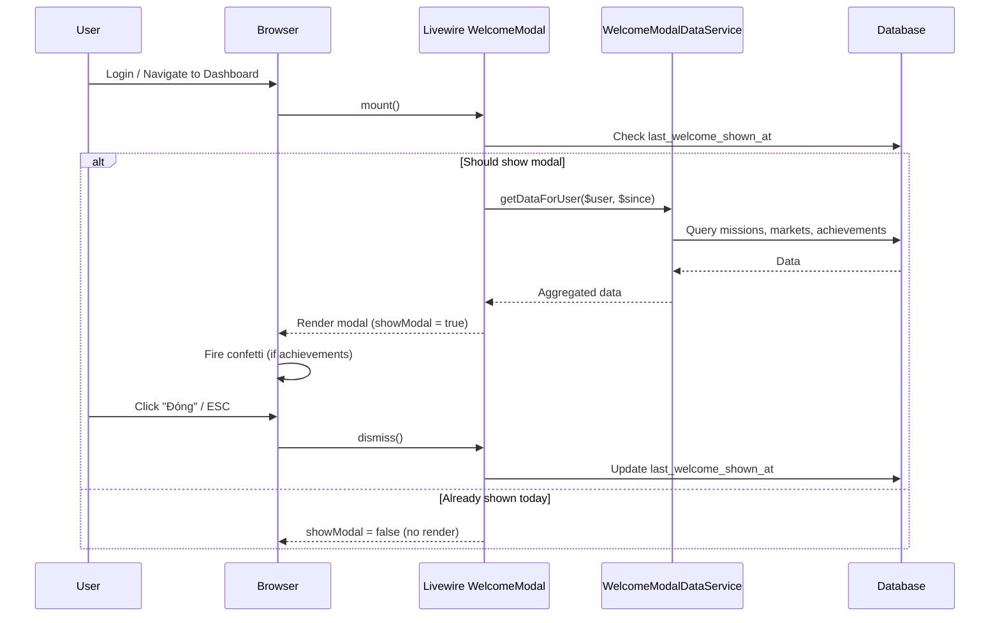

# Daily Login Welcome Modal – Feature Specification

## 1. Mục tiêu

Tạo trải nghiệm **"chào mừng mỗi ngày"** khi người chơi đăng nhập lần đầu trong ngày hoặc sau khoảng thời gian idle nhất định, bằng một **modal popup** tổng hợp:

- Nhiệm vụ ngày/tuần đang diễn ra + tiến độ.
- Các trận / market đang mở.
- Thành tựu mới đạt được (kèm hiệu ứng celebration).
- Nhiệm vụ hoàn thành (kèm hiệu ứng pháo hoa / confetti).
- Tin tức / thông báo nổi bật từ admin (optional).

---

## 2. Điều kiện kích hoạt

### 2.1. Login lần đầu trong ngày

```text
Trigger khi: Carbon::parse($user->last_welcome_shown_at)->isToday() === false
```

### 2.2. Sau khoảng thời gian idle (configurable)

```text
Trigger khi: now()->diffInHours($user->last_welcome_shown_at) >= welcome_modal_cooldown_hours
```

### 2.3. Cấu hình trong GameSettings (spatie/laravel-settings)

| Setting | Type | Default | Mô tả |
|---|---|---|---|
| `welcome_modal_enabled` | bool | true | Bật/tắt modal toàn hệ thống |
| `welcome_modal_cooldown_hours` | int | 12 | Khoảng thời gian tối thiểu giữa 2 lần hiển thị |
| `welcome_modal_show_missions` | bool | true | Hiển thị section nhiệm vụ |
| `welcome_modal_show_matches` | bool | true | Hiển thị section trận đang mở |
| `welcome_modal_show_achievements` | bool | true | Hiển thị section thành tựu |
| `welcome_modal_max_matches` | int | 5 | Số trận đang mở tối đa hiển thị |
| `welcome_modal_max_achievements` | int | 3 | Số thành tựu mới tối đa hiển thị |

### 2.4. Người dùng tự tắt

User có thể tick checkbox **"Không hiển thị lại hôm nay"** ở footer modal. Giá trị lưu vào `last_welcome_shown_at` = now(), khiến modal không hiện lại trong ngày.

---

## 3. Nội dung Modal

Modal chia thành **các section dạng tab slide** hoặc **scrollable card stack**, tuỳ viewport.

### 3.1. Section 1 – Lời chào & Tóm tắt

```text
┌─────────────────────────────────────────────┐
│  🌟 Chào [Tên user]!                        │
│  Hôm nay là ngày thi đấu thứ [X] của WC2026│
│                                              │
│  Số lá hiện có: 12,500 lá                   │
│  Lãi ròng mùa giải: +2,300 lá               │
│  Hạng hiện tại: #5                           │
│  Chuỗi thắng: 3 🔥                          │
└─────────────────────────────────────────────┘
```

**Dữ liệu cần:** `Wallet`, `UserStatistic`, `LeaderboardSnapshot`.

### 3.2. Section 2 – Nhiệm vụ ngày/tuần

Hiển thị tối đa 5 nhiệm vụ active, ưu tiên:
1. Nhiệm vụ **sắp hoàn thành** (progress >= 70%).
2. Nhiệm vụ **daily** (ưu tiên hơn weekly).
3. Nhiệm vụ **chưa bắt đầu**.

```text
┌─────────────────────────────────────────────┐
│  📋 Nhiệm Vụ Hôm Nay                       │
│                                              │
│  ✅ Dự đoán trong ngày      [1/1] 100%  🎉 │
│  ⏳ Khám phá đủ kèo         [2/3]  67%     │
│  ⏳ Người chơi đều đặn       [1/3]  33%     │
│                                              │
│  [Xem tất cả nhiệm vụ →]                    │
└─────────────────────────────────────────────┘
```

**Hiệu ứng:** Nhiệm vụ đã hoàn thành hiển thị với animation shimmer vàng + icon confetti nhỏ.

**Dữ liệu cần:** `Mission`, `UserMission`.

### 3.3. Section 3 – Trận đang mở / Sắp đóng

Hiển thị tối đa `welcome_modal_max_matches` trận có market OPEN, sắp xếp theo `close_at ASC`.

```text
┌─────────────────────────────────────────────┐
│  ⚽ Trận Đang Mở                             │
│                                              │
│  🇧🇷 Brazil vs 🇫🇷 Pháp                      │
│  Đóng kèo trong: 2 giờ 15 phút              │
│  [Dự đoán ngay →]                            │
│                                              │
│  🇦🇷 Argentina vs 🇩🇪 Đức                     │
│  Đóng kèo trong: 5 giờ 30 phút              │
│  [Dự đoán ngay →]                            │
│                                              │
│  [Xem tất cả trận →]                         │
└─────────────────────────────────────────────┘
```

**Hiệu ứng:** Trận đóng kèo trong < 1 giờ có badge đỏ "Sắp đóng" pulse animation.

**Dữ liệu cần:** `Market` (status=OPEN, close_at > now()), `FootballMatch`.

### 3.4. Section 4 – Thành tựu mới đạt được

Chỉ hiển thị nếu có thành tựu mới kể từ `last_welcome_shown_at`.

```text
┌─────────────────────────────────────────────┐
│  🏆 Thành Tựu Mới!                          │
│                                              │
│  [🎖️ Chuỗi thắng 3 — Bậc thầy phong độ]    │
│  [🎖️ Bắt đúng tỉ số — Siêu dự đoán]        │
│                                              │
│  [Xem Con Đường Danh Vọng →]                 │
└─────────────────────────────────────────────┘
```

**Hiệu ứng:**
- **Confetti / pháo hoa** full-screen khi có >= 1 achievement mới.
- Mỗi badge mới có animation **glow pulse** + **scale-in bounce**.
- Âm thanh celebration nhỏ (optional, tắt được).

**Dữ liệu cần:** `UserAchievement` where `awarded_at > last_welcome_shown_at`.

### 3.5. Section 5 – Nhiệm vụ hoàn thành (kèm celebration)

Chỉ hiển thị nếu có mission completed kể từ `last_welcome_shown_at`.

```text
┌─────────────────────────────────────────────┐
│  🎯 Nhiệm Vụ Hoàn Thành!                   │
│                                              │
│  🎉 "Khám phá đủ kèo" — Đã hoàn thành!     │
│     Phần thưởng: 🎖️ Badge Người Chơi Đa Dạng│
│                                              │
│  🎉 "5 vé thắng trong tuần" — Xuất sắc!     │
│     Phần thưởng: 🎖️ Badge Tay Săn Lá Vàng   │
└─────────────────────────────────────────────┘
```

**Hiệu ứng:**
- **Pháo hoa (fireworks)** khi section này xuất hiện.
- Animation **checkmark scale-in** cho mỗi mission.

**Dữ liệu cần:** `UserMission` where `is_completed = true AND completed_at > last_welcome_shown_at`.

---

## 4. Database Changes

### 4.1. Thêm cột vào bảng `users`

```sql
ALTER TABLE users ADD COLUMN last_welcome_shown_at TIMESTAMP NULL;
```

Migration:

```php
Schema::table('users', function (Blueprint $table) {
    $table->timestamp('last_welcome_shown_at')->nullable()->after('last_login_at');
});
```

### 4.2. Thêm settings vào `GameSettings`

```php
// app/Settings/GameSettings.php (hoặc AppSettings.php tuỳ cấu trúc)
public bool $welcome_modal_enabled = true;
public int $welcome_modal_cooldown_hours = 12;
public bool $welcome_modal_show_missions = true;
public bool $welcome_modal_show_matches = true;
public bool $welcome_modal_show_achievements = true;
public int $welcome_modal_max_matches = 5;
public int $welcome_modal_max_achievements = 3;
```

---

## 5. Kiến trúc kỹ thuật

### 5.1. Component Stack

```text
PlayerPanelProvider
  └─ renderHook(BODY_END)
       └─ @livewire('player.welcome-modal')
            └─ Blade view: welcome-modal.blade.php
                 └─ Alpine.js: animation controller
                      └─ canvas-confetti (npm) hoặc CSS animation
```

### 5.2. Livewire Component

```text
File: app/Livewire/Player/WelcomeModal.php
View: resources/views/livewire/player/welcome-modal.blade.php
```

#### Logic trong `mount()`:

```php
public bool $showModal = false;

public function mount(): void
{
    $user = auth()->user();
    $settings = app(AppSettings::class); // hoặc GameSettings

    if (!$settings->welcome_modal_enabled) {
        return;
    }

    $lastShown = $user->last_welcome_shown_at;
    $cooldown = $settings->welcome_modal_cooldown_hours;

    $shouldShow = $lastShown === null
        || !Carbon::parse($lastShown)->isToday()
        || now()->diffInHours(Carbon::parse($lastShown)) >= $cooldown;

    if ($shouldShow) {
        $this->showModal = true;
        $this->loadData();
    }
}
```

#### Method `dismiss()`:

```php
public function dismiss(): void
{
    $this->showModal = false;
    auth()->user()->update(['last_welcome_shown_at' => now()]);
}
```

### 5.3. Data Loading (Service class)

```text
File: app/Services/WelcomeModalDataService.php
```

```php
class WelcomeModalDataService
{
    public function getDataForUser(User $user, ?Carbon $since): array
    {
        return [
            'summary' => $this->getSummary($user),
            'missions' => $this->getActiveMissions($user),
            'completedMissions' => $this->getCompletedMissions($user, $since),
            'openMatches' => $this->getOpenMatches(),
            'newAchievements' => $this->getNewAchievements($user, $since),
        ];
    }
    // ... private methods for each section
}
```

### 5.4. Hiệu ứng Animation

#### Confetti / Pháo hoa

Sử dụng **canvas-confetti** (npm package, 6KB gzipped) hoặc CSS-only animation.

```text
Package: canvas-confetti
Install: npm install canvas-confetti
Import: resources/js/app.js hoặc inline trong blade
```

Alternative CSS-only:

```text
Dùng CSS @keyframes cho particle animation
Không cần npm dependency
Nhẹ hơn nhưng ít đẹp hơn
```

**Khuyến nghị:** Dùng `canvas-confetti` vì lightweight và hiệu ứng đẹp.

#### Trigger hiệu ứng

```javascript
// Alpine.js integration
Alpine.data('welcomeModal', () => ({
    show: @entangle('showModal'),
    hasNewAchievements: @js($hasNewAchievements),
    hasCompletedMissions: @js($hasCompletedMissions),

    init() {
        if (this.show && (this.hasNewAchievements || this.hasCompletedMissions)) {
            this.$nextTick(() => {
                this.fireConfetti();
            });
        }
    },

    fireConfetti() {
        confetti({
            particleCount: 100,
            spread: 70,
            origin: { y: 0.6 },
            colors: ['#FFD700', '#FF6347', '#00CED1', '#FF69B4'],
        });
    },

    dismiss() {
        this.show = false;
        this.$wire.dismiss();
    }
}));
```

#### CSS Animations cho badges/missions

```css
/* Glow pulse cho achievement mới */
@keyframes achievementGlow {
    0%, 100% { box-shadow: 0 0 5px rgba(255, 215, 0, 0.5); }
    50% { box-shadow: 0 0 20px rgba(255, 215, 0, 0.8), 0 0 40px rgba(255, 215, 0, 0.3); }
}

/* Scale-in bounce cho badge */
@keyframes badgeBounceIn {
    0% { transform: scale(0); opacity: 0; }
    50% { transform: scale(1.2); }
    100% { transform: scale(1); opacity: 1; }
}

/* Shimmer cho completed mission */
@keyframes shimmer {
    0% { background-position: -200% 0; }
    100% { background-position: 200% 0; }
}

/* Checkmark draw animation */
@keyframes checkDraw {
    0% { stroke-dashoffset: 100; }
    100% { stroke-dashoffset: 0; }
}
```

---

## 6. UI/UX Design

### 6.1. Layout

```text
┌──────────────────────────────────────────────────┐
│  ╔══════════════════════════════════════════════╗ │
│  ║           Modal (max-w-2xl, centered)       ║ │
│  ║                                              ║ │
│  ║  [Header: Chào + Summary Stats]             ║ │
│  ║  ──────────────────────────────────          ║ │
│  ║  [Tab/Scroll: Nhiệm vụ | Trận | Thành tựu] ║ │
│  ║                                              ║ │
│  ║  ──────────────────────────────────          ║ │
│  ║  [Footer: Đóng | Không hiển thị lại]        ║ │
│  ╚══════════════════════════════════════════════╝ │
│                  (Overlay backdrop)               │
└──────────────────────────────────────────────────┘
```

### 6.2. Responsive

| Viewport | Behavior |
|---|---|
| Desktop (>= md) | Modal centered, max-width 640px, scrollable body |
| Mobile (< md) | Full-screen slide-up bottom sheet |

### 6.3. Dark Mode

- Background: `bg-gray-900/95 backdrop-blur-xl`
- Cards: `bg-gray-800/60 border-gray-700/40`
- Text: `text-white`, `text-gray-400`
- Accent: gradient `from-emerald-500 to-teal-400`

### 6.4. Timing

| Event | Duration |
|---|---|
| Modal appear | 300ms fade-in + scale |
| Section stagger | 100ms delay between sections |
| Achievement glow | 2s infinite |
| Badge bounce-in | 500ms per badge, 200ms stagger |
| Confetti burst | 3s duration |
| Auto-dismiss (optional) | Không auto-dismiss, user phải đóng |

---

## 7. Registration trong PlayerPanelProvider

```php
// app/Providers/Filament/PlayerPanelProvider.php

->renderHook(
    PanelsRenderHook::BODY_END,
    fn (): string => Blade::render('
        @livewire(\'player.welcome-modal\')
        {{-- ... existing AFK logout code ... --}}
    ')
)
```

---

## 8. Files cần tạo/sửa

### Tạo mới

| File | Loại | Mô tả |
|---|---|---|
| `app/Livewire/Player/WelcomeModal.php` | Livewire | Component chính |
| `resources/views/livewire/player/welcome-modal.blade.php` | Blade | View cho modal |
| `app/Services/WelcomeModalDataService.php` | Service | Aggregation data |
| `database/migrations/xxxx_add_last_welcome_shown_at_to_users.php` | Migration | Thêm cột tracking |
| `resources/css/components/welcome-modal.css` | CSS | Animation styles |

### Sửa

| File | Thay đổi |
|---|---|
| `app/Providers/Filament/PlayerPanelProvider.php` | Thêm renderHook cho welcome-modal |
| `app/Models/User.php` | Thêm `last_welcome_shown_at` vào `$fillable` + `$casts` |
| `app/Settings/AppSettings.php` | Thêm welcome modal settings |
| `package.json` | Thêm `canvas-confetti` dependency |
| `resources/js/app.js` | Import confetti (nếu dùng npm) |

---

## 9. Performance

### 9.1. Lazy Loading

Modal data chỉ load khi `shouldShow = true`. Nếu user đã xem trong ngày → Livewire component mount nhanh, không query DB.

### 9.2. Caching

```php
// Cache summary data 15 phút
Cache::remember("welcome_modal_{$user->id}", 900, fn () => ...);
```

### 9.3. Query Optimization

- Missions: Đã có index trên `is_active`.
- Markets: Đã có index trên `status` + `close_at`.
- UserAchievements: Query với `awarded_at > $since`, cần index trên `(user_id, awarded_at)`.
- UserMissions: Query với `completed_at > $since`, cần index trên `(user_id, completed_at)`.

### 9.4. Asset Size

| Asset | Size (gzipped) |
|---|---|
| canvas-confetti | ~6 KB |
| CSS animations | ~2 KB |
| Blade template | ~5 KB |

---

## 10. Accessibility

- Modal có `role="dialog"` + `aria-modal="true"`.
- Focus trap khi modal mở.
- ESC key đóng modal.
- Screen reader: Đọc summary text trước.
- Animation: `prefers-reduced-motion` → tắt confetti, giảm animation.

---

## 11. Testing Plan

### Unit Tests

| Test | Mô tả |
|---|---|
| `WelcomeModalDataServiceTest` | Verify data aggregation chính xác |
| `WelcomeModalTriggerTest` | Test trigger conditions (first login, cooldown) |

### Feature Tests

| Test | Mô tả |
|---|---|
| Test modal hiện khi login lần đầu | `last_welcome_shown_at = null` |
| Test modal không hiện khi đã xem hôm nay | `last_welcome_shown_at = today` |
| Test modal hiện sau cooldown | `last_welcome_shown_at = now - cooldown - 1` |
| Test dismiss cập nhật timestamp | Verify `last_welcome_shown_at` updated |
| Test modal tắt khi `welcome_modal_enabled = false` | Verify no render |

### Browser Tests

| Test | Mô tả |
|---|---|
| Confetti fires khi có achievement mới | Visual verification |
| Modal responsive trên mobile | Bottom sheet behavior |
| Dark mode rendering | Color contrast check |

---

## 12. Rollout Plan

### Phase A – MVP Modal (ưu tiên cao)

- [ ] Migration thêm `last_welcome_shown_at`
- [ ] `WelcomeModalDataService`
- [ ] Livewire `WelcomeModal` component (chỉ summary + missions + matches)
- [ ] Register vào `PlayerPanelProvider`
- [ ] CSS animations cơ bản

### Phase B – Celebration Effects (ưu tiên trung bình)

- [ ] Tích hợp `canvas-confetti`
- [ ] Section thành tựu mới + pháo hoa
- [ ] Section nhiệm vụ hoàn thành + checkmark animation
- [ ] Badge glow + bounce-in effects

### Phase C – Polish (ưu tiên thấp)

- [ ] Admin settings UI cho welcome modal config
- [ ] Sound effects (optional, muted by default)
- [ ] A/B test: so sánh engagement có/không modal
- [ ] Analytics: track dismiss rate, click-through rate

---

## 13. Rủi ro & Mitigations

| Rủi ro | Impact | Mitigation |
|---|---|---|
| Modal gây phiền khi user muốn vào nhanh | UX negative | Cho phép dismiss nhanh, "Không hiện lại hôm nay" |
| Animation lag trên thiết bị yếu | Performance | `prefers-reduced-motion` fallback, CSS-only option |
| Query chậm khi có nhiều data | Performance | Cache 15 phút, lazy load |
| Confetti không render trên một số browser | Compatibility | Fallback CSS animation |

---

## 14. Ví dụ Flow



---

## 15. Ghi chú pháp lý

Modal **KHÔNG** hiển thị:
- Nút nạp tiền/mua lá.
- Thông tin quy đổi lá sang giá trị vật chất.
- Link chia sẻ công khai.

Footer modal nên có dòng nhỏ:

```text
Game nội bộ sử dụng điểm ảo, không có giá trị quy đổi.
```
