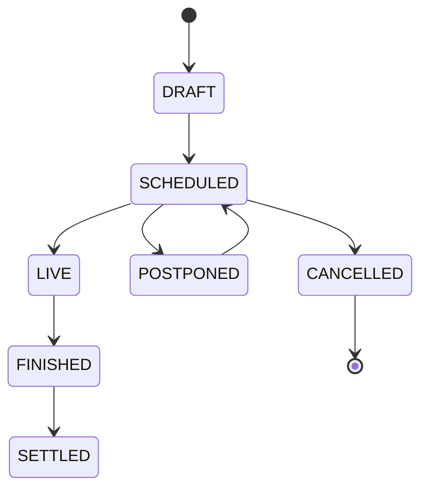
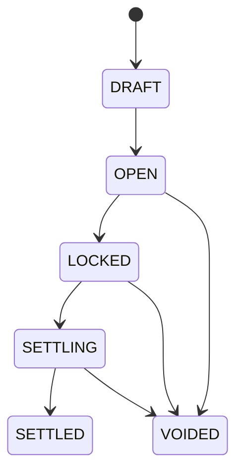
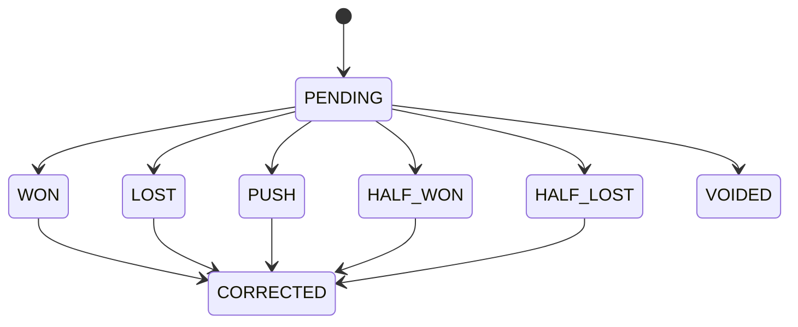

# SRS - Software Requirement Specification

## 1. Mục đích

Tài liệu SRS mô tả yêu cầu hệ thống cho website dự đoán bóng đá nội bộ bằng điểm ảo **lá**. Tài liệu này dùng cho developer, QA, admin vận hành và stakeholder kỹ thuật.

Hệ thống phải đảm bảo 4 nguyên tắc:

1. **Đúng nghiệp vụ**: tính lá chính xác cho tỉ số, handicap châu Á và tài/xỉu.
2. **Không mất dữ liệu**: mọi biến động lá, bet, settlement đều có log.
3. **An toàn vận hành**: chống đặt quá giờ, chống double settlement, chống số dư âm.
4. **Tuân thủ nội bộ**: không nạp/rút/quy đổi/chuyển nhượng lá.

---

## 2. Phạm vi hệ thống

## 2.1. Module chính

| Module | Mô tả |
|---|---|
| Auth | Đăng nhập, đăng xuất, quản lý session |
| User Management | Quản lý user, khóa/mở tài khoản |
| Wallet | Quản lý ví lá, ledger, cấp/trừ lá |
| Season & Fixture | Quản lý mùa giải, lịch WC2026, trận đấu |
| Market | Quản lý loại dự đoán, period, outcome, tỷ lệ ăn |
| Bet Placement | User đặt phiếu dự đoán |
| Market Locking | Tự động/ thủ công khóa market |
| Result Management | Admin nhập kết quả theo period |
| Settlement | Preview và execute settlement |
| Leaderboard | Bảng xếp hạng cá nhân |
| Notification | Thông báo trong hệ thống |
| Audit Log | Ghi lại hành động quan trọng |
| Reports | Export dữ liệu |
| Settings | Cấu hình luật hệ thống |

---

## 3. Actor và quyền tổng quát

| Actor | Mô tả |
|---|---|
| Player | Người chơi nội bộ được admin cấp tài khoản |
| Operator | Admin vận hành trận, market, tỷ lệ ăn, kết quả sơ bộ |
| Settlement Manager | Người xác nhận settlement/correction/void |
| Auditor | Người xem log và báo cáo, không chỉnh sửa |
| Super Admin | Toàn quyền hệ thống |

---

## 4. Functional Requirements

## 4.1. Auth

| ID | Requirement | Priority |
|---|---|---|
| FR-AUTH-001 | Hệ thống phải cho user đăng nhập bằng email/password hoặc tài khoản do admin cấp | Must |
| FR-AUTH-002 | Hệ thống phải cho user đăng xuất | Must |
| FR-AUTH-003 | Hệ thống phải khóa tài khoản inactive/blocked | Must |
| FR-AUTH-004 | Admin nên có 2FA | Should |
| FR-AUTH-005 | Hệ thống phải ghi log login failed nhiều lần | Should |

## 4.2. User Management

| ID | Requirement | Priority |
|---|---|---|
| FR-USER-001 | Admin tạo user mới | Must |
| FR-USER-002 | Admin gán role cho user | Must |
| FR-USER-003 | Admin khóa/mở user | Must |
| FR-USER-004 | Admin reset password | Should |
| FR-USER-005 | Hệ thống không cho xóa cứng user đã có bet/ledger | Must |

## 4.3. Wallet

| ID | Requirement | Priority |
|---|---|---|
| FR-WALLET-001 | Mỗi user có một ví lá theo season | Must |
| FR-WALLET-002 | Ví có `available_balance`, `locked_balance`, `total_balance` | Must |
| FR-WALLET-003 | Admin cấp lá bằng transaction ledger | Must |
| FR-WALLET-004 | Admin trừ lá bằng transaction ledger | Must |
| FR-WALLET-005 | User đặt lá thì available giảm, locked tăng | Must |
| FR-WALLET-006 | Settlement thì locked giảm, available tăng theo payout | Must |
| FR-WALLET-007 | Không cho available âm | Must |
| FR-WALLET-008 | Không cho user chuyển lá cho nhau | Must |

## 4.4. Season & Fixture

| ID | Requirement | Priority |
|---|---|---|
| FR-FIX-001 | Admin tạo season | Must |
| FR-FIX-002 | Admin seed/import lịch WC2026 | Must |
| FR-FIX-003 | Mỗi trận có home team, away team, kickoff, venue, stage | Must |
| FR-FIX-004 | Trận có trạng thái `DRAFT`, `SCHEDULED`, `LIVE`, `FINISHED`, `CANCELLED`, `POSTPONED`, `SETTLED` | Must |
| FR-FIX-005 | User xem lịch trận theo ngày/status | Must |

## 4.5. Market & Outcome

| ID | Requirement | Priority |
|---|---|---|
| FR-MKT-001 | Admin tạo market cho từng match period | Must |
| FR-MKT-002 | Hỗ trợ market type: `EXACT_SCORE`, `ASIAN_HANDICAP`, `OVER_UNDER` | Must |
| FR-MKT-003 | Hỗ trợ period: `FULL_TIME`, `FIRST_HALF`, `SECOND_HALF`, `EXTRA_TIME`, `PENALTY` | Must |
| FR-MKT-004 | Market có `open_at`, `close_at`, `status` | Must |
| FR-MKT-005 | Admin tạo outcome với `profit_rate` theo cách Việt Nam, ví dụ `0.90` cho cách nói “ăn 0.9” | Must |
| FR-MKT-006 | Outcome phải có thông tin đủ để settlement | Must |
| FR-MKT-007 | Market đã có bet thì không được xóa cứng | Must |

## 4.6. Bet Placement

| ID | Requirement | Priority |
|---|---|---|
| FR-BET-001 | User đặt lá khi market đang `OPEN` | Must |
| FR-BET-002 | Hệ thống kiểm tra `current_time < close_at` trong transaction | Must |
| FR-BET-003 | Hệ thống kiểm tra user đủ available balance | Must |
| FR-BET-004 | Hệ thống kiểm tra stake trong giới hạn min/max | Must |
| FR-BET-005 | Hệ thống snapshot tỷ lệ ăn, line, outcome label, period, market type | Must |
| FR-BET-006 | Hệ thống tạo wallet ledger `BET_PLACED` | Must |
| FR-BET-007 | Hệ thống không cho sửa/hủy bet sau khi market locked | Must |
| FR-BET-008 | User xem bet pending/settled/voided | Must |

## 4.7. Result Management

| ID | Requirement | Priority |
|---|---|---|
| FR-RES-001 | Admin nhập kết quả cho từng period | Must |
| FR-RES-002 | Kết quả full-time không bao gồm hiệp phụ/penalty | Must |
| FR-RES-003 | Kết quả second-half là tỉ số riêng hiệp 2, không phải tỉ số chung cuộc | Must |
| FR-RES-004 | Kết quả extra-time là tỉ số riêng hiệp phụ | Must |
| FR-RES-005 | Kết quả penalty là tỉ số loạt sút luân lưu nếu có | Must |
| FR-RES-006 | Sửa kết quả đã settle phải đi qua correction | Must |

## 4.8. Settlement

| ID | Requirement | Priority |
|---|---|---|
| FR-SET-001 | Admin preview settlement trước khi execute | Must |
| FR-SET-002 | Settlement tính exact score | Must |
| FR-SET-003 | Settlement tính Asian handicap | Must |
| FR-SET-004 | Settlement tính Over/Under | Must |
| FR-SET-005 | Settlement hỗ trợ win, lose, push, half_win, half_loss, void | Must |
| FR-SET-006 | Settlement chạy trong transaction | Must |
| FR-SET-007 | Settlement idempotent, không chạy 2 lần cho cùng bet | Must |
| FR-SET-008 | Settlement ghi `settlement_items` cho từng bet | Must |
| FR-SET-009 | Settlement tạo wallet ledger tương ứng | Must |
| FR-SET-010 | Settlement cập nhật leaderboard snapshot | Should |

## 4.9. Leaderboard

| ID | Requirement | Priority |
|---|---|---|
| FR-LB-001 | Leaderboard theo season | Must |
| FR-LB-002 | Sắp xếp mặc định theo `total_balance` hoặc `net_profit` | Must |
| FR-LB-003 | Hiển thị stake total, win rate, ROI, số vé, số lần đúng tỉ số | Should |
| FR-LB-004 | Không có leaderboard phòng ban/team | Must |
| FR-LB-005 | ROI leaderboard phải có điều kiện tối thiểu số bet và stake | Should |

## 4.10. Audit Log

| ID | Requirement | Priority |
|---|---|---|
| FR-AUD-001 | Log admin tạo/sửa/xóa mềm user | Must |
| FR-AUD-002 | Log cấp/trừ lá | Must |
| FR-AUD-003 | Log tạo/sửa tỷ lệ ăn/market | Must |
| FR-AUD-004 | Log nhập kết quả | Must |
| FR-AUD-005 | Log settlement/void/correction | Must |
| FR-AUD-006 | Auditor có thể xem nhưng không chỉnh sửa log | Must |

---

## 5. Non-functional Requirements

| ID | Requirement | Priority |
|---|---|---|
| NFR-001 | Hệ thống phải dùng HTTPS khi deploy thật | Must |
| NFR-002 | Admin action quan trọng phải có permission check | Must |
| NFR-003 | Bet placement phải xử lý concurrency an toàn | Must |
| NFR-004 | Settlement 1.000 bet/market nên hoàn thành trong thời gian chấp nhận được | Should |
| NFR-005 | DB phải backup tự động hàng ngày | Must |
| NFR-006 | Queue worker phải tự restart khi deploy | Should |
| NFR-007 | Log lỗi phải có đủ context | Must |
| NFR-008 | UI phải responsive cho mobile | Should |
| NFR-009 | Hệ thống phải dùng timezone Asia/Ho_Chi_Minh cho hiển thị | Must |
| NFR-010 | Dữ liệu tiền/tỷ lệ ăn phải dùng decimal/integer, không dùng float | Must |

---

## 6. Business Validation Rules

## 6.1. Stake

```text
min_stake <= stake <= max_stake_per_bet
stake <= user.available_balance
stake + user_staked_in_match <= max_stake_per_match
stake + user_staked_today <= max_stake_per_day
```

## 6.2. Market

```text
market.status == OPEN
now < market.close_at
outcome.status == ACTIVE
match.status in [SCHEDULED, LIVE]
```

## 6.3. Tỷ lệ ăn

```text
profit_rate >= 0.01
profit_rate <= configured_max_profit_rate
profit_rate has max 4 decimal places
decimal_odds = 1 + profit_rate
```

Quy ước nhập liệu theo Việt Nam:

```text
Kèo Home -0.5 ăn 0.90 -> line_value = -0.50, profit_rate = 0.90
Đặt 100 lá, thắng đủ -> gross_payout = 100 * (1 + 0.90) = 190
```

## 6.4. Score

```text
home_score >= 0
away_score >= 0
score must be integer
period result cannot be edited after settlement except via correction
```

---

## 7. State machines

## 7.1. Match status



## 7.2. Market status



## 7.3. Bet status



---

## 8. Error handling

| Code | Khi nào xảy ra | Message gợi ý |
|---|---|---|
| E_MARKET_CLOSED | Market đã khóa hoặc quá giờ | Market đã đóng, không thể đặt thêm |
| E_INSUFFICIENT_BALANCE | User không đủ lá | Số lá khả dụng không đủ |
| E_STAKE_LIMIT | Stake vượt giới hạn | Số lá đặt không hợp lệ |
| E_OUTCOME_INACTIVE | Outcome không còn active | Lựa chọn không còn khả dụng |
| E_DOUBLE_SETTLEMENT | Bet/market đã settle | Market đã được xử lý kết quả |
| E_INVALID_SCORE | Kết quả nhập sai | Tỉ số không hợp lệ |
| E_PERMISSION_DENIED | Không đủ quyền | Bạn không có quyền thực hiện thao tác này |

---

## 9. Logging bắt buộc

Mỗi log cần có:

```text
actor_user_id
action
subject_type
subject_id
before
after
ip_address
user_agent
created_at
reason optional
```

---

## 10. Acceptance criteria tổng quát

- Tất cả functional requirements `Must` phải có test hoặc kiểm tra nghiệm thu.
- Settlement engine phải pass toàn bộ test matrix.
- Không có thao tác nào làm mất ledger/bet/settlement cũ.
- User không thể đặt sau thời điểm khóa.
- Admin không thể settle trùng làm cộng lá hai lần.
- Tất cả thao tác nhạy cảm có audit log.
