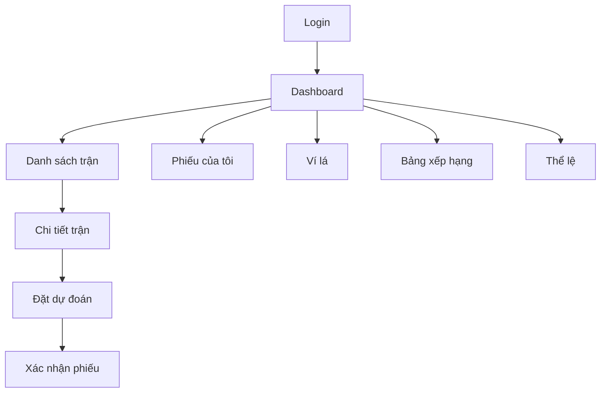
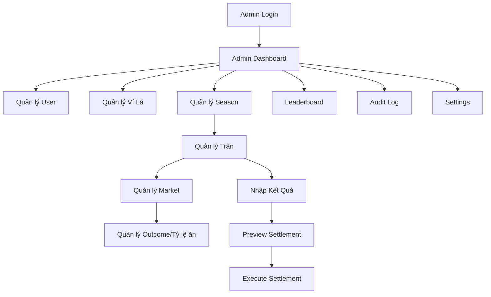

# UI/UX Wireframe Specification

## 1. Mục tiêu thiết kế

Giao diện phải rõ ràng, dễ hiểu trên mobile, hạn chế wording cá cược, ưu tiên trải nghiệm dự đoán vui vẻ nội bộ. Hệ thống gồm 2 khu vực chính:

1. **Player UI**: dành cho người chơi.
2. **Admin Panel**: dùng Laravel Filament cho vận hành.

Không có module phòng ban/team.

---

## 2. Nguyên tắc UX

- Hiển thị rõ số lá khả dụng trước khi đặt.
- Hiển thị rõ thời gian đóng market.
- Trước khi đặt, user phải thấy stake, tỷ lệ ăn, potential payout.
- Sau khi đặt, user nhận phiếu xác nhận.
- Không dùng từ “cược”, “tiền cược”, “nhà cái”, “rút thưởng”.
- Các action nguy hiểm của admin phải có confirmation modal.
- Settlement phải có màn hình preview trước khi execute.
- Mobile-first cho player UI.

---

## 3. Player UI Sitemap



---

## 4. Admin UI Sitemap



---

## 5. Player screen details

## 5.1. Login

### Mục tiêu

Cho user nội bộ đăng nhập.

### Thành phần UI

- Logo/tên hệ thống.
- Email.
- Password.
- Nút đăng nhập.
- Link quên mật khẩu nếu bật.
- Disclaimer ngắn.

### Copy gợi ý

```text
Dự đoán Lá là game điểm ảo nội bộ. Lá không có giá trị quy đổi.
```

### Validation

- Email bắt buộc.
- Password bắt buộc.
- Tài khoản bị khóa thì báo rõ.

---

## 5.2. First Login / Accept Rules

### Mục tiêu

Bắt user xác nhận thể lệ trước khi chơi.

### Thành phần UI

- Tóm tắt 5 rule quan trọng.
- Link xem full thể lệ.
- Checkbox xác nhận.
- Nút “Tôi đã hiểu và đồng ý”.

### Rule bắt buộc hiển thị

```text
- Lá là điểm ảo nội bộ.
- Lá không quy đổi thành tiền/hiện vật/dịch vụ.
- Không mua bán/chuyển nhượng lá.
- Hệ thống chỉ phục vụ giải trí nội bộ.
- Mọi kết quả do ban tổ chức xác nhận theo thể lệ.
```

---

## 5.3. Dashboard

### Mục tiêu

Cho user nắm nhanh trạng thái cá nhân và các trận sắp diễn ra.

### Wireframe dạng text

```text
------------------------------------------------
Header: Logo | Số lá khả dụng | Avatar
------------------------------------------------
Card: Ví của tôi
- Khả dụng: 1.000 lá
- Đang khóa: 200 lá
- Tổng: 1.200 lá
------------------------------------------------
Card: Trận sắp đóng
- Match 001: Team A vs Team B
- Đóng sau: 02:15:30
- Button: Xem dự đoán
------------------------------------------------
Card: Phiếu đang chờ
- 3 phiếu pending
- Tổng lá đang khóa: 200
------------------------------------------------
Card: Hạng hiện tại
- Rank #12
- Net profit: +350 lá
------------------------------------------------
Bottom nav: Trận | Phiếu | Ví | BXH | Thể lệ
```

### Empty state

```text
Chưa có trận nào đang mở. Vui lòng quay lại sau.
```

---

## 5.4. Match List

### Mục tiêu

Liệt kê trận theo ngày/status.

### Filter

- Tất cả.
- Đang mở.
- Sắp diễn ra.
- Đã khóa.
- Đã có kết quả.
- Theo vòng đấu.

### Card trận

```text
Team A vs Team B
Ngày giờ: 12/06/2026 02:00
Stage: Group Stage
Market đang mở: 6
Đóng gần nhất: 01:25:10
Button: Xem chi tiết
```

---

## 5.5. Match Detail

### Mục tiêu

Hiển thị các market của một trận.

### Layout

```text
Header trận
- Team A vs Team B
- Kickoff
- Status
- Countdown market gần nhất

Tabs period:
[Cả trận] [Hiệp 1] [Hiệp 2] [Hiệp phụ] [Penalty]

Accordion market:
1. Dự đoán tỉ số chính xác
2. Dự đoán handicap
3. Dự đoán tài/xỉu
```

### Outcome row

```text
[2-1]    Ăn 6.00    [Chọn]
[Home -0.75] Ăn 0.90 [Chọn]
[Over 2.5] Ăn 0.85 [Chọn]
```

### Rules

- Nếu market locked: disable chọn, hiển thị “Đã đóng”.
- Nếu user không đủ lá: vẫn xem được tỷ lệ ăn nhưng không đặt được.
- Nếu outcome inactive: ẩn hoặc disable.

---

## 5.6. Place Prediction Modal

### Mục tiêu

Xác nhận user đặt lá.

### Wireframe

```text
Modal: Xác nhận dự đoán

Trận: Team A vs Team B
Mốc: Cả trận 90 phút
Loại: Handicap
Lựa chọn: Home -0.75
Tỷ lệ ăn: 0.90

Số lá khả dụng: 1.000
Nhập số lá: [100]
Có thể nhận: 190 lá
Lãi nếu thắng đủ: +90 lá

[Hủy] [Xác nhận]
```

### Validation

- Stake bắt buộc.
- Stake là số nguyên.
- Stake >= min_stake.
- Stake <= max_stake_per_bet.
- Stake <= available_balance.
- Market vẫn đang open tại thời điểm submit.

### Error state

```text
Market vừa đóng. Phiếu dự đoán chưa được ghi nhận.
```

---

## 5.7. Bet Success

```text
Đã ghi nhận phiếu dự đoán
Mã phiếu: B20260611-000123
Lựa chọn: Home -0.75 ăn 0.90
Số lá: 100
Trạng thái: Đang chờ kết quả
```

Button:

- Xem phiếu của tôi.
- Quay lại trận.

---

## 5.8. My Bets

### Tabs

- Pending.
- Settled.
- Voided.
- All.

### Bet card

```text
Mã phiếu: B20260611-000123
Team A vs Team B
Cả trận | Handicap | Home -0.75 ăn 0.90
Số lá: 100
Trạng thái: Pending
Đặt lúc: 11/06/2026 21:30
```

Sau settlement:

```text
Kết quả: Half won
Payout: 145 lá
Lãi/lỗ: +45 lá
```

---

## 5.9. Wallet History

### Thành phần

- Current available.
- Locked balance.
- Total balance.
- Ledger list.

### Ledger row

```text
BET_PLACED | -100 khả dụng / +100 khóa | Match 001 | 21:30
BET_HALF_WON | +145 khả dụng / -100 khóa | Match 001 | 23:50
ADMIN_GRANT | +1.000 | Season start | 08:00
```

---

## 5.10. Leaderboard

### Columns

| Rank | User | Tổng lá | Lãi/lỗ | Số phiếu | Win rate | ROI |
|---:|---|---:|---:|---:|---:|---:|

### Notes

- Không hiển thị phòng ban.
- ROI leaderboard cần điều kiện tối thiểu để tránh user đặt 1 phiếu rồi đứng top.

---

## 5.11. Rules Page

### Nội dung chính

- Lá là gì.
- Cách đặt dự đoán.
- Cách tính tỉ số chính xác.
- Cách tính handicap châu Á.
- Cách tính tài/xỉu.
- Khi nào hoàn lá.
- Khi nào market đóng.
- Chính sách không quy đổi.

---

## 6. Admin screens

## 6.1. Admin Dashboard

### Widgets

- Tổng user active.
- Tổng lá đang lưu hành.
- Tổng lá đang locked.
- Số market đang open.
- Số market cần settle.
- Top 10 leaderboard.
- Lỗi/correction gần đây.

---

## 6.2. User Resource

### Columns

- Name.
- Email.
- Role.
- Status.
- Current season leaves.
- Created at.

### Actions

- Create.
- Edit.
- Block/unblock.
- Reset password.
- View wallet.
- Grant leaves.
- Deduct leaves.

### Validation

- Email unique.
- Role required.
- Grant/deduct reason required.

---

## 6.3. Season Resource

### Fields

- Code.
- Name.
- Start/end date.
- Status.
- Default starting leaves.

### Actions

- Create season.
- Activate season.
- Close season.
- Seed wallets.
- Reset leaderboard.

---

## 6.4. Match Resource

### Columns

- Match code.
- Stage.
- Home.
- Away.
- Kickoff.
- Status.
- Markets count.

### Actions

- Create/edit.
- Import fixtures.
- Generate default markets.
- View markets.
- Enter results.

---

## 6.5. Market Resource

### Fields

- Match.
- Period type.
- Market type.
- Open at.
- Close at.
- Status.

### Actions

- Create outcomes.
- Import tỷ lệ ăn.
- Publish.
- Lock.
- Void.
- Preview settlement.

### Guard rails

- Không xóa market đã có bet.
- Không sửa close_at về quá khứ nếu market đang open mà không có confirmation.
- Không publish market không có outcome active.

---

## 6.6. Outcome / Tỷ lệ ăn UI

### EXACT_SCORE

Form fields:

- Home score.
- Away score.
- Tỷ lệ ăn.
- Status.

### ASIAN_HANDICAP

Form fields:

- Selection side: HOME/AWAY.
- Line: -2.0 đến +2.0 hoặc mở rộng.
- Tỷ lệ ăn.
- Label auto generate.

### OVER_UNDER

Form fields:

- Selection side: OVER/UNDER.
- Total line.
- Tỷ lệ ăn.
- Label auto generate.

---

## 6.7. Result Entry

### Layout

```text
Match: Team A vs Team B

Period results:
- First half: [Home] [Away]
- Full-time: [Home] [Away]
- Second half: auto suggested or manual
- Extra-time: optional
- Penalty: optional

[Save Draft] [Confirm Result]
```

### Validation

- Score integer >= 0.
- Second half can be auto calculated if first half and full-time exist.
- Result locked after settlement unless correction.

---

## 6.8. Settlement Preview

### Mục tiêu

Cho admin kiểm tra trước khi execute.

### Summary

```text
Market: Full-time Handicap
Bets pending: 120
Total stake: 12.000 lá
Estimated payout: 14.350 lá
Net system movement: +2.350 lá payout
```

### Breakdown

| Status | Count | Stake | Payout |
|---|---:|---:|---:|
| Won | 40 | 4.000 | 7.600 |
| Lost | 50 | 5.000 | 0 |
| Push | 10 | 1.000 | 1.000 |
| Half won | 15 | 1.500 | 2.175 |
| Half lost | 5 | 500 | 250 |

### Actions

- Back.
- Export preview.
- Execute settlement.

Execute phải có confirmation:

```text
Tôi xác nhận kết quả đã đúng và hiểu rằng settlement sẽ cập nhật ví của user.
```

---

## 6.9. Correction UI

### Khi dùng

- Nhập sai kết quả.
- Chọn sai period.
- Lỗi rule settlement.

### Form

- Settlement cũ.
- Lý do correction.
- Kết quả đúng.
- Preview delta.
- Confirm.

### Không cho

- Xóa settlement cũ.
- Sửa ledger cũ.

---

## 7. Design components

## 7.1. Status badges

| Status | Style gợi ý |
|---|---|
| OPEN | Green |
| LOCKED | Gray |
| SETTLING | Yellow |
| SETTLED | Blue |
| VOIDED | Red |
| PENDING | Gray |
| WON | Green |
| LOST | Red |
| PUSH | Blue |
| HALF_WON | Green outline |
| HALF_LOST | Orange |

## 7.2. Currency display

```text
1.000 lá
+90 lá
-100 lá
```

Không dùng ký hiệu tiền.

## 7.3. Tỷ lệ ăn display

```text
ăn 0.90
Ăn 0.90
```

---

## 8. Acceptance criteria UI/UX

- Player có thể đặt bet trong tối đa 3 bước từ dashboard.
- Mobile hiển thị tốt cho match detail và modal đặt lá.
- Market locked hiển thị rõ, không có button chọn.
- User luôn thấy potential payout trước khi confirm.
- Admin không thể execute settlement mà chưa qua preview.
- Các action nguy hiểm có confirmation modal.
- Trang thể lệ dễ truy cập từ mọi màn hình player.
