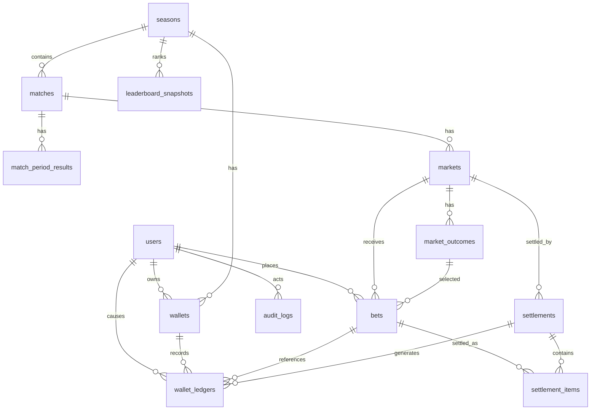

# ERD / Database Design

## 1. Nguyên tắc thiết kế database

- Database chính: PostgreSQL.
- Không dùng float cho tỷ lệ ăn, line, payout.
- Số lá lưu dạng integer.
- Tỷ lệ ăn kiểu Việt Nam lưu bằng field `profit_rate decimal(10,4)`. Đây là hệ số lãi, ví dụ `0.90` nghĩa là đặt 100 thắng đủ lãi 90.
- Có thể lưu thêm `decimal_odds decimal(10,4)` dạng generated/stored để query/report nhanh: `decimal_odds = 1 + profit_rate`.
- Handicap/total line lưu dạng `decimal(6,2)`.
- Dữ liệu lõi không xóa cứng: bet, wallet ledger, settlement, audit log.
- Mọi thay đổi số dư phải đi qua `wallet_ledgers`.
- Bet phải lưu snapshot tỷ lệ ăn/line/outcome label tại thời điểm đặt.
- Settlement phải idempotent bằng constraint và status.

---

## 2. Sơ đồ quan hệ tổng quát



---

## 3. Enum chuẩn

## 3.1. Role

```text
super_admin
operator
settlement_manager
auditor
player
```

## 3.2. Match status

```text
DRAFT
SCHEDULED
LIVE
FINISHED
SETTLED
POSTPONED
CANCELLED
```

## 3.3. Period type

```text
FULL_TIME
FIRST_HALF
SECOND_HALF
EXTRA_TIME
PENALTY
```

## 3.4. Market type

```text
EXACT_SCORE
ASIAN_HANDICAP
OVER_UNDER
PENALTY_WINNER
```

`PENALTY_WINNER` là optional. MVP có thể chưa bật.

## 3.5. Market status

```text
DRAFT
OPEN
LOCKED
SETTLING
SETTLED
VOIDED
CANCELLED
```

## 3.6. Bet status

```text
PENDING
WON
LOST
PUSH
HALF_WON
HALF_LOST
VOIDED
CORRECTED
```

## 3.7. Ledger type

```text
ADMIN_GRANT
ADMIN_DEDUCT
BET_PLACED
BET_WON
BET_LOST
BET_PUSH
BET_HALF_WON
BET_HALF_LOST
BET_VOIDED
SETTLEMENT_CORRECTION
SEASON_RESET
```

---

## 4. Bảng `users`

Dùng bảng users mặc định của Laravel, bổ sung field cần thiết.

| Field | Type | Null | Note |
|---|---|---:|---|
| id | bigserial | No | PK |
| name | varchar(255) | No | Tên hiển thị |
| email | varchar(255) | No | Unique |
| password | varchar(255) | No | Hash |
| status | varchar(30) | No | ACTIVE/BLOCKED/INACTIVE |
| accepted_rules_at | timestamp | Yes | User đã đồng ý thể lệ |
| last_login_at | timestamp | Yes | Theo dõi đăng nhập |
| email_verified_at | timestamp | Yes | Laravel default |
| remember_token | varchar(100) | Yes | Laravel default |
| created_at | timestamp | No |  |
| updated_at | timestamp | No |  |
| deleted_at | timestamp | Yes | Soft delete |

### Index

```text
unique(users.email)
index(users.status)
```

---

## 5. Bảng `seasons`

| Field | Type | Null | Note |
|---|---|---:|---|
| id | bigserial | No | PK |
| code | varchar(50) | No | Ví dụ WC2026 |
| name | varchar(255) | No | Tên mùa giải |
| starts_at | timestamp | Yes |  |
| ends_at | timestamp | Yes |  |
| status | varchar(30) | No | DRAFT/ACTIVE/CLOSED |
| default_starting_leaves | integer | No | Lá mặc định |
| created_by | bigint | Yes | FK users |
| created_at | timestamp | No |  |
| updated_at | timestamp | No |  |

### Constraint

```text
unique(seasons.code)
default_starting_leaves >= 0
```

---

## 6. Bảng `wallets`

Mỗi user có một ví theo season.

| Field | Type | Null | Note |
|---|---|---:|---|
| id | bigserial | No | PK |
| user_id | bigint | No | FK users |
| season_id | bigint | No | FK seasons |
| available_balance | integer | No | Lá khả dụng |
| locked_balance | integer | No | Lá đang khóa trong bet pending |
| total_staked | integer | No | Tổng lá đã đặt |
| total_payout | integer | No | Tổng payout nhận được |
| net_profit | integer | No | total_payout - total_staked |
| status | varchar(30) | No | ACTIVE/LOCKED |
| created_at | timestamp | No |  |
| updated_at | timestamp | No |  |

### Constraint

```text
unique(wallets.user_id, wallets.season_id)
available_balance >= 0
locked_balance >= 0
```

### Công thức

```text
total_balance = available_balance + locked_balance
net_profit = total_payout - total_staked
```

Có thể dùng generated column hoặc tính ở query.

---

## 7. Bảng `wallet_ledgers`

Bảng quan trọng nhất để audit biến động lá.

| Field | Type | Null | Note |
|---|---|---:|---|
| id | bigserial | No | PK |
| wallet_id | bigint | No | FK wallets |
| user_id | bigint | No | Chủ ví |
| season_id | bigint | No | Season |
| type | varchar(50) | No | Ledger type |
| amount_available | integer | No | Delta available |
| amount_locked | integer | No | Delta locked |
| balance_available_after | integer | No | Snapshot sau giao dịch |
| balance_locked_after | integer | No | Snapshot sau giao dịch |
| bet_id | bigint | Yes | FK bets |
| settlement_id | bigint | Yes | FK settlements |
| actor_id | bigint | Yes | User/admin tạo action |
| reason | text | Yes | Lý do |
| metadata | jsonb | Yes | Extra context |
| created_at | timestamp | No |  |

### Index

```text
index(wallet_ledgers.wallet_id, wallet_ledgers.created_at)
index(wallet_ledgers.user_id, wallet_ledgers.created_at)
index(wallet_ledgers.bet_id)
index(wallet_ledgers.settlement_id)
index(wallet_ledgers.type)
```

---

## 8. Bảng `matches`

| Field | Type | Null | Note |
|---|---|---:|---|
| id | bigserial | No | PK |
| season_id | bigint | No | FK seasons |
| match_code | varchar(50) | No | Ví dụ M001 |
| stage | varchar(100) | No | Group, R32, R16, QF, SF, Final |
| home_team | varchar(255) | No | Có thể TBD |
| away_team | varchar(255) | No | Có thể TBD |
| kickoff_at | timestamp | No | Lưu theo Asia/Ho_Chi_Minh |
| timezone | varchar(100) | No | Asia/Ho_Chi_Minh |
| venue | varchar(255) | Yes | Sân |
| status | varchar(30) | No | Match status |
| created_by | bigint | Yes | FK users |
| created_at | timestamp | No |  |
| updated_at | timestamp | No |  |

### Constraint

```text
unique(matches.season_id, matches.match_code)
index(matches.kickoff_at)
index(matches.status)
```

---

## 9. Bảng `match_period_results`

Lưu kết quả từng period.

| Field | Type | Null | Note |
|---|---|---:|---|
| id | bigserial | No | PK |
| match_id | bigint | No | FK matches |
| period_type | varchar(30) | No | FULL_TIME/FIRST_HALF/... |
| home_score | integer | No | Bàn đội home trong period |
| away_score | integer | No | Bàn đội away trong period |
| status | varchar(30) | No | DRAFT/CONFIRMED/CORRECTED |
| entered_by | bigint | Yes | FK users |
| confirmed_by | bigint | Yes | FK users |
| source_note | text | Yes | Ghi chú nguồn |
| created_at | timestamp | No |  |
| updated_at | timestamp | No |  |

### Constraint

```text
unique(match_period_results.match_id, match_period_results.period_type)
home_score >= 0
away_score >= 0
```

---

## 10. Bảng `markets`

| Field | Type | Null | Note |
|---|---|---:|---|
| id | bigserial | No | PK |
| match_id | bigint | No | FK matches |
| period_type | varchar(30) | No | Period |
| market_type | varchar(50) | No | Market type |
| name | varchar(255) | No | Tên hiển thị |
| open_at | timestamp | No | Thời gian mở |
| close_at | timestamp | No | Thời gian đóng |
| status | varchar(30) | No | Market status |
| display_order | integer | No | Sort UI |
| created_by | bigint | Yes | FK users |
| locked_at | timestamp | Yes | Khi khóa |
| settled_at | timestamp | Yes | Khi settle |
| voided_at | timestamp | Yes | Khi void |
| void_reason | text | Yes | Lý do void |
| created_at | timestamp | No |  |
| updated_at | timestamp | No |  |

### Constraint

```text
close_at > open_at
index(markets.match_id)
index(markets.status, markets.close_at)
```

---

## 11. Bảng `market_outcomes`

| Field | Type | Null | Note |
|---|---|---:|---|
| id | bigserial | No | PK |
| market_id | bigint | No | FK markets |
| label | varchar(255) | No | Ví dụ Home -0.75, Over 2.5, 2-1 |
| selection_side | varchar(30) | Yes | HOME/AWAY/OVER/UNDER/DRAW |
| score_home | integer | Yes | Exact score |
| score_away | integer | Yes | Exact score |
| line_value | decimal(6,2) | Yes | Handicap hoặc total line |
| profit_rate | decimal(10,4) | No | Tỷ lệ ăn kiểu Việt Nam, ví dụ 0.90 |
| decimal_odds | decimal(10,4) | Yes | Optional/generated: 1 + profit_rate, ví dụ 1.90 |
| status | varchar(30) | No | ACTIVE/INACTIVE |
| display_order | integer | No | Sort |
| created_at | timestamp | No |  |
| updated_at | timestamp | No |  |

### Ghi chú theo market type

| Market type | Field bắt buộc |
|---|---|
| EXACT_SCORE | score_home, score_away, profit_rate |
| ASIAN_HANDICAP | selection_side HOME/AWAY, line_value, profit_rate |
| OVER_UNDER | selection_side OVER/UNDER, line_value, profit_rate |
| PENALTY_WINNER | selection_side HOME/AWAY, profit_rate |

---

## 12. Bảng `bets`

| Field | Type | Null | Note |
|---|---|---:|---|
| id | bigserial | No | PK |
| public_code | varchar(50) | No | Mã phiếu cho user |
| user_id | bigint | No | FK users |
| wallet_id | bigint | No | FK wallets |
| season_id | bigint | No | FK seasons |
| match_id | bigint | No | FK matches |
| market_id | bigint | No | FK markets |
| outcome_id | bigint | No | FK market_outcomes |
| stake | integer | No | Lá đặt |
| profit_rate_snapshot | decimal(10,4) | No | Tỷ lệ ăn lúc đặt |
| line_snapshot | decimal(6,2) | Yes | Line lúc đặt |
| label_snapshot | varchar(255) | No | Label lúc đặt |
| display_odds_snapshot | varchar(255) | No | Ví dụ `Brazil -0.5 ăn 0.90` |
| close_at_snapshot | timestamp | No | Thời điểm đóng market lúc đặt |
| market_type_snapshot | varchar(50) | No | Snapshot |
| period_type_snapshot | varchar(30) | No | Snapshot |
| selection_side_snapshot | varchar(30) | Yes | HOME/AWAY/OVER/UNDER |
| status | varchar(30) | No | Bet status |
| gross_payout | integer | Yes | Payout đã tính |
| net_result | integer | Yes | gross_payout - stake |
| placed_at | timestamp | No | Thời điểm đặt |
| settled_at | timestamp | Yes | Thời điểm settle |
| voided_at | timestamp | Yes |  |
| metadata | jsonb | Yes |  |
| created_at | timestamp | No |  |
| updated_at | timestamp | No |  |

### Constraint

```text
unique(bets.public_code)
stake > 0
gross_payout >= 0
index(bets.user_id, bets.created_at)
index(bets.market_id, bets.status)
index(bets.match_id)
```

---

## 13. Bảng `settlements`

| Field | Type | Null | Note |
|---|---|---:|---|
| id | bigserial | No | PK |
| market_id | bigint | No | FK markets |
| match_id | bigint | No | FK matches |
| period_type | varchar(30) | No | Period settled |
| status | varchar(30) | No | PREVIEWED/EXECUTED/VOIDED/CORRECTED |
| result_home_score | integer | Yes | Score used |
| result_away_score | integer | Yes | Score used |
| total_bets | integer | No |  |
| total_stake | integer | No |  |
| total_payout | integer | No |  |
| executed_by | bigint | Yes | FK users |
| executed_at | timestamp | Yes |  |
| reason | text | Yes |  |
| metadata | jsonb | Yes |  |
| created_at | timestamp | No |  |
| updated_at | timestamp | No |  |

### Constraint

```text
unique partial: one EXECUTED settlement per market
index(settlements.market_id)
```

---

## 14. Bảng `settlement_items`

| Field | Type | Null | Note |
|---|---|---:|---|
| id | bigserial | No | PK |
| settlement_id | bigint | No | FK settlements |
| bet_id | bigint | No | FK bets |
| user_id | bigint | No | FK users |
| stake | integer | No | Snapshot |
| profit_rate_snapshot | decimal(10,4) | No | Snapshot tỷ lệ ăn lúc settle |
| decimal_odds_snapshot | decimal(10,4) | Yes | Optional/generated snapshot: 1 + profit_rate_snapshot |
| result_status | varchar(30) | No | WON/LOST/PUSH/HALF_WON/HALF_LOST/VOIDED |
| gross_payout | integer | No | Payout |
| net_result | integer | No | Payout - stake |
| calculation_detail | jsonb | Yes | Components, split lines |
| created_at | timestamp | No |  |

### Constraint

```text
unique(settlement_items.settlement_id, settlement_items.bet_id)
unique partial: bet can have one active settlement item unless correction flow
```

---

## 15. Bảng `leaderboard_snapshots`

| Field | Type | Null | Note |
|---|---|---:|---|
| id | bigserial | No | PK |
| season_id | bigint | No | FK seasons |
| user_id | bigint | No | FK users |
| rank | integer | No | Rank tại snapshot |
| available_balance | integer | No |  |
| locked_balance | integer | No |  |
| total_balance | integer | No |  |
| total_staked | integer | No |  |
| total_payout | integer | No |  |
| net_profit | integer | No |  |
| total_bets | integer | No |  |
| won_bets | integer | No |  |
| lost_bets | integer | No |  |
| push_bets | integer | No |  |
| exact_score_wins | integer | No |  |
| roi | decimal(10,4) | Yes | net_profit / total_staked |
| win_rate | decimal(10,4) | Yes | won / settled |
| snapshot_at | timestamp | No |  |

### Index

```text
index(leaderboard_snapshots.season_id, leaderboard_snapshots.snapshot_at)
index(leaderboard_snapshots.rank)
```

---

## 16. Bảng `audit_logs`

Có thể dùng Spatie Activitylog. Nếu tự thiết kế:

| Field | Type | Null | Note |
|---|---|---:|---|
| id | bigserial | No | PK |
| actor_id | bigint | Yes | FK users |
| action | varchar(100) | No | CREATE_MARKET, SETTLE_MARKET... |
| subject_type | varchar(255) | No | Model class |
| subject_id | bigint | Yes | Model id |
| before | jsonb | Yes | Data trước |
| after | jsonb | Yes | Data sau |
| metadata | jsonb | Yes | IP, user agent, reason |
| created_at | timestamp | No |  |

---

## 17. Bảng `system_settings`

Nếu dùng Spatie Settings có thể lưu trong bảng package. Các setting cần có:

```text
default_starting_leaves
min_stake
max_stake_per_bet
max_stake_per_match
max_stake_per_day
allow_negative_balance = false
allow_leaf_transfer = false
default_market_close_minutes_before_kickoff
max_profit_rate
rounding_mode = ROUND_HALF_UP
timezone = Asia/Ho_Chi_Minh
```

---

## 18. Transaction patterns bắt buộc

## 18.1. Đặt bet

```text
BEGIN
lock wallet row FOR UPDATE
check market status and close_at
check outcome active
check balance and limits
create bet
update wallet available -= stake, locked += stake
create wallet ledger BET_PLACED
COMMIT
```

## 18.2. Settlement

```text
BEGIN
lock market row FOR UPDATE
check market not settled
create settlement
for each pending bet:
    lock wallet FOR UPDATE
    calculate payout
    update bet status/payout
    update wallet locked -= stake, available += payout
    create settlement item
    create wallet ledger
update market status SETTLED
COMMIT
```

---

## 19. Migration order đề xuất

```text
01 create users
02 create seasons
03 create wallets
04 create wallet_ledgers
05 create matches
06 create match_period_results
07 create markets
08 create market_outcomes
09 create bets
10 create settlements
11 create settlement_items
12 create leaderboard_snapshots
13 create audit_logs or install activitylog
14 create settings tables
```
